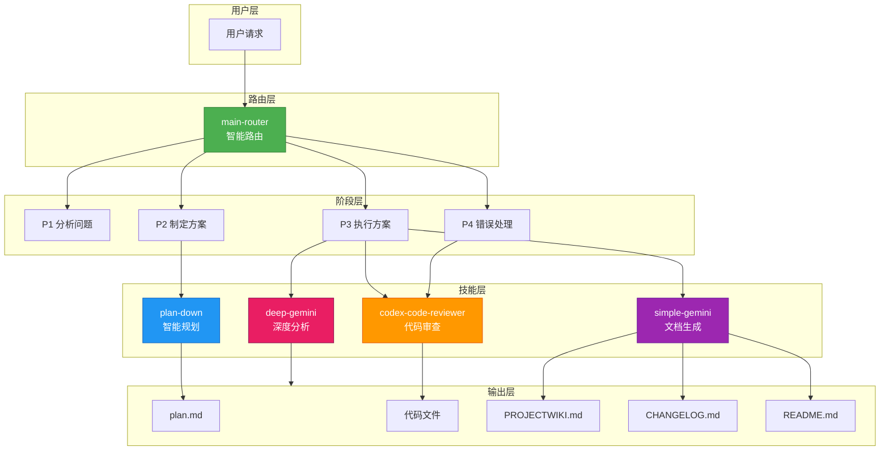
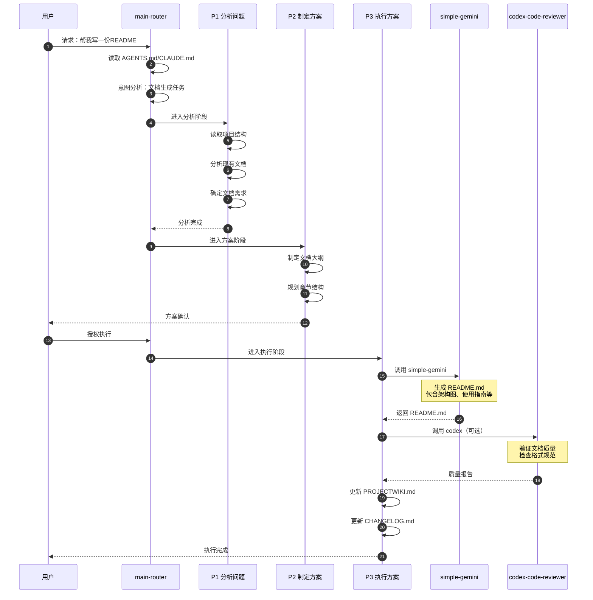
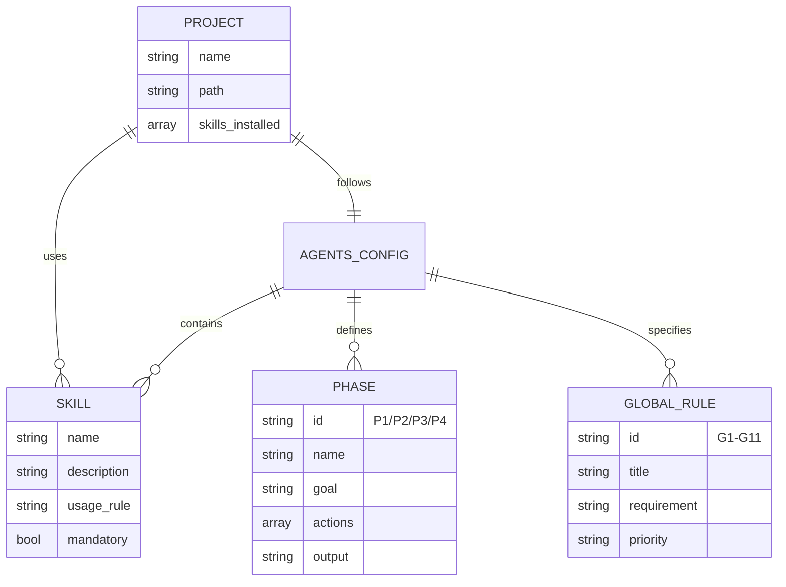
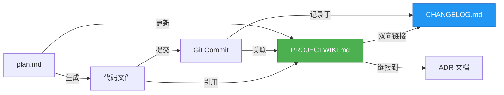
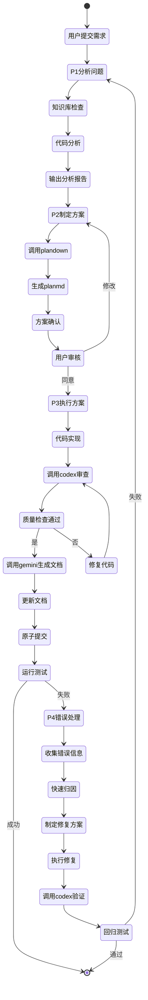
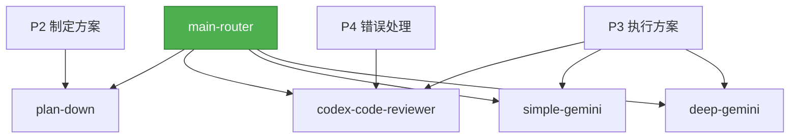

# PROJECTWIKI.md - Claude Code Skill Work

> 本文件是 Claude Code Skill Work 项目的知识库文档，遵循 AGENTS.md 定义的标准模板。

---

## 1. 项目概述

### 目标（Goal）
构建一套面向 AI 编程智能体的技能包集合，通过智能路由和多阶段工作流，实现从需求分析到代码实现、从质量审查到文档生成的全流程自动化。

### 背景（Background）
- **问题**：AI 编程助手在处理复杂任务时，缺少结构化的工作流和专业化的工具支持
- **需求**：需要一套标准化的技能系统，确保任务执行的质量和一致性
- **解决方案**：基于 AGENTS.md 规范，开发 5 个核心技能包，通过 main-router 智能调度

### 范围（In-Scope）与非目标（Out-of-Scope）

**In-Scope（本项目包含）：**
- ✅ 智能路由机制（main-router）
- ✅ 任务规划能力（plan-down）
- ✅ 代码质量审查（codex-code-reviewer）
- ✅ 文档生成能力（simple-gemini, deep-gemini）
- ✅ 多阶段工作流（P1-P4）
- ✅ 知识库驱动的文档体系

**Out-of-Scope（不包含）：**
- ❌ 具体业务逻辑实现
- ❌ 特定编程语言的编译器/解释器
- ❌ 代码部署和运维工具
- ❌ 版本控制系统（依赖外部 Git）

### 角色 / 干系人（Stakeholders）
- **开发者**：使用技能包进行项目开发
- **AI 智能体**：执行技能调用和任务协调
- **项目维护者**：维护和更新技能包
- **贡献者**：开发新技能或改进现有技能

### 运行环境 / 平台
- **操作系统**：Windows 10/11、macOS、Linux（含 WSL）
- **AI 环境**：Claude AI（Cursor IDE 或 Claude API）
- **Python 版本**：3.8+
- **编码**：UTF-8 无 BOM

---

## 2. 架构设计

### 总体架构



### 关键流程：文档生成流程



### 架构设计说明

#### 分层设计
1. **用户层**：接收用户请求
2. **路由层**：main-router 负责意图分析和技能选择
3. **阶段层**：P1-P4 多阶段工作流
4. **技能层**：专用技能包提供核心能力
5. **输出层**：生成各类文档和代码文件

#### 核心原则
- **智能路由优先**：所有请求先经过 main-router 分析
- **强制技能使用**：关键任务必须使用专用技能
- **阶段严格控制**：P3 执行前必须经过 P1 分析和 P2 方案
- **文档一等公民**：代码与文档同步更新，建立双向链接

---

## 3. 架构决策记录（ADR）

### ADR 目录
- 位置：`docs/adr/`
- 模板：MADR（`YYYYMMDD-title.md`）
- 当前状态：待建立 ADR 目录

### 最新 ADR 列表
- （待添加）首个 ADR：技能包架构设计

---

## 4. 设计决策 & 技术债务

### 当前设计决策

| 决策点 | 选择方案 | 理由 | 影响 |
|--------|----------|------|------|
| 技能包格式 | .zip 文件 | 便于分发和版本管理 | 需要解压才能查看内容 |
| 路由机制 | 集中式 main-router | 统一决策，易于监控 | 单点依赖 |
| 文档格式 | Markdown + Mermaid | 易读易写，支持图表 | 需要支持 Mermaid 的渲染器 |
| 工作流阶段 | P1-P4 四阶段 | 结构清晰，职责明确 | 简单任务可能过度流程化 |

### 技术债务清单

| 债务项 | 类型 | 优先级 | 预计工作量 | 负责人 | 状态 |
|--------|------|--------|------------|--------|------|
| 建立 ADR 目录和模板 | 文档 | Medium | 2h | TBD | 待处理 |
| 补充技能包内部文档 | 文档 | High | 8h | TBD | 待处理 |
| 添加单元测试 | 测试 | High | 16h | TBD | 待处理 |
| 性能基准测试 | 测试 | Low | 4h | TBD | 待处理 |

---

## 5. 模块文档

### 5.1 main-router（智能路由）

**职责**：
- 读取 AGENTS.md 和 CLAUDE.md 配置
- 分析用户意图和当前阶段
- 选择最佳技能或直接执行
- 全程监控任务生命周期

**入口点**：用户请求处理的第一层

**依赖**：
- AGENTS.md（全局规则）
- CLAUDE.md（项目配置）
- 其他所有技能包

**风险点**：
- 单点故障：router 失效则整个系统无法工作
- 决策错误：意图分析不准确导致错误的技能选择

**扩展点**：
- 支持更多意图识别规则
- 支持技能优先级配置
- 支持决策日志和审计

---

### 5.2 plan-down（智能规划）

**职责**：
- 任务分解和结构化
- 生成可勾选的执行计划
- 多模型验证和标准合规检查

**入口点**：P2 阶段自动调用

**输出**：`plan.md`

**依赖**：
- 用户需求描述
- 项目现状分析结果

**风险点**：
- 计划过于理想化，实际执行困难
- 遗漏关键步骤或依赖关系

**扩展点**：
- 支持多种计划模板
- 支持计划变更追踪
- 支持工时估算

---

### 5.3 codex-code-reviewer（代码审查）

**职责**：
- 5 维度质量检查（质量、安全、性能、架构、文档）
- 生成修复建议
- 全自动模式下自动修复

**入口点**：
- P3 代码生成完成后
- P4 错误修复后验证

**输出**：
- 质量报告（按严重级别分类）
- 修复建议（含代码示例）

**依赖**：
- 代码文件
- 语言特定的分析工具

**风险点**：
- 误报：将正常代码标记为问题
- 漏报：未检测到实际问题
- 自动修复可能破坏业务逻辑

**扩展点**：
- 支持更多编程语言
- 支持自定义规则
- 支持增量分析

---

### 5.4 simple-gemini（标准文档生成）

**职责**：
- 生成 README、PROJECTWIKI、CHANGELOG
- 生成单元测试和集成测试代码
- 确保文档符合模板和规范

**入口点**：
- P3 执行阶段（文档更新）
- 专门的文档生成请求

**输出**：
- README.md
- PROJECTWIKI.md
- CHANGELOG.md
- 测试代码文件

**依赖**：
- 项目信息和上下文
- 文档模板（AGENTS.md 中定义）

**风险点**：
- 生成内容与实际不符
- 格式不规范
- 缺少必要章节

**扩展点**：
- 支持更多文档类型
- 支持多语言文档
- 支持文档版本管理

---

### 5.5 deep-gemini（深度分析）

**职责**：
- 架构设计深度分析
- 性能瓶颈和优化建议
- 复杂度分析和可维护性评估
- 技术债务评估

**入口点**：
- 需要深度技术分析时
- 架构评审和重构规划

**输出**：
- 深度分析报告
- 架构优化建议
- 技术债务清单

**依赖**：
- 完整的项目代码
- 运行日志和性能数据（可选）

**风险点**：
- 分析耗时较长
- 结论可能过于理论化

**扩展点**：
- 支持更多分析维度
- 支持对比分析
- 支持可视化报告

---

## 6. API 手册

### 技能调用接口（概念层面）

由于技能包是集成在 AI 环境中的，没有传统意义上的 API 接口。以下是概念层面的调用方式：

#### main-router 调用

```yaml
# 概念示例
Tool: main-router
Input:
  user_request: "帮我分析这个登录功能的问题"
  context:
    files: ["login.py", "auth.py"]
    stage: "P1"
Output:
  selected_skill: "zen-thinkdeep"
  confidence: 0.95
  reason: "复杂问题需要深度分析"
```

#### plan-down 调用

```yaml
Tool: plan-down
Input:
  requirement: "开发用户注册功能"
  constraints:
    - "需要邮箱验证"
    - "支持第三方登录"
  context: "现有用户系统基于 Django"
Output:
  plan_file: "plan.md"
  tasks: 12
  estimated_time: "4-6 hours"
```

#### codex-code-reviewer 调用

```yaml
Tool: codex-code-reviewer
Input:
  files: ["src/login.py"]
  check_dimensions:
    - quality
    - security
    - performance
    - architecture
    - documentation
Output:
  issues:
    critical: 1  # SQL注入风险
    high: 2      # 缺少异常处理
    medium: 3
    low: 5
  auto_fix_available: true
```

### 兼容性策略

- **版本化**：技能包通过文件名版本号标识（如未来可能采用 `codex-v2.0.0.zip`）
- **向后兼容**：新版本技能包应保持与旧版 AGENTS.md 的兼容性
- **废弃通知**：重大变更提前在 CHANGELOG.md 中通知

---

## 7. 数据模型

### 项目配置数据模型



### 文档关联模型



---

## 8. 核心流程

### 8.1 完整开发流程



### 8.2 文档更新流程

1. **检测变更**：识别代码变更类型（新增/修改/删除）
2. **更新 PROJECTWIKI.md**：
   - 新增功能 → 更新模块文档 + API 手册
   - 修复 Bug → 更新技术债务 + 添加复盘
   - 重构 → 更新架构设计 + ADR
3. **更新 CHANGELOG.md**：按 Keep a Changelog 格式记录
4. **建立双向链接**：提交信息引用文档，文档引用提交 SHA
5. **原子提交**：代码 + 文档 = 1 个 commit

---

## 9. 依赖图谱

### 内部依赖



### 外部依赖

| 依赖项 | 版本要求 | 用途 | 许可证 | 必需/可选 |
|--------|----------|------|--------|-----------|
| Python | 3.8+ | 脚本执行和环境检测 | PSF | 必需 |
| Claude AI | Latest | AI 推理和技能执行 | Proprietary | 必需 |
| Git | 2.0+ | 版本控制 | GPL-2.0 | 推荐 |
| Mermaid | - | 图表渲染（查看器） | MIT | 推荐 |

### 潜在冲突
- 暂无已知冲突

### 可替代方案
- **Claude AI** → 其他支持 MCP 的 AI 服务（需要适配）
- **Mermaid** → PlantUML、Graphviz（需要修改图表语法）

---

## 10. 维护建议

### 日常维护

1. **技能包更新**
   - 定期检查技能包版本
   - 测试新版本兼容性
   - 更新 CHANGELOG.md

2. **文档同步**
   - 代码变更后立即更新文档
   - 定期审查文档一致性
   - 清理过时信息

3. **质量监控**
   - 定期运行 codex 全量检查
   - 关注技术债务积累
   - 追踪修复进度

### 容量规划

- **技能包大小**：每个 < 10MB（当前总计约 5-20MB）
- **文档大小**：PROJECTWIKI.md < 100KB
- **Git 仓库**：< 50MB（不包含 .zip 文件时）

### 成本控制

- **AI API 调用**：建议使用缓存减少重复调用
- **存储成本**：技能包可托管在 Git LFS
- **人力成本**：全自动模式可节省 60-80% 人工审查时间

---

## 11. 术语表和缩写

### 术语

| 术语 | 定义 |
|------|------|
| 智能路由 | 基于意图分析自动选择最佳技能的机制 |
| 多阶段工作流 | P1-P4 的结构化任务处理流程 |
| 强制技能使用 | 特定任务必须使用指定技能的规则 |
| 知识库驱动 | 以 PROJECTWIKI.md 为唯一可信文档源 |
| 双向可追溯 | 代码与文档之间建立相互引用链接 |
| 原子提交 | 代码变更和文档更新作为一个不可分割的提交 |
| MRE | Minimal Reproducible Example（可复现的最小示例） |
| ADR | Architecture Decision Record（架构决策记录） |
| DoD | Definition of Done（完成标准） |
| SLO | Service Level Objective（服务质量目标） |

### 缩写

| 缩写 | 全称 |
|------|------|
| P1 | Phase 1（阶段一：分析问题） |
| P2 | Phase 2（阶段二：制定方案） |
| P3 | Phase 3（阶段三：执行方案） |
| P4 | Phase 4（阶段四：错误处理） |
| G1-G11 | Global Rule 1-11（全局规则 1-11） |
| API | Application Programming Interface |
| CLI | Command Line Interface |
| WSL | Windows Subsystem for Linux |
| UTF-8 | Unicode Transformation Format - 8-bit |
| BOM | Byte Order Mark |
| SHA | Secure Hash Algorithm |
| ER | Entity-Relationship（实体关系） |
| E2E | End-to-End（端到端） |

---

## 12. 变更日志

详细变更历史请参见 [CHANGELOG.md](CHANGELOG.md)。

### 最近变更

#### [Unreleased] - 2025-10-22
- ✅ 重写完整的 README.md 文档（700+ 行）
- ✅ 创建 PROJECTWIKI.md 知识库文档
- ✅ 创建 CHANGELOG.md 变更日志
- ✅ 添加完整的架构图和流程图（Mermaid）
- ✅ 建立文档双向链接体系

#### [1.0.0] - 2025-10-22
- 初始化项目
- 添加 5 个核心技能包
- 添加 AGENTS.md 全局规则

---

## 附录

### A. 相关链接

- **AGENTS.md**：[查看全局规则](AGENTS.md)
- **CLAUDE.md**：[查看项目配置](CLAUDE.md)
- **README.md**：[查看快速开始](README.md)
- **CHANGELOG.md**：[查看变更历史](CHANGELOG.md)

### B. 联系方式

- **项目维护**：请提交 Issue 或 Pull Request
- **技术讨论**：参见 Discussions 区域
- **Bug 报告**：请使用 Issue 模板

---

<div align="center">

**本文档最后更新**：2025-10-22  
**文档版本**：v1.0.0  
**对应项目版本**：v1.0.0

</div>

