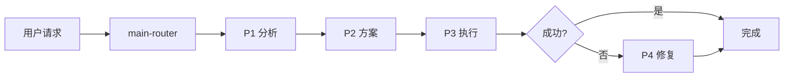

# Claude Code Zen mcp Skill Work

> 面向 AI 编程智能体的技能包集合

## 📋 项目简介

本项目基于 [Zen MCP Server](https://github.com/BeehiveInnovations/zen-mcp-server) 构建，采用多阶段工作流（P1-P4）的 AI 智能体技能系统。通过智能路由自动选择最合适的工具处理编程任务，借助 Zen MCP 可在 Claude 中调用 Codex 和 Gemini CLI 处理相关任务。

> **⚠️ 重要配置提示**  
> 使用 OpenAI API Key 时，需要在 `zen-mcp/.env` 中进行以下配置：
> - 设置 `OPENAI_ALLOWED_MODELS=` 指定使用的模型（默认会优先使用 gpt5-pro）
> - 在 `DISABLED_TOOLS` 中删除 `docgen` 以启用文档生成功能

**核心特性**：
- 🧠 智能路由 - 自动选择最佳技能
- 📊 多阶段工作流 - P1(分析) → P2(方案) → P3(执行) → P4(修复)
- 🔍 5 维代码审查 - 质量、安全、性能、架构、文档
- 📝 文档自动生成 - README、测试代码、项目文档

---

## 🎯 技能清单

本项目包含 5 个核心技能包（位于 `skills/` 目录）：

### 1. main-router
智能路由和技能匹配，负责意图分析和任务调度。

### 2. plan-down
智能任务分解和执行计划生成，输出结构化的 `plan.md`。

### 3. codex-code-reviewer
代码质量审查，提供 5 维度检查（质量、安全、性能、架构、文档）。

### 4. simple-gemini
标准文档生成，用于 README、PROJECTWIKI、CHANGELOG 和测试代码。

### 5. deep-gemini
深度技术分析，提供架构分析、性能优化建议等。

---

## 🏗️ 工作流程



**四个阶段**：
- **P1 分析问题** - 理解需求，定位根因
- **P2 制定方案** - 设计解决方案，调用 plan-down 生成计划
- **P3 执行方案** - 实施代码，调用 codex 检查，调用 gemini 生成文档
- **P4 错误处理** - 修复问题，验证修复

---

## 🚀 快速开始

### 环境要求
- Python 3.8+
- 必要: Claude code,zen-mcp
- 可选: gemini cli, codex cli
下载:
zem-mcp:
git clone https://github.com/BeehiveInnovations/zen-mcp-server.git
cd zen-mcp-server
./run-server.sh  


### 使用方式

**交互模式**：
```
用户：帮我分析这个功能
→ AI 自动进入 P1 分析
→ 输出分析报告
→ 等待用户确认后进入 P2/P3
```

**全自动模式**：
```
用户：全程自动化，开发注册功能
→ AI 自动完成 P1→P2→P3 全流程
→ 自动调用技能（plan-down、codex、gemini）
→ 生成 auto_log.md 决策日志
```

---

## 📚 相关文档

| 文档 | 说明 |
|------|------|
| [AGENTS.md](AGENTS.md) | 全局规则和 P1-P4 阶段定义 |
| [PROJECTWIKI.md](PROJECTWIKI.md) | 项目知识库和详细文档 |
| [CHANGELOG.md](CHANGELOG.md) | 变更日志 |

---

## 💡 主要规则

1. **强制技能使用**
   - 生成 plan.md → 必须用 plan-down
   - 代码完成后 → 必须用 codex-code-reviewer
   - 生成文档 → 必须用 simple-gemini

2. **文档一等公民**
   - 代码变更时必须同步更新 PROJECTWIKI.md 和 CHANGELOG.md
   - 建立代码与文档的双向链接

3. **低风险执行**
   - P3 执行前需满足：代码≤200行、文件≤5个、无破坏性变更

---

## 📄 许可证

MIT License

---

## 🙏 致谢

感谢以下项目和贡献者：

- **[HelloAgents](https://github.com/hellowind777/helloagents)** - 提供了 AGENTS.md 规范和多阶段工作流设计
- **[Zen MCP Server](https://github.com/BeehiveInnovations/zen-mcp-server)** - 提供了 MCP 服务器实现和技能包架构参考

