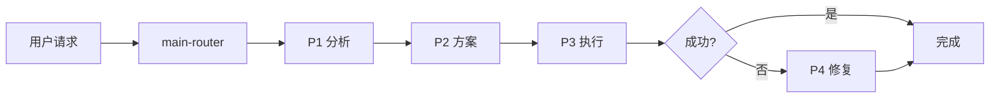

# Claude Code Zen MCP Skill Work

> 🚀 一键安装的 AI 编程智能体技能包 - 自动下载 Zen MCP + 5 个核心技能

[](LICENSE)
[](https://nodejs.org/)

---

## ✨ 核心特性

- 📦 **开箱即用** - 包含 Zen MCP Server，一次克隆全部搞定
- 🧠 **智能路由** - 自动选择最佳技能处理任务
- 📊 **多阶段工作流** - P1(分析) → P2(方案) → P3(执行) → P4(修复)
- 🔍 **5 维代码审查** - 质量、安全、性能、架构、文档全方位检查
- 📝 **文档自动生成** - README、测试代码、项目知识库
- 🌍 **跨平台支持** - Windows / macOS / Linux 全平台 （可能）

---

> ⚠️ **重要提示**  
> 配置 OpenAI API Key 后，请务必在 `OPENAI_ALLOWED_MODELS` 中指定允许的模型列表（如 `gpt-5,gpt-4-turbo,o1`）。  
> 如果留空或未配置，系统可能会默认使用 GPT-5-Pro 等高成本模型，导致意外费用。

## 🚀 快速开始

### 环境要求

**必需**：
- ✅ [Claude Desktop](https://claude.ai/download)
- ✅ [Node.js](https://nodejs.org/) >= 14.0.0
- ✅ [Python](https://www.python.org/) >= 3.8（Zen MCP Server 需要）

**可选**：
- ✅ [Git](https://git-scm.com/downloads)（如果从 GitHub 克隆）

### 安装方式

#### 方式 1: 手动安装（推荐，最稳定）

```bash
# 1. 下载本项目（已包含 Zen MCP Server）
git clone https://github.com/VCnoC/Claude-Code-Zen-mcp-Skill-Work.git
cd Claude-Code-Zen-mcp-Skill-Work

# 2. 复制 Zen MCP Server 到用户目录
# Linux/Mac
cp -r zen-mcp-server ~/zen-mcp-server
cd ~/zen-mcp-server

# Windows PowerShell
# Copy-Item -Path "zen-mcp-server" -Destination "$env:USERPROFILE\zen-mcp-server" -Recurse
# cd $env:USERPROFILE\zen-mcp-server
# npm install

# 3. 返回项目目录，复制技能包到 Claude 配置目录
# Linux/Mac
cd -  # 返回上一个目录（项目目录）
cp -r skills/* ~/.claude/skills/

# Windows PowerShell
# Copy-Item -Path "skills\*" -Destination "$env:USERPROFILE\.claude\skills\" -Recurse

# 4. 复制全局配置
cp CLAUDE.md ~/.claude/CLAUDE.md

# Windows PowerShell
# Copy-Item CLAUDE.md $env:USERPROFILE\.claude\CLAUDE.md
```

#### 方式 2: 自动安装脚本（实验性）

> ⚠️ **注意**：自动安装脚本仅在 NPM 包中，GitHub 版本请使用手动安装

**通过 NPM 安装**：
```bash
npx claude-code-zen-installer
```

**或从 NPM 克隆后运行**：
```bash
npm install -g claude-code-zen-installer
claude-code-zen-installer
```

**📁 最终目录结构**：

```
用户主目录（~/ 或 %USERPROFILE%）
├── zen-mcp-server/              ← Zen MCP Server（与 .claude 同级）
└── .claude/
    ├── skills/                  ← 技能包目录
    │   ├── main-router/
    │   ├── plan-down/
    │   ├── codex-code-reviewer/
    │   ├── simple-gemini/
    │   └── deep-gemini/
    └── CLAUDE.md                ← 全局规则
```

---

## ⚙️ 配置

### 1. 配置 Zen MCP Server

编辑 `~/zen-mcp-server/.env`：

```bash
# OpenAI API Key（必需，用于代码审查）
OPENAI_API_KEY=sk-your-openai-api-key-here

# 指定允许的模型（留空表示使用默认模型，避免意外使用 gpt-5-pro）
OPENAI_ALLOWED_MODELS=gpt-4,gpt-4-turbo,o1-mini,o1-preview

# Google Gemini API Key（必需，用于文档生成）
GEMINI_API_KEY=your-gemini-api-key-here

# 启用所有工具（删除 docgen 以启用文档生成）
DISABLED_TOOLS=
```

> 📌 **获取 API Key**：
> - OpenAI: https://platform.openai.com/api-keys
> - Google Gemini: https://makersuite.google.com/app/apikey

### 2. 配置 Claude Desktop

编辑 Claude Desktop 的 MCP 配置文件：

**配置文件路径**：
- **Windows**: `%APPDATA%\Claude\claude_desktop_config.json`
- **macOS**: `~/Library/Application Support/Claude/claude_desktop_config.json`
- **Linux**: `~/.config/Claude/claude_desktop_config.json`

**配置内容**（参考）：

```json
{
  "mcpServers": {
    "zen": {
      "command": "node",
      "args": ["/path/to/zen-mcp-server/build/index.js"],
      "env": {
        "OPENAI_API_KEY": "sk-your-key-here",
        "GEMINI_API_KEY": "your-gemini-key-here"
      }
    }
  }
}
```

> 💡 **详细配置说明**：请参考 [Zen MCP Server 文档](https://github.com/BeehiveInnovations/zen-mcp-server)

### 3. 启动 Zen MCP Server

```bash
cd ~/zen-mcp-server
npm start

# 或使用启动脚本
./run-server.sh
```

### 4. 重启 Claude Desktop

完全关闭 Claude Desktop，然后重新启动。

---

## ✅ 验证安装

启动 Claude Desktop，输入：

```
请使用 main-router 帮我分析当前可用的技能
```

**预期结果**：应该看到 5 个技能包的详细说明。

---

## 📖 使用方式

### 交互模式（默认）

```
用户：帮我分析这个功能
→ AI 自动进入 P1 分析
→ 输出分析报告
→ 等待用户确认后进入 P2/P3
```

### 全自动模式

```
用户：全程自动化，开发用户注册功能
→ AI 自动完成 P1→P2→P3 全流程
→ 自动调用技能（plan-down、codex、gemini）
→ 生成 auto_log.md 决策日志
```

---

## 🎯 技能包介绍

| 技能 | 功能 | 何时使用 |
|------|------|---------|
| **main-router** | 智能路由和任务调度 | 所有任务的入口 |
| **plan-down** | 任务分解和计划生成 | 制定开发计划时 |
| **codex-code-reviewer** | 5 维度代码审查 | 代码完成后检查质量 |
| **simple-gemini** | 标准文档生成 | 生成 README、测试代码 |
| **deep-gemini** | 深度技术分析 | 架构分析、性能优化 |

---

## 🏗️ 工作流程



**四个阶段**：
- **P1 分析问题** - 理解需求，定位根因
- **P2 制定方案** - 设计解决方案，生成 plan.md
- **P3 执行方案** - 实施代码，自动检查质量，生成文档
- **P4 错误处理** - 修复问题，验证修复

---

## 💡 核心规则

### 1. 强制技能使用

- ✅ 生成 plan.md → **必须使用 plan-down**
- ✅ 代码完成后 → **必须使用 codex-code-reviewer**
- ✅ 生成文档 → **必须使用 simple-gemini**

### 2. 文档一等公民

- 代码变更时必须同步更新 `PROJECTWIKI.md` 和 `CHANGELOG.md`
- 建立代码与文档的双向链接

### 3. 低风险执行

- P3 执行前需满足：代码 ≤ 200 行、文件 ≤ 5 个、无破坏性变更

---

## 📁 项目结构

```
Claude-Code-Zen-mcp-Skill-Work/
├── zen-mcp-server/                  # Zen MCP Server（已包含，无需单独下载）
│   ├── server.py                   # MCP 服务器主程序
│   ├── tools/                      # MCP 工具集
│   ├── requirements.txt            # Python 依赖
│   └── ...                         # 其他文件
├── skills/                          # 技能包目录（已解压，可直接复制）
│   ├── main-router/                # 智能路由和技能匹配
│   ├── plan-down/                  # 任务分解和计划生成
│   ├── codex-code-reviewer/        # 代码质量审查
│   ├── simple-gemini/              # 标准文档生成
│   └── deep-gemini/                # 深度技术分析
├── AGENTS.md                        # 全局规则和 P1-P4 阶段定义
├── CLAUDE.md                        # 全局工作流规则
├── LICENSE                          # Apache 2.0 License
└── README.md                        # 项目说明（本文件）

注：install.js/sh/ps1、package.json、QUICKSTART.md、CHANGELOG.md 仅在 NPM 包中
```

---

## 📚 文档

| 文档 | 说明 |
|------|------|
| [AGENTS.md](AGENTS.md) | 全局规则和 P1-P4 阶段定义 |
| [CLAUDE.md](CLAUDE.md) | 全局工作流规则（需复制到 `~/.claude/`） |
| [LICENSE](LICENSE) | Apache 2.0 开源许可证 |

**NPM 包专属文档**（仅在 `npx claude-code-zen-installer` 下载的包中）：
- QUICKSTART.md - 3 分钟快速开始指南
- CHANGELOG.md - 版本变更记录

---

## 🔧 高级配置

### 可选：CLI 工具安装

> 
> 以下工具仅在需要本地命令行调试时安装：

**Gemini CLI**：
```bash
npm install -g @google/gemini-cli
```

**Codex CLI**：
```bash
npm install -g @openai/codex
```

---

## ❓ 常见问题

### Q1: 安装后 Claude 无法识别技能？

**检查**：
1. 技能包是否正确复制到 `~/.claude/skills/` 目录
2. 每个技能包文件夹内是否有 `SKILL.md` 文件
3. Claude Desktop 是否已重启

### Q2: Zen MCP Server 连接失败？

**检查**：
1. Zen MCP Server 是否正在运行（`./run-server.sh`）
2. API Keys 是否正确配置
3. Claude Desktop 配置文件中的路径是否正确

### Q3: 技能调用时报错？

**检查**：
1. `.env` 文件中的 `OPENAI_ALLOWED_MODELS` 是否正确配置（留空或指定模型）
2. `DISABLED_TOOLS` 是否为空（启用所有工具）
3. API Keys 是否有足够额度

---

## 🙏 致谢

本项目基于以下优秀项目：

- **[HelloAgents](https://github.com/hellowind777/helloagents)** - 提供了 AGENTS.md 规范和多阶段工作流设计
- **[Zen MCP Server](https://github.com/BeehiveInnovations/zen-mcp-server)** - 提供了 MCP 服务器实现和技能包架构

---

## 📄 许可证

[Apache 2.0 License](LICENSE) - 详见 LICENSE 文件

---

## 🔗 相关链接

- 📦 GitHub 仓库: https://github.com/VCnoC/Claude-Code-Zen-mcp-Skill-Work
- 🐛 问题反馈: https://github.com/VCnoC/Claude-Code-Zen-mcp-Skill-Work/issues
- 📖 Zen MCP Server: https://github.com/BeehiveInnovations/zen-mcp-server
- 📖 HelloAgents: https://github.com/hellowind777/helloagents
