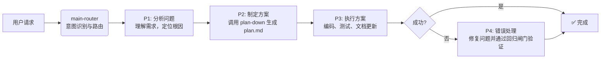

# Claude Code Zen MCP Skill Work

[](LICENSE)
[](https://github.com/VCnoC/Claude-Code-Zen-mcp-Skill-Work)

> 🚀 **一个为 AI 编程智能体设计的、开箱即用的规则体系与技能包。**

本项目不仅仅是工具的集合，更是一套标准化的工作流程和质量保障机制。它通过智能路由、多阶段工作流和自动化代码审查，赋能 AI 智能体以更高效、更可靠的方式完成复杂的编程任务。

---

## ✨ 核心特性
- 🔗 **CLI 桥接能力**: 使 AI 智能体能通过 Zen MCP 自主调用外部命令行工具（如 Codex CLI, Gemini CLI），实现跨工具协作。
- 🧠 **智能路由 (`main-router`)**: 根据用户意图自动选择最合适的技能，是整个系统的“大脑”。
- 📊 **结构化工作流 (P1-P4)**: 将复杂的开发任务分解为分析、方案、执行、修复四个标准阶段，确保流程清晰可控。
- 📝 **自动化规划 (`plan-down`)**: 告别手动任务分解，自动生成结构化的 `plan.md`，并支持多模型验证。
- 🔍 **5维代码审查 (`codex-code-reviewer`)**: 从质量、安全、性能、架构和文档五个维度对代码进行全面审查和打分。
- 📄 **专业文档生成 (`simple-gemini` & `deep-gemini`)**: 自动生成和维护项目知识库 (`PROJECTWIKI.md`)、变更日志 (`CHANGELOG.md`) 和深度技术分析报告。
- 🤖 **全自动模式**: 支持“一句话需求，全自动开发”模式，AI 可自主完成从规划到代码实现、审查、测试和文档更新的全过程。

## 🏗️ 工作原理

系统通过一个四阶段（P1-P4）的工作流来处理用户请求，由 `main-router` 统一调度。这个流程确保了每个任务都经过充分的分析、严谨的规划和严格的质量验证。



> 深入了解架构设计、状态机和数据模型，请查阅 **[PROJECTWIKI.md](./PROJECTWIKI.md)**。

## 🎯 核心技能包

本项目提供了一套即插即用的核心技能，每个技能都为 AI 智能体赋予一项专业能力。

| 技能 | 核心职责 | 主要产出 |
|-----------------------|------------------------------------|--------------------------------|
| `main-router` | **智能路由与任务调度** | 路由决策、全局状态管理 |
| `plan-down` | **任务分解与计划生成** | `plan.md` 文件 |
| `codex-code-reviewer` | **5维度代码质量审查与自动修复** | 质量报告、修复后的代码 |
| `simple-gemini` | **标准文档与测试代码生成** | `README`, `PROJECTWIKI`, 测试文件 |
| `deep-gemini` | **深度技术分析与报告生成** | 架构/性能分析报告 |

## 🚀 快速开始

### 1. 环境要求

- **[Python](https://www.python.org/)** >= 3.8**
- **[Git](https://git-scm.com/downloads)**

### 2. 安装步骤

本仓库包含了 **Zen MCP Server** 和 **核心技能包**，只需三步即可完成安装。

**第一步：克隆仓库**
```bash
git clone https://github.com/VCnoC/Claude-Code-Zen-mcp-Skill-Work.git
cd Claude-Code-Zen-mcp-Skill-Work
```

**第二步：运行一键安装脚本**

脚本将自动完成 Zen MCP Server 的安装、技能包的复制和全局规则的配置。

- **Linux / macOS**:
  ```bash
  chmod +x install.sh && ./install.sh
  ```
- **Windows**:
  ```powershell
  .\install.ps1
  ```

> **💡 提示**: 如果一键脚本不可用（例如从 GitHub 克隆的版本），请使用下面的手动安装步骤。

#### Linux / macOS 手动安装

```bash
# 1. 复制并安装 Zen MCP Server
cp -r zen-mcp-server ~/zen-mcp-server
cd ~/zen-mcp-server
pip3 install -r requirements.txt
cd ..

# 2. 复制技能包、共享资源和全局规则
mkdir -p ~/.claude/skills
cp -r skills/* ~/.claude/skills/
cp -r references ~/.claude/references
cp CLAUDE.md ~/.claude/CLAUDE.md
```

#### Windows 手动安装

```powershell
# 1. 复制并安装 Zen MCP Server
Copy-Item -Path ".\zen-mcp-server" -Destination "$env:USERPROFILE\zen-mcp-server" -Recurse
cd "$env:USERPROFILE\zen-mcp-server"
pip install -r requirements.txt
cd $OLDPWD

# 2. 复制技能包、共享资源和全局规则
New-Item -ItemType Directory -Path "$env:USERPROFILE\.claude\skills" -Force
Copy-Item -Path ".\skills\*" -Destination "$env:USERPROFILE\.claude\skills\" -Recurse
Copy-Item -Path ".\references" -Destination "$env:USERPROFILE\.claude\references" -Recurse
Copy-Item -Path ".\CLAUDE.md" -Destination "$env:USERPROFILE\.claude\CLAUDE.md"
```

### 3. 配置与启动

**第一步：配置 API Keys**

编辑位于 `~/zen-mcp-server/.env` (或 `%USERPROFILE%\zen-mcp-server\.env`) 的配置文件，填入您的 API Keys。

```dotenv
# OpenAI API Key (用于代码审查等)
OPENAI_API_KEY=sk-your-openai-api-key-here

# Google Gemini API Key (用于文档生成等)
GEMINI_API_KEY=your-gemini-api-key-here

# ⚠️ 强烈建议：指定允许的模型，避免意外高额费用
OPENAI_ALLOWED_MODELS=gpt-4-turbo,gpt-4o
```

**第二步：启动 Zen MCP Server**

```bash
cd ~/zen-mcp-server

# 推荐：使用启动脚本（自动配置环境）
# Linux/Mac 用户
chmod +x run-server.sh
./run-server.sh

# Windows 用户
.\run-server.ps1

# 或直接运行
python3 server.py        # Linux/Mac
python server.py         # Windows

启动脚本会提供交互式配置选项，根据实际情况选择后，会自动将 MCP 配置写入 .claude.json 文件
```

### 4. 重启 Claude code

完全关闭 Claude code，然后重新启动。

---

## ✅ 验证安装

启动 Claude code，输入：

```
请使用 main-router 帮我分析当前可用的技能
```

如果能看到 `main-router`, `plan-down` 等5个技能的详细说明，则表示安装成功！

---

## 📖 使用示例

### 交互模式 (默认)

在默认模式下，AI 会在关键决策点寻求您的确认，确保您对开发过程有完全的控制。

**示例：**
> `帮我重构一下 auth.py 文件，提高其可读性。`

**AI 的响应流程：**
1.  **P1 分析**: AI 分析 `auth.py`，识别出可重构的关键区域（如复杂的函数、重复的代码块）。
2.  **P2 方案**: AI 提出一个重构计划（`plan.md`），例如：“将 `authenticate_user` 函数拆分为三个独立的私有函数”，并等待您的批准。
3.  **P3 执行**: 在您确认后，AI 执行重构，并通过 `codex-code-reviewer` 验证代码质量。

### 全自动模式

对于信任度高的任务，您可以授权 AI 全自动完成，无需人工干预。

**示例：**
> `全程自动化，为我的 Flask 应用增加一个使用 SQLite 的用户注册功能，测试覆盖率不低于85%。`

**AI 的响应流程：**
1.  **自动规划**: AI 调用 `plan-down` 制定详细的开发步骤。
2.  **自动执行**: 创建数据库模型、编写后端路由、生成前端模板。
3.  **自动审查与测试**: 每一步代码都由 `codex-code-reviewer` 自动审查。AI 还会调用 `simple-gemini` 编写测试用例，确保覆盖率达到85%。
4.  **自动记录**: 所有决策和操作都会被记录在 `auto_log.md` 中，供您随时审计。

---

## 💡 核心理念

本项目的规则和技能设计遵循以下核心理念，这些理念定义在全局配置文件 `CLAUDE.md` 中。

- **G1: 文档一等公民**: 代码的任何变更都必须同步更新到 `PROJECTWIKI.md` 和 `CHANGELOG.md`，确保文档与代码的绝对一致。
- **G8: 强制技能使用 (反偷懒原则)**: 关键任务（如规划、代码审查、文档生成）必须由最专业的技能执行，杜绝“主模型”直接处理，以保证输出质量。
- **G9: 可量化的质量目标**: 所有开发活动都应围绕明确的质量指标进行，例如，测试覆盖率目标 (`coverage_target`) 必须在任务开始时设定。

---

## 📚 文档中心

| 文档 | 内容描述 |
|----------------------------------------------------------------|----------------------------------------------------------|
| **[PROJECTWIKI.md](./PROJECTWIKI.md)** | **项目知识库 (核心)**：架构设计、决策记录、模块文档。 |
| **[CLAUDE.md](./CLAUDE.md)** | **全局规则**: 定义了 G1-G11 全局规则和 P1-P4 工作流。 |
| **[CHANGELOG.md](./CHANGELOG.md)** | **变更日志**: 记录了项目的所有版本变更历史。 |
| **[skills/shared/tool_parameter_contract.md](./skills/shared/tool_parameter_contract.md)** | **工具参数契约**: Zen MCP Server 中所有工具的详细参数说明。 |

---

## 🙏 致谢

本项目的实现离不开以下优秀开源项目的启发和支持：

- **[HelloAgents](https://github.com/hellowind777/helloagents)**: 提供了 `AGENTS.md` 规范和多阶段工作流的初始设计理念。
- **[Zen MCP Server](https://github.com/BeehiveInnovations/zen-mcp-server)**: 提供了稳定可靠的 MCP 服务器实现。

---

## 📄 许可证

本项目采用 [Apache 2.0 License](LICENSE)。
