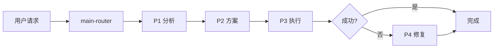

# Claude Code Zen mcp Skill Work

> 面向 AI 编程智能体的技能包集合

## 📋 项目简介

本项目基于 [Zen MCP Server](https://github.com/BeehiveInnovations/zen-mcp-server) 构建，采用多阶段工作流（P1-P4）的 AI 智能体技能系统。通过智能路由自动选择最合适的工具处理编程任务，借助 Zen MCP 可在 Claude 中调用 Codex 和 Gemini CLI 处理相关任务。

> **⚠️ 重要配置提示**  
> 1. **API Keys 配置**：安装前请在环境变量中设置 `OPENAI_API_KEY` 和 `GEMINI_API_KEY`
> 2. **Zen MCP 配置**：在 `zen-mcp/.env` 中：
>    - 设置 `OPENAI_ALLOWED_MODELS=` 指定使用的模型
>    - 在 `DISABLED_TOOLS` 中删除 `docgen` 以启用文档生成
> 3. **全局规则**：将 `CLAUDE.md` 复制到 `~/.claude/CLAUDE.md`（仅需一次）

**核心特性**：
- 🧠 智能路由 - 自动选择最佳技能
- 📊 多阶段工作流 - P1(分析) → P2(方案) → P3(执行) → P4(修复)
- 🔍 5 维代码审查 - 质量、安全、性能、架构、文档
- 📝 文档自动生成 - README、测试代码、项目文档

---

## 📁 项目结构

```
Claude-Code-Zen-mcp-Skill-Work/
├── skills/                          # 技能包目录
│   ├── main-router.zip             # 智能路由和技能匹配
│   ├── plan-down.zip               # 任务分解和计划生成
│   ├── codex-code-reviewer.zip     # 代码质量审查（5维度）
│   ├── simple-gemini.zip           # 标准文档生成
│   └── deep-gemini.zip             # 深度技术分析
├── AGENTS.md                        # 项目级阶段规则（P1-P4）
├── CLAUDE.md                        # 全局规则模板（需配置到 Claude）
└── README.md                       # 项目说明（本文件）
```

**目录说明**：
- `skills/` - 包含 5 个压缩的技能包，需解压后安装到 `~/.claude/skills/`
- `CLAUDE.md` - **全局规则**，需复制到 `~/.claude/CLAUDE.md`，适用于所有项目
- `AGENTS.md` - **项目级规则**，放在项目根目录，定义 P1-P4 阶段工作流

---

## 🎯 技能清单

本项目包含 5 个核心技能包（位于 `skills/` 目录）：

### 1. main-router
智能路由和技能匹配，负责意图分析和任务调度。

### 2. plan-down
智能任务分解和执行计划生成，输出结构化的 `plan.md`。

### 3. codex-code-reviewer
代码质量审查，提供 5 维度检查（质量、安全、性能、架构、文档）。

### 4. simple-gemini
标准文档生成，用于 README、PROJECTWIKI、CHANGELOG 和测试代码。

### 5. deep-gemini
深度技术分析，提供架构分析、性能优化建议等。

---

## 🏗️ 工作流程



**四个阶段**：
- **P1 分析问题** - 理解需求，定位根因
- **P2 制定方案** - 设计解决方案，调用 plan-down 生成计划
- **P3 执行方案** - 实施代码，调用 codex 检查，调用 gemini 生成文档
- **P4 错误处理** - 修复问题，验证修复

---

## 🚀 快速开始

### 环境要求

**必需组件**：
- [Claude Desktop](https://claude.ai/download) - AI 编程助手
- [Git](https://git-scm.com/downloads) - 版本控制工具
- [Node.js](https://nodejs.org/) >= 14.0.0 - 运行环境

**自动安装项**（脚本会自动下载）：
- [Zen MCP Server](https://github.com/BeehiveInnovations/zen-mcp-server) - MCP 服务器（自动下载）
- 5 个技能包（自动安装）
- 全局配置文件（自动配置）

### 一键安装 ⭐ 推荐

#### 方式 1: NPM 安装（跨平台）

```bash
# 方法 A: 使用 npx（无需下载仓库）
npx claude-code-zen-installer

# 方法 B: 克隆仓库后安装
git clone https://github.com/VCnoC/Claude-Code-Zen-mcp-Skill-Work.git
cd Claude-Code-Zen-mcp-Skill-Work
npm install
node install.js
```

#### 方式 2: Shell 脚本（Linux/Mac）

```bash
git clone https://github.com/VCnoC/Claude-Code-Zen-mcp-Skill-Work.git
cd Claude-Code-Zen-mcp-Skill-Work
chmod +x install.sh
./install.sh
```

#### 方式 3: PowerShell 脚本（Windows）

```powershell
git clone https://github.com/VCnoC/Claude-Code-Zen-mcp-Skill-Work.git
cd Claude-Code-Zen-mcp-Skill-Work
.\install.ps1
```

**安装脚本会自动完成**：
1. ✅ 下载并安装 Zen MCP Server
2. ✅ 解压并安装 5 个技能包到 `~/.claude/skills/`
3. ✅ 复制 CLAUDE.md 到 `~/.claude/CLAUDE.md`
4. ✅ 配置 Claude Desktop 的 MCP 连接（可选）
5. ✅ 创建 `.env` 配置模板

### 配置 API Keys

安装完成后，需要配置 API Keys：

**1. Zen MCP Server 配置**：
编辑 `~/zen-mcp-server/.env`：
```bash
OPENAI_API_KEY=sk-your-openai-api-key-here
GEMINI_API_KEY=your-gemini-api-key-here
```

**2. Claude Desktop 配置**：
编辑配置文件中的 API Keys：
- **Windows**: `%APPDATA%\Claude\claude_desktop_config.json`
- **macOS**: `~/Library/Application Support/Claude/claude_desktop_config.json`
- **Linux**: `~/.config/Claude/claude_desktop_config.json`

> 📌 **获取 API Key**：
> - OpenAI: https://platform.openai.com/api-keys
> - Google Gemini: https://makersuite.google.com/app/apikey

### 启动服务

```bash
# 启动 Zen MCP Server
cd ~/zen-mcp-server
npm start
```

然后重启 Claude Desktop。

### 验证安装

启动 Claude Desktop，在对话中输入：
```
请使用 main-router 帮我分析当前可用的技能
```

如果看到 5 个技能包（main-router、plan-down、codex-code-reviewer、simple-gemini、deep-gemini），说明安装成功。

---

## 🛠️ 手动安装（可选）

如果自动安装失败，可以手动安装：

### 1. 安装 Zen MCP Server

```bash
git clone https://github.com/BeehiveInnovations/zen-mcp-server.git ~/zen-mcp-server
cd ~/zen-mcp-server
npm install
```

### 2. 安装技能包

```bash
# 下载本项目
git clone https://github.com/VCnoC/Claude-Code-Zen-mcp-Skill-Work.git
cd Claude-Code-Zen-mcp-Skill-Work

# 解压并复制技能包
unzip skills/main-router.zip -d ~/.claude/skills/
unzip skills/plan-down.zip -d ~/.claude/skills/
unzip skills/codex-code-reviewer.zip -d ~/.claude/skills/
unzip skills/simple-gemini.zip -d ~/.claude/skills/
unzip skills/deep-gemini.zip -d ~/.claude/skills/

# Windows 用户使用 PowerShell:
# Expand-Archive -Path skills\*.zip -DestinationPath $env:USERPROFILE\.claude\skills\
```

### 3. 复制全局配置

```bash
cp CLAUDE.md ~/.claude/CLAUDE.md

# Windows 用户:
# Copy-Item CLAUDE.md $env:USERPROFILE\.claude\CLAUDE.md
```

---

## 📖 使用方式

**交互模式**：
```
用户：帮我分析这个功能
→ AI 自动进入 P1 分析
→ 输出分析报告
→ 等待用户确认后进入 P2/P3
```

**全自动模式**：
```
用户：全程自动化，开发注册功能
→ AI 自动完成 P1→P2→P3 全流程
→ 自动调用技能（plan-down、codex、gemini）
→ 生成 auto_log.md 决策日志
```

---

## ⚙️ 详细配置说明

### Zen MCP Server 配置

#### 1. 配置 API Keys

编辑 `zen-mcp-server/.env` 文件：

```bash
# OpenAI API Key（必需，用于 codex-code-reviewer）
OPENAI_API_KEY=sk-your-openai-api-key-here
OPENAI_ALLOWED_MODELS=gpt-4,gpt-4-turbo,o1-mini,o1-preview

# Google Gemini API Key（可选，用于 simple-gemini 和 deep-gemini）
GEMINI_API_KEY=your-gemini-api-key-here

# 其他配置
DISABLED_TOOLS=  # 删除 docgen 以启用文档生成
```

> 📌 **获取 API Key**：
> - OpenAI: https://platform.openai.com/api-keys
> - Google Gemini: https://makersuite.google.com/app/apikey

#### 2. 配置 Claude Desktop

编辑 Claude Desktop 的 MCP 配置文件：

**Windows**: `%APPDATA%\Claude\claude_desktop_config.json`  
**macOS**: `~/Library/Application Support/Claude/claude_desktop_config.json`

添加 Zen MCP Server：

```json
{
  "mcpServers": {
    "zen": {
      "command": "node",
      "args": ["/path/to/zen-mcp-server/build/index.js"],
      "env": {
        "OPENAI_API_KEY": "sk-your-key-here",
        "GEMINI_API_KEY": "your-gemini-key-here"
      }
    }
  }
}
```

### 可选：CLI 工具安装（增强功能）

> 📝 **注意**：Zen MCP Server 已内置对 Codex 和 Gemini 的 API 调用支持，无需额外安装 CLI 工具。
> 
> 以下 CLI 工具仅在需要本地命令行调试时安装：

#### Gemini CLI（可选）

```bash
npm install -g @google/gemini-cli
gemini --version
```

#### Codex CLI（可选）

```bash
npm install -g @openai/codex
codex --version
```

**参考**：
- [google-gemini/gemini-cli](https://github.com/google-gemini/gemini-cli)
- [openai/codex](https://github.com/openai/codex)

---

## 📚 相关文档

| 文档 | 说明 |
|------|------|
| [QUICKSTART.md](QUICKSTART.md) | ⭐ 3 分钟快速开始指南 |
| [AGENTS.md](AGENTS.md) | 全局规则和 P1-P4 阶段定义 |
| [CLAUDE.md](CLAUDE.md) | 全局工作流规则（需复制到 `~/.claude/`） |
| [CHANGELOG.md](CHANGELOG.md) | 变更日志 |

---

## 💡 主要规则

1. **强制技能使用**
   - 生成 plan.md → 必须用 plan-down
   - 代码完成后 → 必须用 codex-code-reviewer
   - 生成文档 → 必须用 simple-gemini

2. **文档一等公民**
   - 代码变更时必须同步更新 PROJECTWIKI.md 和 CHANGELOG.md
   - 建立代码与文档的双向链接

3. **低风险执行**
   - P3 执行前需满足：代码≤200行、文件≤5个、无破坏性变更

---

## 📄 许可证

MIT License

---

## 🙏 致谢

感谢以下项目和贡献者：

- **[HelloAgents](https://github.com/hellowind777/helloagents)** - 提供了 AGENTS.md 规范和多阶段工作流设计
- **[Zen MCP Server](https://github.com/BeehiveInnovations/zen-mcp-server)** - 提供了 MCP 服务器实现和技能包架构参考

