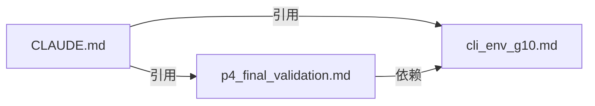

# 标准文档索引（Standards Index）

> 从 CLAUDE.md 中抽取的复杂操作规范，保持主文档简洁的同时提供完整的技术细节。

## 可用标准

| 文件名 | 全局规则 | 用途 | 版本 |
|--------|---------|------|------|
| `cli_env_g10.md` | G10 | 环境自适应 CLI 调用（4 步流程 + 参数合同） | v1.0.0 |
| `p4_final_validation.md` | P4 | P4 最终质量验证（3 步强制验证流程） | v1.0.0 |

## 依赖关系

## SSOT 原则

- 每个概念/规范只在一处定义，其他地方通过引用指向
- 简单概念（5-6 行）：保留在 CLAUDE.md「共享概念速查」中
- 复杂规范（多步骤操作）：抽取到本目录独立文档
