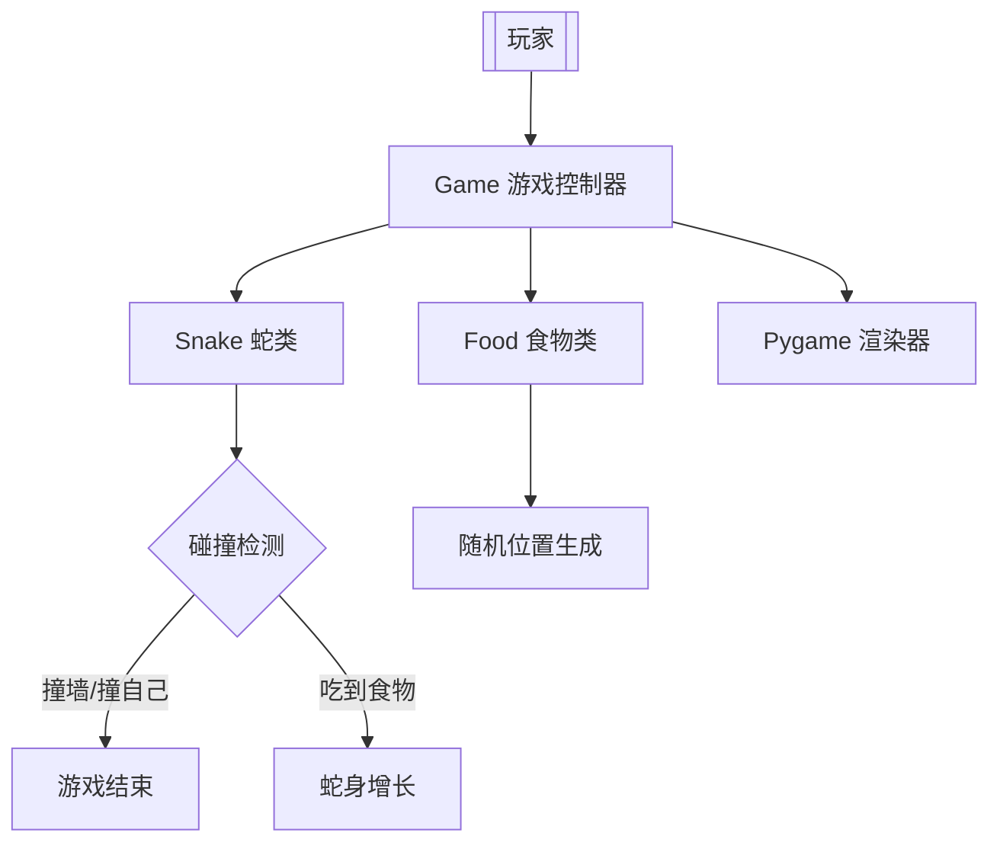
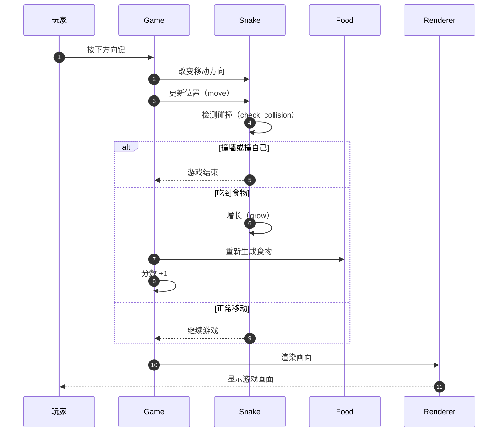
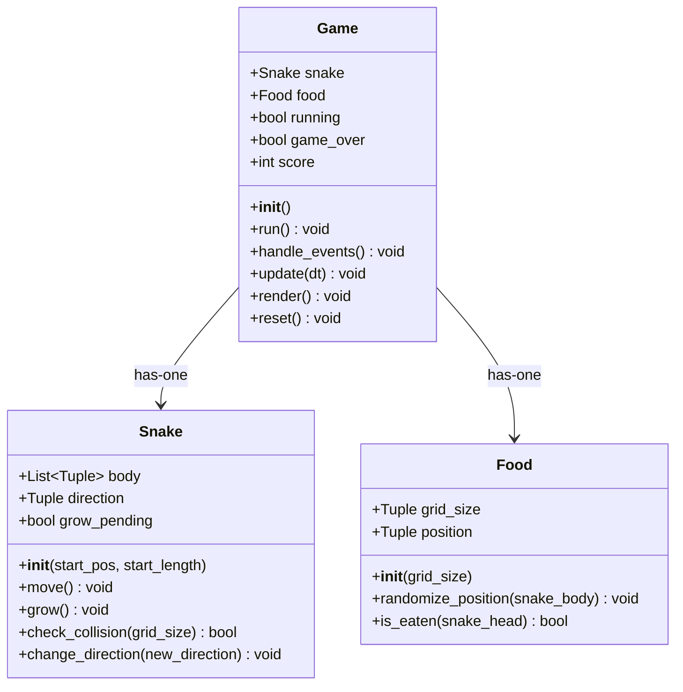
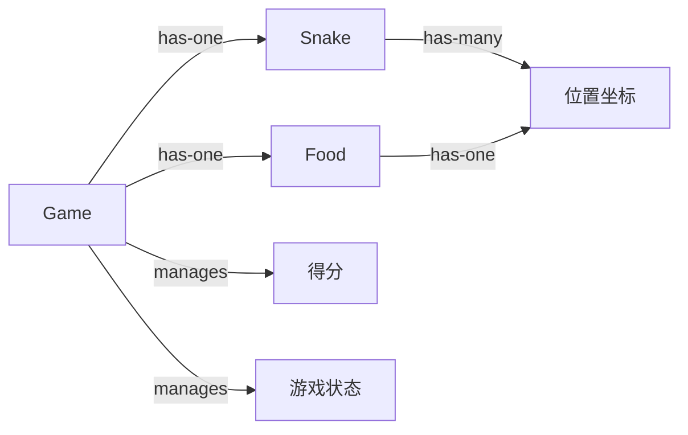

# PROJECTWIKI.md - 贪吃蛇游戏项目知识库

> 最后更新：2025-11-15

## 1. 项目概述

**目标（Goal）**：开发一个完整的贪吃蛇游戏（Python + Pygame）

**背景（Background）**：经典贪吃蛇游戏的 Python 实现，用于学习游戏开发和 Python 编程

**范围（In-Scope）**：
- 蛇的移动控制（方向键/WASD）
- 食物随机生成和碰撞检测
- 游戏得分统计
- 碰撞检测（撞墙、撞自己）
- 图形界面渲染

**非目标（Out-of-Scope）**：
- 多人联机
- 关卡系统
- 音效
- 排行榜持久化

**角色 / 干系人（Stakeholders）**：开发者、玩家

**运行环境 / 平台**：Python 3.8+，需要图形界面环境

## 2. 架构设计

**总体说明**：采用面向对象设计，分为三个核心类：Snake（蛇）、Food（食物）、Game（游戏控制器）



**关键流程（游戏循环）**：



## 3. 架构决策记录（ADR）

**目录**：`docs/adr/`

**最新 ADR 列表**：
- **ADR-001** (20251115): 选择 Python + Pygame 技术栈
  - **决策**：使用 Python 3.8+ 和 Pygame 2.5.0 开发游戏
  - **理由**：Python 语法简洁，Pygame 成熟稳定，社区活跃，适合 2D 游戏开发
  - **影响**：开发效率高，跨平台性好

- **ADR-002** (20251115): 测试覆盖率目标设定为 85%
  - **决策**：要求测试覆盖率 ≥ 85%
  - **理由**：工业标准，确保代码质量和可维护性
  - **影响**：测试开发工作量增加，但降低了缺陷风险

- **ADR-003** (20251115): 配置集中化管理
  - **决策**：所有游戏配置参数集中在 config.py
  - **理由**：便于调整游戏参数，避免魔法数字，符合最佳实践
  - **影响**：代码可维护性提高，参数调整更灵活

## 4. 设计决策 & 技术债务

**当前技术债务清单**：
- 无（新项目）

**关键设计决策**：
1. **技术栈选择**：Python + Pygame
   - 理由：简单易学，Pygame 成熟稳定，适合 2D 游戏
2. **测试覆盖率目标**：≥ 85%
   - 理由：工业标准，确保代码质量
3. **配置分离**：config.py 集中管理所有配置
   - 理由：便于调整游戏参数，符合最佳实践

## 5. 模块文档

**类关系图**：



### Snake 类（✅ 已实现 - snake_game.py:14-77）
- **职责**：管理蛇的状态和行为
- **入口**：`__init__(start_pos, start_length=3)`
- **关键属性**：
  - `body: List[Tuple[int, int]]` - 蛇身坐标列表，头部在索引0
  - `direction: Tuple[int, int]` - 当前移动方向
  - `grow_pending: bool` - 是否在下次移动时增长
- **关键方法**：
  - `move()` - 根据方向移动蛇，处理增长逻辑
  - `grow()` - 标记下次移动时增长
  - `check_collision(grid_size)` - 碰撞检测（撞墙、撞自己）
  - `change_direction(new_direction)` - 改变方向（防止反向移动）
- **依赖**：config.py（INITIAL_SNAKE_LENGTH, DIRECTION_*）
- **风险**：碰撞检测逻辑需要重点测试边界条件
- **复杂度**：O(n) 移动操作，O(n) 碰撞检测

### Food 类（✅ 已实现 - snake_game.py:80-116）
- **职责**：管理食物的生成和碰撞检测
- **入口**：`__init__(grid_size)`
- **关键属性**：
  - `grid_size: Tuple[int, int]` - 网格大小
  - `position: Tuple[int, int]` - 食物当前位置
- **关键方法**：
  - `randomize_position(snake_body)` - 随机生成位置（避开蛇身）
  - `is_eaten(snake_head)` - 检测食物是否被吃
- **依赖**：config.py, random 模块
- **复杂度**：O(n) 随机位置生成（最坏情况）

### Game 类（✅ 已实现 - snake_game.py:119-231）
- **职责**：游戏主控制器，管理游戏循环和状态
- **入口**：`run()`
- **关键属性**：
  - `snake: Snake` - 蛇对象
  - `food: Food` - 食物对象
  - `running: bool` - 游戏是否运行中
  - `game_over: bool` - 游戏是否结束
  - `score: int` - 当前得分
  - `move_timer: int` - 移动定时器（毫秒）
  - `move_interval: int` - 移动间隔（毫秒）
- **关键方法**：
  - `run()` - 主游戏循环（事件→更新→渲染）
  - `handle_events()` - 处理键盘输入（方向键/WASD，空格重新开始）
  - `update(dt)` - 更新游戏状态（移动蛇、碰撞检测、吃食物）
  - `render()` - 渲染画面（蛇、食物、分数、游戏结束提示）
  - `reset()` - 重置游戏到初始状态
- **依赖**：Snake, Food, pygame, config.py
- **帧率控制**：使用 `clock.tick(FPS)` 控制帧率为 60 FPS
- **移动速度**：使用定时器控制蛇的移动速度（SNAKE_SPEED=10 格/秒）

## 6. API 手册

### Snake 类 API（✅ 已实现）

```python
class Snake:
    """蛇类：管理蛇的状态和行为"""

    body: List[Tuple[int, int]]  # 蛇身坐标列表，头部在索引0
    direction: Tuple[int, int]   # 当前移动方向
    grow_pending: bool           # 是否在下次移动时增长

    def __init__(self, start_pos: Tuple[int, int],
                 start_length: int = INITIAL_SNAKE_LENGTH) -> None:
        """初始化蛇

        Args:
            start_pos: 起始位置（grid 坐标）
            start_length: 初始长度（默认3）
        """

    def move(self) -> None:
        """根据当前方向移动蛇

        - 计算新头部位置
        - 在列表前端插入新头部
        - 如果不需要增长，移除尾部
        """

    def grow(self) -> None:
        """标记蛇在下次移动时增长"""

    def check_collision(self, grid_size: Tuple[int, int]) -> bool:
        """检测碰撞

        Args:
            grid_size: 网格大小（宽, 高）

        Returns:
            True 表示碰撞（撞墙或撞自己），False 表示未碰撞

        检测逻辑：
        - 撞墙：头部坐标超出网格边界
        - 撞自己：头部坐标在身体列表中出现
        """

    def change_direction(self, new_direction: Tuple[int, int]) -> None:
        """改变移动方向（防止反向移动）

        Args:
            new_direction: 新方向（dx, dy）

        防止反向逻辑：
        - 如果新方向与当前方向相反（相加为0），则忽略
        - 例如：正在向右时，不能直接向左
        """
```

### Food 类 API（✅ 已实现）

```python
class Food:
    """食物类：管理食物的生成和碰撞检测"""

    grid_size: Tuple[int, int]  # 网格大小
    position: Tuple[int, int]   # 食物当前位置

    def __init__(self, grid_size: Tuple[int, int]) -> None:
        """初始化食物

        Args:
            grid_size: 网格大小（宽, 高）

        初始化后自动随机生成位置
        """

    def randomize_position(self, snake_body: List[Tuple[int, int]]) -> None:
        """随机生成食物位置（避开蛇身）

        Args:
            snake_body: 蛇的身体坐标列表

        生成逻辑：
        - 在网格范围内随机生成坐标
        - 如果位置与蛇身重合，重新生成
        - 直到找到合法位置
        """

    def is_eaten(self, snake_head: Tuple[int, int]) -> bool:
        """检测食物是否被吃

        Args:
            snake_head: 蛇头坐标

        Returns:
            True 表示被吃，False 表示未被吃
        """
```

### Game 类 API（✅ 已实现）

```python
class Game:
    """游戏主控制器：管理游戏循环和状态"""

    snake: Snake           # 蛇对象
    food: Food             # 食物对象
    running: bool          # 游戏是否运行中
    game_over: bool        # 游戏是否结束
    score: int             # 当前得分
    move_timer: int        # 移动定时器（毫秒）
    move_interval: int     # 移动间隔（毫秒）

    def __init__(self) -> None:
        """初始化游戏

        - 初始化 Pygame
        - 创建窗口和时钟
        - 创建蛇和食物对象
        - 初始化游戏状态
        """

    def run(self) -> None:
        """运行游戏主循环

        循环流程：
        1. 处理事件（handle_events）
        2. 更新状态（update，仅在游戏未结束时）
        3. 渲染画面（render）
        4. 控制帧率（60 FPS）
        """

    def handle_events(self) -> None:
        """处理键盘输入和窗口事件

        支持的按键：
        - 方向键 / WASD：控制蛇的移动方向
        - 空格键：游戏结束后重新开始
        - 窗口关闭按钮：退出游戏
        """

    def update(self, dt: int) -> None:
        """更新游戏状态

        Args:
            dt: 距离上一帧的时间差（毫秒）

        更新逻辑：
        1. 累加移动定时器
        2. 达到移动间隔时移动蛇
        3. 检测碰撞，如有则游戏结束
        4. 检测是否吃到食物，如有则增长并重新生成食物
        """

    def render(self) -> None:
        """渲染游戏画面

        渲染内容：
        - 背景（黑色）
        - 蛇（头部亮绿色，身体深绿色）
        - 食物（红色）
        - 分数（左上角白色文字）
        - 游戏结束提示（屏幕中央）
        """

    def reset(self) -> None:
        """重置游戏到初始状态

        重置内容：
        - 重新创建蛇和食物对象
        - 重置分数为0
        - 重置游戏结束标志
        - 重置移动定时器
        """
```

## 7. 数据模型

**主要实体与关系**：



**核心数据结构**：
- **蛇身**: `List[Tuple[int, int]]` - 坐标列表，头部在索引0
- **食物位置**: `Tuple[int, int]` - 单个坐标
- **方向**: `Tuple[int, int]` - (dx, dy)，例如 (1, 0) 表示向右
- **游戏状态**: `bool` - running (True/False)

## 8. 核心流程

**游戏循环（Main Loop）**：

1. **事件处理**：检测键盘输入，改变蛇的移动方向
2. **状态更新**：
   - 蛇根据方向移动
   - 检测碰撞（撞墙、撞自己）
   - 检测是否吃到食物
   - 更新分数
3. **渲染**：绘制蛇、食物、分数、游戏结束提示
4. **帧率控制**：限制 FPS

**碰撞检测逻辑**：
- 撞墙：蛇头坐标超出网格边界
- 撞自己：蛇头坐标与身体任意节点重合

## 9. 依赖图谱

**内部依赖**：
- `main.py` → `snake_game.py` (Game 类)
- `snake_game.py` → `config.py`
- `tests/test_snake_game.py` → `snake_game.py`

**外部依赖**：
| 依赖库 | 版本 | 许可证 | 用途 |
|--------|------|--------|------|
| pygame | >=2.5.0 | LGPL | 游戏开发库 |
| pytest | >=7.4.0 | MIT | 测试框架 |
| pytest-cov | >=4.1.0 | MIT | 测试覆盖率 |

## 10. 维护建议

**运维**：
- 确保 Python 3.8+ 环境
- 确保有图形界面（非 SSH 终端）
- 使用虚拟环境安装依赖：`python -m venv venv && source venv/bin/activate && pip install -r requirements.txt`

**监控**：
- 测试覆盖率：运行 `pytest --cov=. --cov-report=term-missing`
- 代码质量：通过 codex-code-reviewer 检查

**容量**：
- 轻量级本地应用，无容量限制

**成本**：
- 零成本（开源项目）

## 11. 术语表和缩写

| 术语 | 定义 |
|------|------|
| Grid | 网格，游戏区域被划分为 30x30 的网格 |
| Snake Body | 蛇身，由多个网格坐标组成的列表 |
| FPS | Frames Per Second，每秒帧数 |
| Collision | 碰撞，包括撞墙和撞自己两种情况 |

| 缩写 | 全称 |
|------|------|
| FPS | Frames Per Second |
| RGB | Red Green Blue |

## 12. 变更日志

参见 `CHANGELOG.md`

**双向链接**：
- 本文档引用 CHANGELOG.md
- CHANGELOG.md 引用本文档相关章节

**最新变更摘要**：
- 2025-11-15: v1.0.0 初始版本发布
  - 完成核心游戏逻辑（Snake, Food, Game）
  - 完成测试代码（98% 覆盖率，56 个测试用例全部通过）
  - 完成项目文档（README, PROJECTWIKI, CHANGELOG）

---

**文档状态**：v1.0（Phase 5 完成）
**最后更新**：2025-11-15 - 补全所有 12 个章节，完善 ADR 列表
**贡献者**：Claude Code (全自动模式生成)
