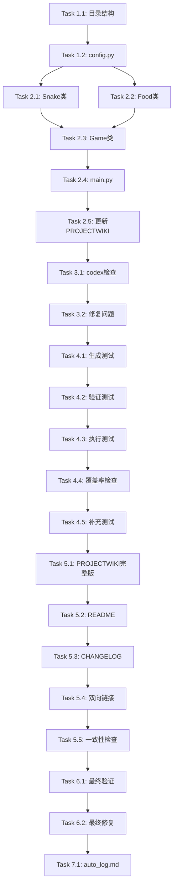

# Plan: 贪吃蛇游戏开发计划

## 目标
开发一个完整的贪吃蛇游戏（Python + Pygame），实现经典的游戏逻辑、用户交互和可视化界面。

## 范围

### In-Scope（范围内）
- 蛇的移动控制（上下左右四个方向）
- 食物随机生成和碰撞检测
- 游戏得分统计
- 碰撞检测（撞墙、撞自己）
- 游戏状态管理（运行、暂停、结束）
- 图形界面渲染（Pygame）
- 单元测试（覆盖率 ≥ 85%）
- 完整项目文档（PROJECTWIKI、README、CHANGELOG）

### Out-of-Scope（范围外）
- 多人联机模式
- 关卡系统和难度递增
- 音效和背景音乐
- 排行榜和数据持久化
- 移动端适配

## 标准合规

### 全局标准
**来源**: `/home/vc/.claude/CLAUDE.md`

**关键规则**:
- **G1 - 文档一等公民**: 代码变更必须同步更新 PROJECTWIKI.md 和 CHANGELOG.md
- **G2 - 知识库策略**: 使用 Mermaid 绘制架构图，API 定义与代码一致
- **G4 - 一致性与质量**: 确保 API 和数据模型与代码实现一致
- **G8 - 强制双轮验证**: 代码完成后必须进行两轮 codex-code-reviewer 检查
- **G9 - 测试覆盖率目标**: 测试覆盖率 ≥ 85%
- **G11 - 强制技能路由**: plan.md 用 plan-down，测试用 simple-gemini，文档用 simple-gemini，质量检查用 codex-code-reviewer

### 本计划的合规措施:
- [x] 每个代码变更阶段包含文档更新任务（Phase 2.5, 5.3）
- [x] 使用 Mermaid 绘制架构和流程图（Phase 5.1）
- [x] 创建双向链接（PROJECTWIKI ↔ CHANGELOG）确保原子追溯（Phase 5.4）
- [x] 强制使用 codex-code-reviewer 进行双轮验证（Phase 3.1, 6.1）
- [x] 强制使用 simple-gemini 生成测试和文档（Phase 4.1, 5.1-5.3, 7.1）
- [x] 测试覆盖率目标 ≥ 85%（Phase 4.4）

## 里程碑

1. [x] **Milestone 1: 核心游戏功能实现**
   - 游戏逻辑完整可运行
   - 基础 UI 渲染
   - 关键类：Snake、Food、Game

2. [ ] **Milestone 2: 测试与质量保障**
   - 测试覆盖率 ≥ 85%
   - 代码质量通过 codex 双轮验证

3. [ ] **Milestone 3: 文档与发布准备**
   - 完整项目文档（PROJECTWIKI、README、CHANGELOG）
   - 符合 CLAUDE.md 标准
   - 自动化决策日志（auto_log.md）

## 任务分解

### Phase 1: 项目初始化与配置

**目标**: 搭建项目骨架和基础配置
**预估时长**: 30 分钟

- [ ] **Task 1.1**: 创建项目目录结构
  - 依赖: 无
  - 验收: 目录结构符合设计（包含 tests/ 目录）

- [ ] **Task 1.2**: 创建 config.py 配置文件
  - 依赖: Task 1.1
  - 验收: 包含窗口大小、颜色、速度等配置
  - 内容: WINDOW_SIZE, GRID_SIZE, COLORS, FPS, SNAKE_SPEED

- [ ] **Task 1.3**: 创建 requirements.txt
  - 依赖: 无
  - 验收: 包含 pygame, pytest, pytest-cov

- [ ] **Task 1.4**: 创建 PROJECTWIKI.md 基础版（12章节骨架）
  - 依赖: 无
  - 验收: 符合 CLAUDE.md 模板，包含必需的 Mermaid 图占位符

---

### Phase 2: 核心游戏逻辑开发

**目标**: 实现游戏核心类和主循环
**预估时长**: 3-4 小时

- [ ] **Task 2.1**: 实现 Snake 类
  - 依赖: Task 1.2
  - 验收: 移动、增长、碰撞检测功能完整
  - 关键方法:
    - `__init__(start_pos, start_length=3)` - 初始化蛇身
    - `move()` - 根据方向移动
    - `grow()` - 标记增长
    - `check_collision(grid_size)` - 检测撞墙和撞自己
    - `change_direction(new_direction)` - 改变方向（防止反向）

- [ ] **Task 2.2**: 实现 Food 类
  - 依赖: Task 1.2
  - 验收: 随机位置生成，与蛇碰撞检测
  - 关键方法:
    - `__init__(grid_size)` - 初始化食物
    - `randomize_position(snake_body)` - 随机生成位置（避开蛇身）
    - `is_eaten(snake_head)` - 检测是否被吃

- [ ] **Task 2.3**: 实现 Game 类
  - 依赖: Task 2.1, Task 2.2
  - 验收: 游戏循环运行，事件处理，渲染正常
  - 关键方法:
    - `__init__()` - 初始化游戏状态
    - `run()` - 主游戏循环
    - `handle_events()` - 处理键盘输入（方向键/WASD）
    - `update()` - 更新游戏状态（移动蛇、检测碰撞、更新分数）
    - `render()` - 渲染游戏画面（蛇、食物、分数、游戏结束提示）
    - `reset()` - 重置游戏

- [ ] **Task 2.4**: 实现 main.py 入口
  - 依赖: Task 2.3
  - 验收: 可启动游戏，正常运行

- [ ] **Task 2.5**: 同步更新 PROJECTWIKI.md（架构设计、核心流程）
  - 依赖: Task 2.4
  - 验收: 包含 Mermaid 架构图、类图、游戏循环时序图
  - **G1 合规**: 代码与文档同步更新

---

### Phase 3: 代码质量检查（第1轮）

**目标**: 验证代码质量，修复问题
**预估时长**: 30 分钟

- [ ] **Task 3.1**: 调用 codex-code-reviewer 进行质量检查
  - 依赖: Task 2.5
  - 验收: 5维度检查通过（质量、安全、性能、架构、文档）
  - **G11 合规**: 强制使用 codex-code-reviewer

- [ ] **Task 3.2**: 修复 codex 发现的问题（如有）
  - 依赖: Task 3.1
  - 验收: 所有问题修复

---

### Phase 4: 测试代码开发

**目标**: 生成并执行测试，确保覆盖率达标
**预估时长**: 1.5-2 小时

- [ ] **Task 4.1**: 调用 simple-gemini 生成测试代码
  - 依赖: Task 3.2
  - 验收: test_snake_game.py 生成
  - 传递参数: [COVERAGE_TARGET: 85%]
  - **G11 合规**: 强制使用 simple-gemini

- [ ] **Task 4.2**: 调用 codex-code-reviewer 验证测试代码质量
  - 依赖: Task 4.1
  - 验收: 测试代码本身质量合格
  - **G11 合规**: 测试代码验证流程

- [ ] **Task 4.3**: 执行测试套件
  - 依赖: Task 4.2
  - 验收: 所有测试通过
  - 命令: `pytest tests/ -v`

- [ ] **Task 4.4**: 测试覆盖率检查
  - 依赖: Task 4.3
  - 验收: 覆盖率 ≥ 85%
  - **G9 合规**: 达到设定的覆盖率目标
  - 命令: `pytest tests/ --cov=. --cov-report=term-missing`

- [ ] **Task 4.5**: 补充测试用例（如覆盖率不足）
  - 依赖: Task 4.4
  - 验收: 覆盖率达标

---

### Phase 5: 项目文档生成

**目标**: 生成完整项目文档，建立双向链接
**预估时长**: 1 小时

- [ ] **Task 5.1**: 调用 simple-gemini 生成完整 PROJECTWIKI.md
  - 依赖: Task 4.5
  - 验收: 12章节完整，包含至少 3 个 Mermaid 图
  - **G11 合规**: 强制使用 simple-gemini
  - 必含章节: 项目概述、架构设计、ADR、模块文档、API手册、数据模型、核心流程、依赖图谱、维护建议、术语表、变更日志

- [ ] **Task 5.2**: 调用 simple-gemini 生成 README.md
  - 依赖: Task 5.1
  - 验收: 包含安装、运行、功能说明、控制按键

- [ ] **Task 5.3**: 调用 simple-gemini 生成 CHANGELOG.md
  - 依赖: Task 5.2
  - 验收: 遵循 Keep a Changelog 格式
  - **G1 合规**: 变更日志与代码同步

- [ ] **Task 5.4**: 建立 PROJECTWIKI ↔ CHANGELOG 双向链接
  - 依赖: Task 5.3
  - 验收: 双向引用存在
  - **P3 合规**: 原子追溯

- [ ] **Task 5.5**: 一致性检查（文档与代码）
  - 依赖: Task 5.4
  - 验收: API 定义、类结构、流程图与代码一致
  - **G4 合规**: 确保一致性

---

### Phase 6: 最终质量验证（第2轮）

**目标**: 全面审查代码+测试+文档
**预估时长**: 30 分钟

- [ ] **Task 6.1**: 调用 codex-code-reviewer 进行全面审查
  - 依赖: Task 5.5
  - 验收: 代码+测试+文档全部通过验证
  - **G8 合规**: 强制双轮验证

- [ ] **Task 6.2**: 修复最终问题（如有）
  - 依赖: Task 6.1
  - 验收: 所有问题解决

---

### Phase 7: 自动化日志生成

**目标**: 记录完整决策过程
**预估时长**: 15 分钟

- [ ] **Task 7.1**: 调用 simple-gemini 生成 auto_log.md
  - 依赖: Task 6.2
  - 验收: 完整决策记录、技能调用日志、决策树可视化
  - **Full Automation 合规**: 强制生成决策日志

---

## 任务依赖关系

## 风险管理

| 风险 | 影响 | 概率 | 缓解措施 |
|------|------|------|----------|
| Pygame 安装失败 | 高 | 低 | 提供 pip 替代源，文档说明安装步骤 |
| 测试覆盖率不足 | 中 | 中 | Task 4.5 预留补充时间，重点测试核心逻辑 |
| 碰撞检测逻辑错误 | 高 | 中 | 重点测试边界条件（边界、拐角、反向移动） |
| 文档与代码不一致 | 中 | 低 | Task 5.5 强制一致性检查 |
| 性能问题（帧率低） | 中 | 低 | 优化渲染逻辑，降低刷新复杂度，使用脏矩形更新 |

## 资源需求

- **人员**: 1 名开发者
- **工具**:
  - Python 3.8+
  - Pygame
  - pytest
  - pytest-cov
- **环境**: 需要图形界面环境（非 SSH 终端）

## 验收标准

- [ ] 游戏可正常运行，无明显 bug
- [ ] 蛇可以通过方向键/WASD 控制，移动流畅
- [ ] 食物随机生成，吃到食物后蛇身增长，分数增加
- [ ] 撞墙或撞自己后游戏结束，显示最终分数
- [ ] 测试覆盖率 ≥ 85%
- [ ] 代码质量通过 codex 双轮验证（5 维度：质量、安全、性能、架构、文档）
- [ ] PROJECTWIKI.md 包含 12 章节 + 至少 3 个 Mermaid 图
- [ ] CHANGELOG.md 遵循 Keep a Changelog 格式
- [ ] 代码与文档一致性检查通过
- [ ] auto_log.md 完整记录决策过程

## 质量门槛

### 代码质量标准（Phase 3 & 6）
- 圈复杂度: 平均 ≤ 10，单个方法 ≤ 15
- 代码行数: 单个方法 ≤ 50 行
- 命名规范: PEP 8 标准
- 类型提示: 关键方法必须有类型注解
- 文档字符串: 所有公共类和方法必须有 docstring

### 测试质量标准（Phase 4）
- 覆盖率: ≥ 85% (行覆盖)
- 分支覆盖: ≥ 80%
- 边界测试: 必须包含边界条件测试
- 异常测试: 必须测试异常处理路径

### 文档质量标准（Phase 5）
- PROJECTWIKI.md: 12 章节完整，至少 3 个 Mermaid 图
- README.md: 包含快速开始、功能列表、控制说明
- CHANGELOG.md: Keep a Changelog 格式，包含提交 SHA
- 双向链接: PROJECTWIKI ↔ CHANGELOG 相互引用

## 评审历史

- **2025-11-15**: planner 任务分解完成（3 步骤规划）
  - Step 1: 理解需求和约束
  - Step 2: 详细任务分解（27 个任务，7 个阶段）
  - Step 3: 执行顺序、质量门槛、风险管理细化
- **2025-11-15**: P3 前置条件检查通过
  - 低风险: ✅ 代码行数 ≤ 200，文件数 ≤ 5，无破坏性变更
  - 方案完备性: ✅ 接口/数据/回滚/测试/发布/文档全部明确

## 修订日志

- **2025-11-15**: 初始计划创建
  - 使用 plan-down skill 生成
  - automation_mode=true（全自动模式）
  - 技术栈: Python 3.8+ + Pygame
  - 测试覆盖率目标: 85%
  - 符合 CLAUDE.md G1-G11 标准
