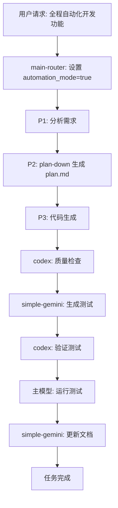

# auto_log.md 统一模板

> 用途：记录全自动化模式下的所有自动决策和自动修复操作，确保透明性和可追溯性。

---

## 模板说明

### 使用场景
- automation_mode=true 时，所有自动决策和自动修复操作必须记录到 `auto_log.md`
- 所有下游技能（main-router, simple-gemini, codex-code-reviewer 等）统一使用此模板
- 每次自动化任务完成后，由 simple-gemini 汇总生成最终日志

### 固定字段定义

| 字段名 | 必填 | 说明 | 示例值 |
|--------|------|------|--------|
| **时间戳** | 是 | 决策/修复发生的时间，格式：`YYYY-MM-DD HH:MM:SS` | `2025-01-13 14:30:25` |
| **阶段** | 是 | 当前所处阶段 | `P1`, `P2`, `P3`, `P4` |
| **技能名** | 是 | 执行决策的技能或工具名称 | `main-router`, `simple-gemini`, `codex-code-reviewer`, `plan-down` |
| **决策类型** | 是 | 决策的分类 | `路由决策`, `修复决策`, `生成文档`, `测试生成`, `质量检查`, `阶段推进`, `参数设置` |
| **决策内容** | 是 | 具体决策的描述 | `自动进入 P2 阶段`, `自动修复 SQL 注入漏洞`, `生成 plan.md` |
| **置信度** | 是 | 对决策的信心等级 | `certain`, `very_high`, `high`, `medium`, `low` |
| **标准依据** | 是 | 决策所依据的规则或标准 | `G9`, `G11`, `P3 前置条件`, `automation_mode=true` |
| **状态** | 是 | 决策执行结果 | `成功`, `失败`, `跳过`, `部分成功` |
| **输入参数** | 否 | 决策使用的输入参数 | `coverage_target=85%`, `model=gemini-2.5-pro` |
| **输出结果** | 否 | 决策产生的输出 | `plan.md 已生成`, `3 个问题已修复, 1 个问题已跳过` |
| **风险评估** | 否 | 识别的风险和影响范围 | `低风险: 仅影响测试代码`, `中风险: 可能影响业务逻辑` |
| **备注** | 否 | 额外说明或上下文信息 | `用户初始请求包含'全程自动化'关键词` |

---

## 标准模板格式

### 单条记录模板

```markdown
### [时间戳] [阶段] - [技能名]

**决策类型**: [决策类型]
**决策内容**: [具体描述]
**置信度**: [置信度等级]
**标准依据**: [规则编号或依据说明]
**状态**: [成功/失败/跳过/部分成功]

**输入参数**:
- [参数1]: [值1]
- [参数2]: [值2]

**输出结果**:
- [结果描述]

**风险评估**: [风险等级和影响范围]

**备注**: [额外信息]

---
```

### 完整日志文件结构

```markdown
# 自动化任务执行日志 (auto_log.md)

**任务标题**: [任务名称]
**开始时间**: [YYYY-MM-DD HH:MM:SS]
**结束时间**: [YYYY-MM-DD HH:MM:SS]
**automation_mode 状态**: true
**总决策数**: [N]
**成功数**: [N]
**失败数**: [N]
**跳过数**: [N]

---

## 执行摘要

[简要说明任务目标、执行过程和最终结果]

---

## 详细决策记录

### [时间戳] [阶段] - [技能名]

**决策类型**: [类型]
**决策内容**: [内容]
...

---

### [时间戳] [阶段] - [技能名]

**决策类型**: [类型]
**决策内容**: [内容]
...

---

## 输出文件清单

- `plan.md` - 任务规划文档
- `PROJECTWIKI.md` - 项目知识库
- `CHANGELOG.md` - 变更日志
- `src/main.py` - 主程序代码
- `tests/test_main.py` - 测试代码

---

## 问题与风险

### 已解决问题
- [问题1描述] - [解决方案]
- [问题2描述] - [解决方案]

### 已跳过问题
- [问题1描述] - [跳过原因]

### 潜在风险
- [风险1描述] - [建议的缓解措施]

---

## 质量指标

- **代码覆盖率**: [实际值]% / [目标值]%
- **代码质量评分**: [评分]
- **安全问题**: [数量] (Critical: [N], High: [N], Medium: [N], Low: [N])
- **性能问题**: [数量]

---

## 决策树 (可选)



---

## 后续建议

- [建议1]
- [建议2]

---

*本日志由 simple-gemini 于 [时间戳] 自动生成，遵循 references/auto_log_template.md 规范*
```

---

## 使用示例

### 示例 1: 路由决策记录

```markdown
### 2025-01-13 14:30:25 P1 - main-router

**决策类型**: 路由决策
**决策内容**: 检测到用户请求包含"全程自动化"关键词，自动设置 automation_mode=true
**置信度**: certain
**标准依据**: G11 自动化模式状态管理
**状态**: 成功

**输入参数**:
- 用户初始请求: "全程自动化，开发贪吃蛇游戏"
- 关键词检测: "全程自动化" (命中)

**输出结果**:
- automation_mode=true (全局状态已设置)
- 后续所有技能将继承此状态

**风险评估**: 低风险 - 自动化模式符合用户明确意图

**备注**: 用户首次明确要求全自动化，无需再次确认

---
```

### 示例 2: 阶段推进记录

```markdown
### 2025-01-13 14:31:05 P1→P2 - main-router

**决策类型**: 阶段推进
**决策内容**: P1 分析完成，无阻塞问题，自动进入 P2 阶段
**置信度**: high
**标准依据**: automation_mode=true + P1 分析完成无阻塞 (G11)
**状态**: 成功

**输入参数**:
- P1 分析结果: 需求明确，无技术障碍
- automation_mode: true

**输出结果**:
- 阶段切换: P1 → P2
- 调用 plan-down skill 生成 plan.md

**风险评估**: 低风险 - 需求分析充分，技术路线清晰

**备注**: 全自动化模式下，阶段推进无需用户确认

---
```

### 示例 3: 修复决策记录

```markdown
### 2025-01-13 14:45:30 P3 - codex-code-reviewer

**决策类型**: 修复决策
**决策内容**: 发现 4 个代码问题，自动修复 3 个，跳过 1 个
**置信度**: high
**标准依据**: automation_mode=true + G11 自动修复规则
**状态**: 部分成功

**输入参数**:
- automation_mode: true
- 检测到的问题:
  - SQL注入漏洞 (Critical)
  - 缺少异常处理 (Medium)
  - 变量命名不规范 (Low)
  - 业务逻辑优化建议 (Medium)

**输出结果**:
- 已修复 (3):
  - SQL注入: 使用参数化查询
  - 异常处理: 添加 try-except 块
  - 变量命名: 重命名为符合规范的名称
- 已跳过 (1):
  - 业务逻辑优化: 需要理解业务上下文，无法自动决策

**风险评估**: 中风险 - 已修复项均为安全且不影响业务逻辑的改动

**备注**: 业务逻辑相关问题记录到待办事项，建议人工审查

---
```

### 示例 4: 参数设置记录

```markdown
### 2025-01-13 14:32:10 P2 - main-router

**决策类型**: 参数设置
**决策内容**: 自动设置测试覆盖率目标为 85% (默认值)
**置信度**: certain
**标准依据**: G9 覆盖率目标管理 + automation_mode=true
**状态**: 成功

**输入参数**:
- automation_mode: true
- 用户未指定覆盖率目标

**输出结果**:
- coverage_target=85% (全局状态已设置)
- 传递格式: [COVERAGE_TARGET: 85%]

**风险评估**: 低风险 - 使用工业标准默认值，最低阈值保障为 70%

**备注**: 如果用户对覆盖率有特殊要求，可在交互模式下重新设置

---
```

---

## 质量检查清单

在生成 auto_log.md 时，确保满足以下条件：

- [ ] 所有必填字段均已填写
- [ ] 时间戳格式正确 (YYYY-MM-DD HH:MM:SS)
- [ ] 阶段标识正确 (P1/P2/P3/P4)
- [ ] 技能名准确无误
- [ ] 决策类型明确清晰
- [ ] 置信度等级合理
- [ ] 标准依据可追溯 (引用具体规则编号)
- [ ] 状态准确反映执行结果
- [ ] 输出文件清单完整
- [ ] 问题与风险部分完整记录
- [ ] 决策树（如有）准确反映执行流程
- [ ] 文件末尾包含生成时间和技能署名

---

## 引用此模板的位置

所有涉及自动决策和自动修复的技能文档中，应包含以下引用说明：

```markdown
**自动化日志记录（仅当 automation_mode=true 时）**:
- 所有自动决策和自动修复操作统一记录到 `auto_log.md`
- 字段与格式遵循 `references/auto_log_template.md` 规范
- 任务完成后由 simple-gemini 汇总生成最终日志
```

---

## 版本历史

- **v1.0** (2025-01-13): 初始版本，定义固定字段和标准格式
