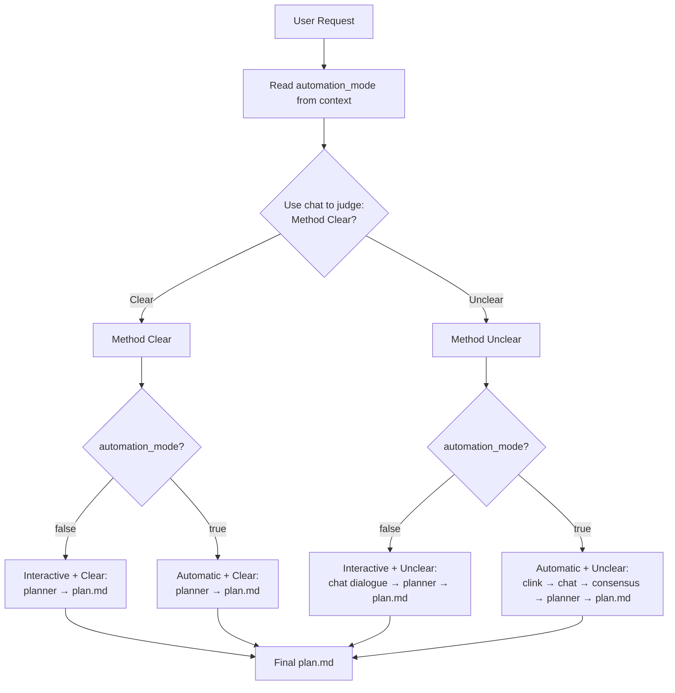
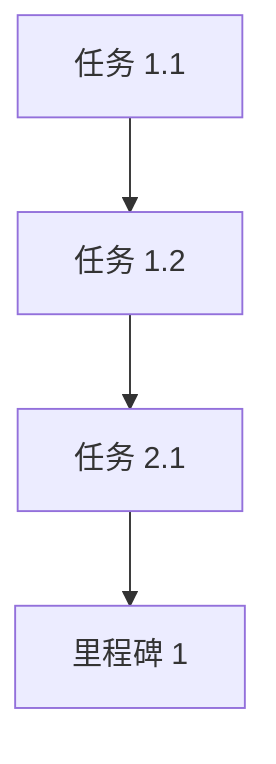

# Plan-Down - 方法驱动的四路径智能规划生成器

## Overview

This skill provides a comprehensive method clarity-driven planning workflow that intelligently adapts to both user interaction preference (Interactive/Automatic) and implementation method clarity (Clear/Unclear).

**Core Innovation:** Uses zen-mcp chat as decision module to assess whether user provides a "clear implementation method" before planning.

**Four Execution Paths:**
1. **Interactive + Clear**: Direct planning with user approval
2. **Interactive + Unclear**: Multi-round dialogue to clarify method, then plan
3. **Automatic + Clear**: Fully automated planning
4. **Automatic + Unclear**: AI chain (clink → chat → consensus) to enrich method, then plan

The final output is a complete `plan.md` file ready for implementation.

**Technical Architecture:**
- **zen-mcp chat**: Method clarity judgment + interactive clarification + deep thinking (via clink)
- **zen-mcp planner**: Interactive, sequential planning tool with revision and branching capabilities
- **zen-mcp consensus**: Multi-model method validation (only for Automatic + Unclear path)
- **Main Claude Model**: Context gathering, workflow orchestration, plan.md generation
- **User**: Provides ideas/requirements (interactive mode) or none (automatic mode)

**New Four-Path Workflow:**
```
User Request → Phase 0 (chat: Method Clear?) → [Conditional Phase 1] → Phase 2 (planner) → Phase 3 (plan.md)
                        ↓                              ↓
                   Clear / Unclear           Clear: Skip to Phase 2
                                            Unclear: Phase 1 (Clarify/Enrich)
                                                    ↓
                                            Interactive: Dialogue with user
                                            Automatic: clink → chat → consensus
```

**Division of Responsibilities:**

**Phase 0 (Method Clarity Assessment - ALWAYS):**
- **chat tool**: Judge if user provides clear implementation method
- **Main Claude**: Gather context from CLAUDE.md/PROJECTWIKI.md

**Phase 1 (Method Clarification/Enrichment - CONDITIONAL):**
- **Path A (Interactive + Unclear)**: chat multi-round dialogue with user to clarify
- **Path B (Automatic + Unclear)**: clink → gemini CLI → chat → consensus → synthesis
- **Main Claude**: Orchestrate clarification/enrichment process

**Phase 2 (Task Decomposition - ALL PATHS CONVERGE):**
- **planner tool**: Task breakdown, milestone definition, dependency mapping, structured planning
- **Main Claude**: Invoke planner with clear/enriched method

**Phase 3 (Final Plan Generation - ALL PATHS):**
- **Main Claude**: Generate and save plan.md directly from planner output (no intermediate review)

## When to Use This Skill

Trigger this skill when the user requests:
- "帮我制定计划"
- "生成 plan.md"
- "使用 planner 进行任务规划"
- "帮我做任务分解"
- "制定实施方案"
- "规划项目"
- Any request for systematic planning and task breakdown

**Use Cases:**
- Feature development planning
- Project implementation roadmaps
- Refactoring strategies
- Migration plans
- Research initiatives
- Complex task breakdowns

## Operation Mode (Based on Router's automation_mode)

**🚨 CRITICAL**: This skill **MUST read** the `automation_mode` status from the context set by main-router. **DO NOT** ask the user about automation preference or check for trigger phrases - this is handled exclusively by the router.

### Mode Detection (READ ONLY - Three-Layer Architecture)

**Layer 1: Router (Global Truth Source)**
- Only the main-router judges and sets `automation_mode` based on initial request
- Status is set once at task start and remains unchanged throughout lifecycle

**Layer 2: Transmission**
- Router passes `automation_mode` status to this skill via context
- Format: `[AUTOMATION_MODE: true]` or `[AUTOMATION_MODE: false]`

**Layer 3: Skill (READ ONLY - This Skill)**

**✅ MUST DO:**
- Read `automation_mode` from context passed by router
- Adjust behavior based on the status:
  - `automation_mode=true` → Auto-approve all decisions (plan outline, consensus feedback), log to auto_log.md
  - `automation_mode=false` → Interactive confirmation required

**❌ ABSOLUTELY FORBIDDEN:**
- ❌ Ask user "是否需要自动化执行？"
- ❌ Check user's initial request for automation keywords
- ❌ Modify the automation_mode status set by router
- ❌ Re-detect automation triggers during execution

## Workflow: Intelligent Planning Process with Method Clarity Assessment

### Overview: Decision Flow Based on Method Clarity



### Phase 0: Method Clarity Assessment (CRITICAL - First Step)

**Main Claude's Action:**

1. **Read automation_mode from context** (passed by main-router)
   - Format: `[AUTOMATION_MODE: true]` or `[AUTOMATION_MODE: false]`

2. **Gather Initial Context:**

   **a) Read Global Standards (CRITICAL):**
   - **Global CLAUDE.md**: `/home/vc/.claude/CLAUDE.md` - 全局规则 (G1-G11)、阶段要求 (P1-P4)、模型开发工作流

   **b) Read Project-Specific Standards (if exist):**
   - **Project CLAUDE.md**: `./CLAUDE.md` - 项目特定规则和流程

   **c) Read Project Documentation:**
   - PROJECTWIKI.md - 项目知识库
   - README.md - 项目概述
   - plan.md (如果存在) - 现有计划
   - docs/adr/*.md - 架构决策记录

   **Standards Priority (when conflicts):**
   1. Global CLAUDE.md (最高优先级)
   2. Project CLAUDE.md
   5. PROJECTWIKI.md

3. **Invoke zen-mcp chat to assess method clarity:**

   ```
   Tool: mcp__zen__chat
   Parameters:
   - prompt: "分析以下用户请求，判断其是否包含'清晰的实践方法'：

     用户请求：[用户的原始输入]

     已收集的项目上下文：
     - 项目类型：[from PROJECTWIKI/README]
     - 技术栈：[from context]
     - 现有规范：[from CLAUDE.md]

     判断标准：
     - '方法清晰' = 用户明确说明了要做什么、怎么做、关键步骤是什么
     - '方法模糊' = 用户只提供了目标/想法，但缺少具体实施路径

     请输出：'方法清晰' 或 '方法模糊'，并简要说明理由。"

   - working_directory: "."
   - model: "gemini-2.5-pro" (or user-specified model)
   ```

**Output:**
- "方法清晰" → Proceed to Phase 2 (Direct Planning)
- "方法模糊" → Proceed to Phase 1 (Method Clarification/Enrichment)

---

### Phase 1: Method Clarification / Enrichment (Conditional - Only if Method Unclear)

**This phase is SKIPPED if Phase 0 determined "方法清晰"**

**Decision Tree Based on automation_mode:**

#### Path A: Interactive Mode (automation_mode = false) + Method Unclear

**Main Claude's Action:**

```
使用 mcp__zen__chat 与用户进行多轮对话，澄清实践方法：

Tool: mcp__zen__chat
Parameters:
- prompt: "您提到要[用户目标]，让我帮您明确具体的实践方法：

  当前理解：
  - 目标：[user's goal]
  - 已知上下文：[project context]

  需要澄清的问题：
  1. 具体要实现哪些功能/步骤？
  2. 优先级是什么？
  3. 是否有技术偏好或约束？
  4. 预期的里程碑和时间线？

  请提供更多细节，我将帮您整理成清晰的实践方案。"

- working_directory: "."
- model: "gemini-2.5-pro"
- continuation_id: [maintain conversation context]
```

**Iteration:**
- Continue chat dialogue until user provides clear implementation method
- Main Claude synthesizes user responses into structured requirements
- Once clear → Proceed to Phase 2 (planner)

**Output:** Clarified implementation method ready for planning

---

#### Path B: Automatic Mode (automation_mode = true) + Method Unclear

**Main Claude's Action - Full Auto-Enrichment Chain:**

**Step 1: Launch chat via clink for deep thinking**

```
Tool: mcp__zen__clink
Parameters:
- cli_name: "gemini"  # Using gemini CLI for deep analysis
- prompt: "基于以下模糊想法，进行深度思考并形成清晰的实践方法：

  用户想法：[用户的原始输入]

  项目上下文：
  - 技术栈：[from context]
  - 现有架构：[from PROJECTWIKI]
  - 规范要求：[from CLAUDE.md]

  请进行以下思考：
  1. 这个想法的核心目标是什么？
  2. 有哪些可行的实现路径？
  3. 每条路径的优缺点是什么？
  4. 考虑项目现状，最佳实践方法是什么？
  5. 关键步骤和里程碑应该是什么？

  输出：结构化的实践方法方案（包含目标、路径、步骤、里程碑）"

- role: "default"
- files: [relevant project files]
```

**What Happens:**
- clink launches gemini CLI in WSL
- Gemini performs deep thinking about the vague idea
- Returns structured implementation approaches

**Step 2: Multi-model consensus evaluation**

**IMPORTANT: Follow G10 - CLI must be launched first**

```
Tool: mcp__zen__consensus
Parameters:
- step: "评审以下由 gemini 深度思考得出的实践方法方案：

  [从 Step 1 获得的方案]

  评审要点：
  1. 方案的可行性和完整性
  2. 是否符合项目技术栈和架构
  3. 是否遵循 CLAUDE.md 规范
  4. 步骤分解是否合理
  5. 里程碑设置是否清晰
  6. 优化建议

  请提供多角度的评审意见。"

- step_number: 1
- total_steps: 2
- next_step_required: true
- findings: "Gemini CLI 已完成深度思考，生成初步方案"
- models: [
    {model: "codex", stance: "against", stance_prompt: "批判性审查方案可行性"},
    {model: "gpt-5-pro", stance: "neutral", stance_prompt: "客观评估方案合理性"},
  ]
- use_assistant_model: true
- continuation_id: [from clink session if applicable]
```

**What Happens:**
- consensus orchestrates multi-model review (uses established CLI session for codex)
- Multiple AI perspectives evaluate and enrich the method
- Consensus synthesis produces optimized implementation approach

**Step 3: Synthesize final clear method**

Main Claude integrates:
- Original user idea
- Gemini's deep thinking
- Multi-model consensus feedback

**Output:** Enriched, validated implementation method ready for planning

**Decision Logging (Automatic Mode):**
```
[自动决策记录]
决策：方法模糊 → 全自动充实流程
流程：clink(gemini) → consensus(codex+gpt-5-pro) → 整合最终方案
置信度：high
标准依据：G11 自动化模式规则，使用多模型验证确保方案质量
已记录到 auto_log.md
```

---

### Phase 2: Task Decomposition via Planner

**Input Source (Depends on Phase 0 Decision):**

- **If "方法清晰" (Phase 0)**: Use user's original clear implementation method directly
- **If "方法模糊" (Phase 0 → Phase 1)**: Use clarified/enriched method from Phase 1
  - Interactive Mode (Path A): Clarified through chat dialogue
  - Automatic Mode (Path B): Enriched through clink → chat → consensus chain

**Main Claude's Action:**

Invoke planner tool to perform interactive task breakdown:

```
Tool: mcp__zen__planner
Parameters:
- step: "基于以下需求，进行任务分解和初步规划：

  **实践方法**（来源：[Phase 0 直接获取 / Phase 1 澄清/充实]）：
  [用户的清晰实践方法 OR Phase 1 的澄清/充实结果]

  目标：[从实践方法中提取]
  范围：[从实践方法中提取]
  约束：[从实践方法中提取]

  **必须遵循的规范（CRITICAL）：**
  [从 Global CLAUDE.md 提取的关键规则，如 G1-G11 和核心原则]
  [从 Project CLAUDE.md 提取的项目特定规则（如有）]

  例如：
  - G1: 文档一等公民 - 代码变更必须同步更新 PROJECTWIKI.md 和 CHANGELOG.md
  - G2: 知识库策略 - 架构图使用 Mermaid，API 定义与代码一致
  - G8: plan.md 强制使用 plan-down skill 生成
  - CLAUDE.md 原则二: 可复现性 - 必须创建模型卡片/运行记录

  请创建详细的任务分解计划，包括：
  1. 主要里程碑和阶段
  2. 每个阶段的具体任务
  3. 任务之间的依赖关系
  4. 预估工作量和时间
  5. 潜在风险和缓解措施
  6. 验收标准
  7. **遵循 CLAUDE.md 规范的具体措施**

  使用清晰的层级结构组织任务。"

- step_number: 1
- total_steps: 3 (初步估计：问题理解 → 初步规划 → 细化调整)
- next_step_required: true
- model: "gemini-2.5-pro" (或用户指定的模型)
- use_assistant_model: true (启用专家模型进行规划验证)
```

**What Happens (planner workflow execution):**
1. planner receives planning requirements (from clear method or enriched method)
2. planner performs interactive, sequential planning:
   - **Step 1**: Describe the task, problem, and scope
   - **Step 2**: Break down into phases and milestones
   - **Step 3**: Define specific tasks for each phase
   - **Step 4**: Map dependencies and risks
   - **Step 5**: Estimate effort and timeline
   - Each step builds on previous steps incrementally
3. planner supports revision and branching if needed
4. Complete plan structure is returned

**planner's Specialized Capabilities:**
- Interactive, step-by-step planning
- Revision capabilities (can revise earlier steps)
- Branching support (explore alternative approaches)
- Incremental plan building with deep reflection
- Expert model validation (if use_assistant_model=true)

**Output:** Complete plan structure ready for final generation

**Note on Workflow Simplification:**

In the new four-path design, **consensus evaluation of planner output is NO LONGER needed**. The workflow proceeds directly from planner to final plan.md generation:

- **All four paths**: planner → plan.md (no intermediate consensus review)
- **Rationale**:
  - planner already has built-in expert model validation (use_assistant_model=true)
  - For "Automatic + Unclear" path, consensus was already used in Phase 1 to validate the implementation method
  - Removing redundant review step improves efficiency while maintaining quality

**If user requests revision during planner execution:**
- Use planner's revision capability (set `is_step_revision: true`)
- Or create alternative branch (set `is_branch_point: true`)

---

### Phase 3: Final Plan Generation (Direct from Planner)

**Why Direct Generation:**

In the new four-path workflow, we skip the intermediate consensus review of planner output because:

1. **planner already has validation**: Built-in expert model validation (use_assistant_model=true)
2. **Consensus used earlier** (for Automatic + Unclear path): Already validated the implementation method in Phase 1
3. **Efficiency**: Eliminates redundant review step while maintaining quality
4. **All paths converge here**: planner → plan.md

**Main Claude's Action:**

Generate final plan.md directly from planner output:

1. **Synthesize Plan Structure:**
   - Use planner's complete plan structure
   - For "Automatic + Unclear" path: Implementation method was already validated by consensus in Phase 1
   - For all paths: planner's expert validation (use_assistant_model=true) ensures quality

2. **Structure plan.md:**

```markdown
# Plan: [项目/任务名称]

## 目标 (Objective)
[明确的目标描述]

## 范围 (Scope)
### 包含 (In-Scope)
- [项目 1]
- [项目 2]

### 不包含 (Out-of-Scope)
- [非目标 1]
- [非目标 2]

## 规范遵循 (Standards Compliance)

### 全局规范 (Global Standards)
**来源**: `/home/vc/.claude/CLAUDE.md`, `/home/vc/.claude/CLAUDE.md`

**关键规则**:
- **G1 - 文档一等公民**: 代码变更必须同步更新 PROJECTWIKI.md 和 CHANGELOG.md
- **G2 - 知识库策略**: 架构图使用 Mermaid，API 定义与代码一致
- **G4 - 一致性与质量**: 确保 API 和数据模型与代码实现一致
- **CLAUDE 原则二 - 可复现性**: 创建模型卡片/运行记录，包含环境、依赖、超参数
- **CLAUDE 原则三 - 基线优先**: 先简单模型，后复杂模型

### 项目规范 (Project-Specific Standards)
**来源**: `./CLAUDE.md`, `./CLAUDE.md` (如果存在)

- [项目特定规则 1]
- [项目特定规则 2]

### 本计划遵循措施:
- [ ] 每个代码变更阶段包含文档更新任务
- [ ] 使用 Mermaid 绘制架构和流程图
- [ ] 创建模型卡片（如涉及机器学习）
- [ ] 遵循 Conventional Commits 规范
- [ ] [其他项目特定遵循措施]

## 里程碑 (Milestones)
1. [ ] **[里程碑 1]** - [预计完成时间]
   - [关键交付物]
2. [ ] **[里程碑 2]** - [预计完成时间]
   - [关键交付物]

## 任务分解 (Task Breakdown)

### 阶段 1: [阶段名称]
**目标**: [阶段目标]
**预计时长**: [X 天/周]

- [ ] **任务 1.1**: [任务描述]
  - 依赖: [无 / 任务 X.X]
  - 预计工作量: [X 小时/天]
  - 验收标准: [明确的完成标准]

- [ ] **任务 1.2**: [任务描述]
  - 依赖: 任务 1.1
  - 预计工作量: [X 小时/天]
  - 验收标准: [明确的完成标准]

### 阶段 2: [阶段名称]
...

## 依赖关系 (Dependencies)


## 风险管理 (Risk Management)
| 风险 | 影响 | 概率 | 缓解措施 |
|------|------|------|---------|
| [风险 1] | 高/中/低 | 高/中/低 | [缓解措施] |
| [风险 2] | 高/中/低 | 高/中/低 | [缓解措施] |

## 资源需求 (Resource Requirements)
- **人力**: [所需角色和人数]
- **工具**: [所需工具和服务]
- **时间**: [总预计时间]

## 验收标准 (Acceptance Criteria)
- [ ] [标准 1]
- [ ] [标准 2]
- [ ] [标准 3]

## 评审历史 (Review History)
- **Planner 评审**: [日期] - 任务分解完成
- **Consensus 评审**: [日期] - 多模型验证通过
  - Codex: [关键反馈]
  - Gemini: [关键反馈]
  - GPT-5: [关键反馈]

## 修订记录 (Revision Log)
- [日期] - 初始计划创建
- [日期] - 根据 consensus 反馈更新
```

3. **Save to File:**
   - Use Write tool to save to `./plan.md`
   - Or user-specified path
   - Default filename: `plan.md`

**Output:** Complete plan.md file saved to disk

---

### Phase 4: Post-Planning Actions (Optional)

**Main Claude's Action (if requested by user):**

1. **Create Task Tracking:**
   - Extract tasks into GitHub Issues
   - Create project board
   - Set up milestones

2. **Generate Summary:**
   - One-page executive summary
   - Gantt chart (Mermaid)
   - Timeline visualization

3. **Integration with Project Wiki:**
   - Link plan.md to PROJECTWIKI.md
   - Update "设计决策 & 技术债务" section
   - Add to CHANGELOG.md

---

## Complete Workflow Examples

### Example 1: Path 1 - Interactive + Clear Method

**User Request:**
```
帮我制定一个用户注册功能的实施计划。

实施方法：
1. 设计数据库表结构（users 表，包含 id, username, email, password_hash, created_at）
2. 实现后端 API（POST /api/register，包含输入验证和密码哈希）
3. 创建前端注册表单（React 组件，表单验证）
4. 编写单元测试和集成测试
5. 更新文档（API 文档，PROJECTWIKI.md）
```

**Workflow:**
```
Phase 0: chat judges → "方法清晰" (用户明确说明了5个步骤)
         ↓
Phase 2: planner receives clear method → task decomposition
         ↓
Phase 3: Generate plan.md
```

**Main Claude Actions:**
- Phase 0: Invoke `mcp__zen__chat` → Returns "方法清晰"
- Phase 2: Invoke `mcp__zen__planner` with the 5-step method
- Phase 3: Generate and save plan.md

**automation_mode: false** → User confirms plan outline before saving

---

### Example 2: Path 2 - Interactive + Unclear Method

**User Request:**
```
帮我制定一个提升系统性能的计划。我觉得现在系统太慢了。
```

**Workflow:**
```
Phase 0: chat judges → "方法模糊" (只有目标，缺少具体方法)
         ↓
Phase 1A: chat multi-round dialogue with user
         User clarifies: 性能瓶颈在数据库查询、需要优化前端加载、考虑引入缓存
         ↓
         Main Claude synthesizes: 明确的三阶段优化方法
         ↓
Phase 2: planner receives clarified method → task decomposition
         ↓
Phase 3: Generate plan.md
```

**Main Claude Actions:**
- Phase 0: Invoke `mcp__zen__chat` → Returns "方法模糊"
- Phase 1A: Multiple `mcp__zen__chat` calls (dialogue)
  - Q1: "性能瓶颈在哪里？数据库、前端还是后端？"
  - User: "主要是数据库查询慢，前端加载也有点问题"
  - Q2: "是否考虑引入缓存？Redis 或其他方案？"
  - User: "可以考虑 Redis"
  - Synthesis: 形成清晰的数据库优化 + 前端优化 + 缓存方案
- Phase 2: Invoke `mcp__zen__planner` with clarified method
- Phase 3: Generate and save plan.md

**automation_mode: false** → User participates in clarification dialogue

---

### Example 3: Path 3 - Automatic + Clear Method

**User Request (with "全程自动化" keyword):**
```
全程自动化模式：帮我制定一个 CI/CD 流程优化计划。

实施方法：
1. 迁移到 GitHub Actions（从 Jenkins）
2. 配置自动化测试流水线
3. 设置部署到 staging 和 production 环境
4. 添加代码质量检查（linting, coverage）
5. 配置通知机制（Slack 集成）
```

**Workflow:**
```
Phase 0: chat judges → "方法清晰"
         ↓
Phase 2: planner receives clear method → task decomposition
         ↓
Phase 3: AUTO-generate plan.md (no user approval needed)
```

**Main Claude Actions:**
- Phase 0: Invoke `mcp__zen__chat` → Returns "方法清晰"
- Phase 2: Invoke `mcp__zen__planner` with the 5-step method
- Phase 3: Auto-generate plan.md → Log decision to auto_log.md
  ```
  [自动决策记录]
  决策：方法清晰且完整，自动批准并生成 plan.md
  置信度：high
  标准依据：用户提供了5个明确步骤，符合 CLAUDE.md 规划要求
  已记录到 auto_log.md
  ```

**automation_mode: true** → All decisions auto-approved

---

### Example 4: Path 4 - Automatic + Unclear Method (MOST COMPLEX)

**User Request (with "全程自动化" keyword):**
```
全自动模式：帮我设计一个智能推荐系统。我想给用户推荐他们可能感兴趣的内容。
```

**Workflow:**
```
Phase 0: chat judges → "方法模糊" (只有想法，缺少实施路径)
         ↓
Phase 1B: Auto-enrichment chain (no user interaction)
         Step 1: clink → gemini CLI (deep thinking)
                 Gemini analyzes: 推荐系统的多种实现路径
                                 - 协同过滤
                                 - 基于内容的推荐
                                 - 混合推荐
                 Gemini proposes: 采用混合推荐方法的实施方案
         ↓
         Step 2: consensus multi-model review
                 codex (critical): 评估技术可行性
                 gpt-5-pro (neutral): 平衡评估
                 Synthesis: 优化后的实施方案
         ↓
         Step 3: Main Claude synthesizes final method
         ↓
Phase 2: planner receives enriched method → task decomposition
         ↓
Phase 3: AUTO-generate plan.md
```

**Main Claude Actions:**

**Phase 0:**
```
Tool: mcp__zen__chat
Output: "方法模糊" - 只有推荐系统的想法，缺少实施路径
```

**Phase 1B - Step 1 (Deep Thinking via clink):**
```
Tool: mcp__zen__clink
Parameters:
- cli_name: "gemini"
- prompt: "基于'智能推荐系统'这个模糊想法，进行深度思考...
           分析协同过滤、基于内容、混合推荐等方案..."

Output: Gemini 提出混合推荐方法（用户行为 + 内容特征 + 深度学习）
```

**Phase 1B - Step 2 (Consensus Validation):**
```
IMPORTANT: Gemini CLI session already established in Step 1

Tool: mcp__zen__consensus
Parameters:
- step: "评审 gemini 提出的混合推荐方法方案..."
- models: [
    {model: "codex", stance: "against"},  # Uses established CLI session
    {model: "gpt-5-pro", stance: "neutral"}
  ]

Output: Consensus 综合反馈 - 方案可行，建议先从简单协同过滤开始
```

**Phase 1B - Step 3 (Synthesis):**
```
Main Claude integrates:
- User's original idea (智能推荐系统)
- Gemini's deep thinking (混合推荐方法)
- Consensus feedback (先简单后复杂)

Final enriched method:
  阶段1：基于协同过滤的基础推荐（用户-物品矩阵）
  阶段2：添加基于内容的特征（标签、分类）
  阶段3：引入深度学习模型（如需要）
```

**Phase 2:**
```
Tool: mcp__zen__planner
Input: Enriched method from Phase 1B
Output: Detailed task breakdown with milestones
```

**Phase 3:**
```
AUTO-generate plan.md
Log to auto_log.md:
  [自动决策记录]
  决策：方法模糊 → 自动充实流程完成
  流程：clink(gemini) → consensus(codex+gpt-5-pro) → 整合方案 → planner → plan.md
  置信度：high
  标准依据：多模型验证确保方案质量，符合 G11 自动化规则
  已记录到 auto_log.md
```

**automation_mode: true** → Full automation, no user interaction

---

## Tool Parameters Reference

### Important: Tool Parameter Contracts (Prevent Misuse)

**🚨 CRITICAL - Parameter Validation Rules:**

Different zen-mcp tools have **different parameter contracts**. Using unsupported parameters will cause tool invocation to fail.

#### mcp__zen__chat Tool

**Purpose:** Q&A, method clarity judgment, interactive clarification

**Supported Parameters (Complete List):**
- ✅ `prompt` - Required, non-empty string
- ✅ `working_directory` - Required, absolute directory path
- ✅ `model` - Required, model name (e.g., "gemini-2.5-pro")
- ✅ `temperature` - Optional, 0-1 (default varies by model)
- ✅ `thinking_mode` - Optional, "minimal"/"low"/"medium"/"high"/"max"
- ✅ `files` - Optional, list of file paths
- ✅ `images` - Optional, list of image paths
- ✅ `continuation_id` - Optional, session continuation ID

**Example:**
```yaml
Tool: mcp__zen__chat
Parameters:
  prompt: "判断用户是否提供清晰的实践方法..."
  working_directory: "."
  model: "gemini-2.5-pro"
```

---

#### mcp__zen__clink Tool

**Purpose:** Launch external CLI (codex, gemini, claude) for deep thinking or specialized tasks

**Supported Parameters (Complete List):**
- ✅ `prompt` - Required, non-empty string
- ✅ `cli_name` - Required, CLI name ("codex" / "gemini" / "claude")
- ✅ `role` - Optional, role preset ("default" / "codereviewer" / "planner")
- ✅ `files` - Optional, list of file paths
- ✅ `images` - Optional, list of image paths
- ✅ `continuation_id` - Optional, session continuation ID

**❌ Unsupported Parameters (Will Be Rejected):**
- ❌ `working_directory` - Not supported, CLI runs in current directory
- ❌ `args` - Built-in parameters, cannot be manually passed
- ❌ `model` - Model is determined by cli_name
- ❌ Any other unlisted fields

**Example:**
```yaml
Tool: mcp__zen__clink
Parameters:
  prompt: "基于模糊想法进行深度思考..."
  cli_name: "gemini"
  role: "default"
  files: ["/path/to/context.md"]
  # ❌ Do NOT include: working_directory, args, model
```

**Why the difference?**
- `chat` is a direct API call tool that needs to know the working context directory
- `clink` launches an external CLI process that inherits the current shell's working directory

---

### mcp__zen__planner Tool

**Purpose:** Interactive, sequential planning with revision and branching capabilities

**Key Parameters:**

```yaml
step: |           # Planning content for this step
  [Step 1: Describe task, problem, scope]
  [Later steps: Updates, revisions, branches, questions]
step_number: 1    # Current step (starts at 1)
total_steps: 3    # Estimated total steps
next_step_required: true  # Whether another step follows
model: "gemini-2.5-pro"  # Model for planning
use_assistant_model: true  # Enable expert validation
is_step_revision: false    # Set true when replacing a previous step
revises_step_number: null  # Step number being replaced (if revising)
is_branch_point: false     # True when creating alternative branch
branch_id: null            # Branch name (e.g., "approach-A")
branch_from_step: null     # Step number where branch starts
more_steps_needed: false   # True when adding steps beyond prior estimate
```

**Specialized Capabilities:**
- Step-by-step incremental planning
- Revision support (replace earlier steps)
- Branching (explore multiple approaches)
- Deep reflection between steps
- Expert model validation
- Context preservation via continuation_id

**Typical Flow:**
```
Step 1: Describe task → planner analyzes
Step 2: Break down phases → planner structures
Step 3: Define tasks → planner details
Step 4: Map dependencies → planner validates
Final: Complete plan outline
```

### mcp__zen__consensus Tool

**Purpose:** Multi-model consensus building through systematic analysis and structured debate

**Key Parameters:**

```yaml
step: |           # The proposal/question every model will see
  [Evaluate the following plan...]
  [Provide specific, actionable feedback]
step_number: 1    # Current step (1 = your analysis, 2+ = model responses)
total_steps: 4    # Number of models + synthesis step
next_step_required: true  # True until synthesis
findings: |       # Step 1: your analysis; Steps 2+: summarize model response
  [Your independent analysis or model response summary]
models: [         # User-specified roster (2+ models, each with unique stance)
  {model: "codex", stance: "against", stance_prompt: "Critical review"},
  {model: "gemini-2.5-pro", stance: "neutral", stance_prompt: "Objective"},
  {model: "gpt-5-pro", stance: "for", stance_prompt: "Optimization"}
]
relevant_files: []  # Optional supporting files (absolute paths)
use_assistant_model: true  # Enable expert synthesis
current_model_index: 0      # Managed internally, starts at 0
model_responses: []         # Internal log of responses
```

**Model Support (CRITICAL - Follow G10 Rules):**

- **For codex/gemini models**: MUST launch CLI via clink BEFORE calling consensus
  - Step 1: Use `mcp__zen__clink` to start codex/gemini CLI session
  - Step 2: Use `mcp__zen__consensus` which will use the established CLI session
  - Rationale: codex/gemini require CLI session, direct API calls will fail (401 error)
- **For other models** (gpt-5-pro, claude, etc.): Direct API access via consensus
- **Best Practice**: If using mixed models (codex + gpt-5-pro), start CLI first for safety
- **Usage in plan-down**: consensus is ONLY used in Phase 1 Path B (Automatic + Unclear) to validate implementation method, NOT to review planner output

**Specialized Capabilities:**
- Multi-model consultation (minimum 2 models)
- Configurable stances (for/against/neutral)
- Independent Main Claude analysis first
- Systematic debate structure
- Comprehensive synthesis
- Expert validation after all models respond

**Stance Configuration:**
- **"against"**: Critical review, challenge feasibility, identify risks
- **"neutral"**: Objective evaluation, balanced perspective
- **"for"**: Optimization suggestions, improvement opportunities

**Typical Flow:**
```
Step 1: Your independent analysis (findings)
Step 2: Model 1 evaluation (codex - critical)
Step 3: Model 2 evaluation (gemini - neutral)
Step 4: Model 3 evaluation (gpt-5-pro - optimistic)
Final: Synthesis of all perspectives
```

### Four-Path Workflow Summary

**New Architecture (Method Clarity-Driven):**

All paths follow: **Phase 0 (Method Clarity Assessment) → [Conditional Phase 1] → Phase 2 (planner) → Phase 3 (plan.md)**

**Path 1: Interactive + Clear**
```
User Request → Phase 0 (chat judges: "方法清晰") → Phase 2 (planner) → Phase 3 (plan.md)
```

**Path 2: Interactive + Unclear**
```
User Request → Phase 0 (chat judges: "方法模糊") → Phase 1A (chat dialogue with user) → Phase 2 (planner) → Phase 3 (plan.md)
```

**Path 3: Automatic + Clear**
```
User Request → Phase 0 (chat judges: "方法清晰") → Phase 2 (planner) → Phase 3 (plan.md)
```

**Path 4: Automatic + Unclear**
```
User Request → Phase 0 (chat judges: "方法模糊") → Phase 1B (clink → chat → consensus → synthesis) → Phase 2 (planner) → Phase 3 (plan.md)
```

**Key Changes from Old Design:**
- ❌ **Removed**: consensus evaluation of planner output (was redundant)
- ✅ **Added**: Phase 0 (Method Clarity Assessment using chat)
- ✅ **Added**: Phase 1 (Conditional - only for unclear methods)
- ✅ **Simplified**: All paths converge at planner → plan.md (no intermediate reviews)

## Best Practices

### For Effective Planning

1. **Clear Objectives:**
   - Start with well-defined goals
   - Clarify scope boundaries (in-scope vs out-of-scope)
   - Set realistic timelines
   - Define success criteria upfront

2. **Comprehensive Context:**
   - Gather all relevant project documentation
   - Understand existing architecture decisions
   - Identify technical constraints early
   - Note dependencies on external systems

3. **Iterative Refinement:**
   - Use planner's revision capability when needed
   - Don't hesitate to explore alternative branches
   - Incorporate consensus feedback thoroughly
   - Validate with domain experts if available

4. **Risk-Aware Planning:**
   - Identify risks early (planner stage)
   - Get multi-perspective risk assessment (consensus stage)
   - Define mitigation strategies
   - Plan for contingencies

### Plan Quality Standards

**Must Include:**
- Clear objective and scope definition
- Hierarchical task breakdown with dependencies
- Realistic time estimates
- Risk assessment and mitigation
- Acceptance criteria for each phase
- **Mermaid diagrams** for dependencies and timeline
- Review history showing planner + consensus validation

**Plan.md Structure:**
```
1. Objective (明确目标)
2. Scope (范围界定)
3. Standards Compliance (规范遵循) - 全局 + 项目规范 ✨
4. Milestones (里程碑)
5. Task Breakdown (任务分解) - 可勾选
6. Dependencies (依赖关系) - Mermaid 图
7. Risk Management (风险管理) - 表格
8. Resource Requirements (资源需求)
9. Acceptance Criteria (验收标准)
10. Review History (评审历史)
11. Revision Log (修订记录)
```

**Formatting Best Practices:**
- Use checkboxes `[ ]` for all tasks and milestones
- Group tasks by phases/stages
- Use Mermaid `graph TD` for dependency visualization
- Use tables for risk assessment
- Include time estimates for each task
- Add dependencies explicitly (task X.X depends on task Y.Y)

## Notes

- **New Four-Path Architecture**: Method clarity-driven workflow with conditional enrichment
  - Phase 0: chat judges method clarity ("方法清晰" vs "方法模糊")
  - Phase 1 (conditional): Method clarification/enrichment (only if method unclear)
  - Phase 2: planner performs task decomposition (all paths converge here)
  - Phase 3: Direct plan.md generation (no intermediate consensus review)
- **consensus Usage**: ONLY in Phase 1 Path B (Automatic + Unclear) to validate implementation method, NOT to review planner output
- **Workflow Simplification**: Removed redundant consensus review of planner output for efficiency
- **Standards-Based Planning**: CRITICAL - All plans must comply with global and project-specific CLAUDE.md standards
- **Standards Priority Hierarchy**:
  1. Global CLAUDE.md (`/home/vc/.claude/CLAUDE.md`) - 最高优先级
  2. Project CLAUDE.md (`./CLAUDE.md`) - 项目覆盖全局
  3. Global CLAUDE.md (`/home/vc/.claude/CLAUDE.md`)
  4. Project CLAUDE.md (`./CLAUDE.md`)
  5. PROJECTWIKI.md - 项目特定文档
- **Sequential Workflow**: Phases build on previous results (Phase 0 → Phase 1 → Phase 2 → Phase 3)
- **Iterative Refinement**: planner supports revision and branching for continuous improvement
- **Multi-Perspective (Phase 1B only)**: For Automatic + Unclear path, consensus evaluates implementation method from multiple angles (critical, neutral, optimistic)
- **Context Preservation**: All tools support continuation_id for multi-turn workflows
- **Expert Validation**: planner has built-in expert model validation (use_assistant_model=true)
- **Output Format**: Final plan.md includes dedicated "Standards Compliance" section listing applicable rules
- **Compliance Verification**: planner ensures tasks include standards adherence
- **Compatibility**: Works seamlessly with CLAUDE.md workflow (especially P2: 制定方案)
- **Flexibility**: Supports branching (alternative approaches) and revision (refine steps) via planner
- **Quality Assurance**: Method validation (Phase 0/1) + planner's expert validation ensures high-quality plans
- **Tool Roles**:
  - **chat**: Method clarity judgment + interactive clarification + deep thinking (via clink)
  - **consensus**: Implementation method validation (Phase 1B only)
  - **planner**: Task decomposition and structured planning (all paths)
- **Efficiency Improvement**: Eliminated redundant consensus review of planner output, streamlined workflow
- **🚨 CRITICAL - automation_mode Management**:
  - **Three-Layer Architecture**: This skill follows the global automation_mode architecture
  - **Router (Layer 1)**: Only main-router judges and sets `automation_mode` based on user's initial request
  - **Transmission (Layer 2)**: Router passes automation_mode to this skill via context `[AUTOMATION_MODE: true/false]`
  - **Skill (Layer 3 - READ ONLY)**: This skill ONLY reads automation_mode, never judges or modifies it
  - **❌ FORBIDDEN**: Do NOT ask user "是否需要自动化执行?" or check for automation keywords
  - **Automated Mode (automation_mode=true)**: All decisions (plan outline approval, consensus feedback approval) auto-approved and logged to `auto_log.md` with reason, confidence, standards
