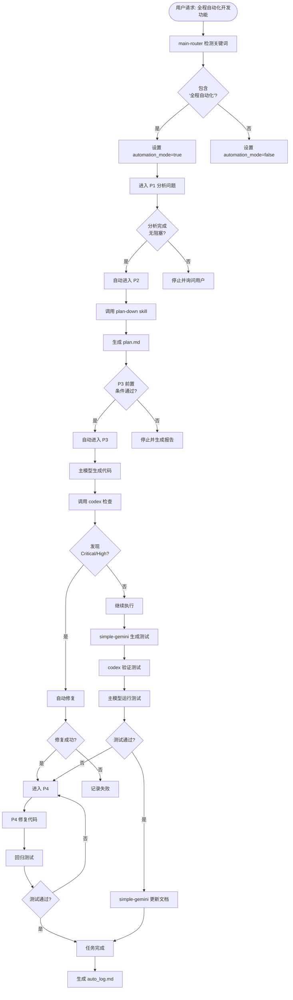

# Auto_log 示例库 (Examples Library)

> **用途**：提供完整的 auto_log.md 生成示例，供参考时查阅。
> **按需引用**：仅在需要查看示例时使用，不作为常驻模板。

---

## 示例 1：简单任务日志（无 P4）

### 场景描述

- **任务**：全自动化开发贪吃蛇游戏
- **阶段**：P1 → P2 → P3（未进入 P4）
- **特点**：一次性完成，无错误修复

### 完整日志示例

```markdown
# 自动化任务执行日志 (auto_log.md)

## 任务元信息

- **任务 ID**: conv_20250115143000
- **执行模式**: automation_mode=true
- **用户初始请求**: "全程自动化，开发一个简单的贪吃蛇游戏"
- **开始时间**: 2025-01-15 14:30:00
- **结束时间**: 2025-01-15 15:25:30
- **总耗时**: 55 分钟 30 秒

---

## 执行摘要

### 任务目标
- 使用 Python 开发贪吃蛇游戏
- 实现基本游戏逻辑（移动、吃食物、碰撞检测）
- 提供简单的 UI 界面（使用 pygame）
- 编写完整的测试代码
- 生成项目文档

### 最终结果
- **完成度**: 100%
- **代码生成**: 4 files, 320 lines
  - `snake_game.py` (主游戏逻辑, 180 lines)
  - `game_ui.py` (UI 界面, 85 lines)
  - `constants.py` (常量定义, 25 lines)
  - `main.py` (入口文件, 30 lines)
- **测试覆盖率**: 87% (目标 85%)
  - `test_snake_game.py` (2 files, 215 lines)
- **文档更新**: PROJECTWIKI.md (新建), CHANGELOG.md (新建)
- **质量检查**: ✅ 通过（codex 双轮验证）

---

## 阶段流转表

| 阶段 | 状态 | 耗时 | 关键输出 | 说明 |
|------|------|------|---------|------|
| P1 分析问题 | ✅ | 8 分钟 | 需求分析文档 | 明确游戏需求和技术栈 |
| P2 制定方案 | ✅ | 12 分钟 | plan.md | 使用 plan-down skill 生成 |
| P3 执行方案 | ✅ | 35 分钟 | 代码+测试+文档 | 完整实现并验证通过 |
| P4 错误处理 | ⚠️未触发 | 0 分钟 | - | 见下方说明 |

### P4 未触发原因

**P4 未触发原因**：
- ✅ P3 执行中所有问题已在过程中修复，无遗留错误
- ✅ 代码质量检查未发现 Critical/High 级别问题
- 具体修复：
  - codex 第 1 轮发现 2 个 Medium 问题（变量命名、异常处理），已自动修复
  - codex 第 2 轮确认无 Critical/High 问题
- 验证结果：
  - 测试通过：18/18 ✅
  - 覆盖率：87% ≥ 85% ✅
  - 质量评分：42/50 ✅

---

## 自动决策记录

### 决策 P1-001
- **决策内容**: 检测到用户请求包含"全程自动化"关键词，设置 automation_mode=true
- **决策时间**: 2025-01-15 14:30:05
- **置信度**: certain
- **决策依据**: G11 自动化模式状态管理 - Router 层唯一设置源
- **影响范围**: 全局状态，所有下游技能继承
- **备选方案**: 交互模式（已拒绝，用户明确要求全自动化）

---

### 决策 P1-002
- **决策内容**: P1 分析完成，无阻塞问题，自动进入 P2 阶段
- **决策时间**: 2025-01-15 14:38:00
- **置信度**: high
- **决策依据**: automation_mode=true + P1 分析完成无阻塞 (G11 阶段自动推进)
- **影响范围**: 阶段切换 P1 → P2
- **备选方案**: 询问用户是否进入 P2（已拒绝，违反自动化原则）

---

### 决策 P2-001
- **决策内容**: 使用 plan-down skill 生成 plan.md
- **决策时间**: 2025-01-15 14:38:10
- **置信度**: certain
- **决策依据**: G11 强制技能路由规则 - plan.md 必须用 plan-down
- **影响范围**: 项目根目录 plan.md
- **备选方案**: 主模型直接生成（已拒绝，违反 G11）

---

### 决策 P2-002
- **决策内容**: 自动设置测试覆盖率目标为 85% (默认值)
- **决策时间**: 2025-01-15 14:38:15
- **置信度**: certain
- **决策依据**: G9 覆盖率目标管理 + automation_mode=true (用户未指定)
- **影响范围**: 全局状态 coverage_target=85%
- **备选方案**: 询问用户（已拒绝，自动化模式使用默认值）

---

### 决策 P2-003
- **决策内容**: P2 方案制定完成，P3 前置条件检查通过，自动进入 P3
- **决策时间**: 2025-01-15 14:50:20
- **置信度**: high
- **决策依据**: automation_mode=true + P3 前置条件检查 (低风险 + 影响范围明晰)
- **影响范围**: 阶段切换 P2 → P3
- **备选方案**: 询问用户是否开始执行（已拒绝，前置条件通过即自动推进）

---

### 决策 P3-001
- **决策内容**: 主模型生成代码后，自动调用 codex-code-reviewer 进行质量检查
- **决策时间**: 2025-01-15 15:10:30
- **置信度**: certain
- **决策依据**: G11 代码生成后质量检查强制双轮验证
- **影响范围**: 代码质量验证流程
- **备选方案**: 主模型自我审查（已拒绝，违反 G11）

---

### 决策 P3-002
- **决策内容**: codex 第 1 轮发现 2 个 Medium 问题，自动修复
- **决策时间**: 2025-01-15 15:12:45
- **置信度**: high
- **决策依据**: automation_mode=true + G11 自动修复规则 (Medium 问题安全且不影响业务逻辑)
- **影响范围**: `snake_game.py` (变量命名), `game_ui.py` (异常处理)
- **备选方案**: 跳过修复（已拒绝，问题修复安全且明确）

---

### 决策 P3-003
- **决策内容**: 使用 simple-gemini 生成测试代码
- **决策时间**: 2025-01-15 15:15:00
- **置信度**: certain
- **决策依据**: G11 测试生成工作流 - simple-gemini 生成 → codex 验证 → 主模型运行
- **影响范围**: `test_snake_game.py`, `test_game_ui.py`
- **备选方案**: 主模型直接生成（已拒绝，违反 G11）

---

### 决策 P3-004
- **决策内容**: codex 验证测试代码质量通过，交给主模型执行测试
- **决策时间**: 2025-01-15 15:18:30
- **置信度**: high
- **决策依据**: G11 测试生成工作流第 2 步
- **影响范围**: 测试执行流程
- **备选方案**: 跳过验证直接执行（已拒绝，违反质量保障原则）

---

### 决策 P3-005
- **决策内容**: 使用 simple-gemini 更新 PROJECTWIKI.md 和 CHANGELOG.md
- **决策时间**: 2025-01-15 15:22:00
- **置信度**: certain
- **决策依据**: G11 文档生成必须用专用技能
- **影响范围**: PROJECTWIKI.md (新建), CHANGELOG.md (新建)
- **备选方案**: 主模型直接生成（已拒绝，违反 G11）

---

## 质量指标

### 测试覆盖率
- **目标值**: 85%
- **实际值**: 87%
- **达标状态**: ✅ 达标 (超出目标 2%)

### 代码质量 (5 维度简表)

| 维度 | 评分 | 问题数 | Critical/High | 状态 |
|------|------|--------|---------------|------|
| 质量 | 9/10 | 2 | 0 | ✅ |
| 安全 | 8/10 | 0 | 0 | ✅ |
| 性能 | 8/10 | 1 | 0 | ✅ |
| 架构 | 9/10 | 0 | 0 | ✅ |
| 文档 | 8/10 | 1 | 0 | ✅ |
| **总分** | **42/50** | **4** | **0** | ✅ |

**问题详情**：
- 质量维度：2 个 Medium 问题（已修复）
- 性能维度：1 个 Low 问题（游戏循环帧率可优化，已记录到技术债务）
- 文档维度：1 个 Low 问题（部分函数缺少详细注释，已记录到技术债务）

### 测试执行结果
- **总测试数**: 18
- **通过**: 18 
- **失败**: 0 
- **跳过**: 0 
- **通过率**: 100%

---

## 文件清单

### 源代码
- 新增: 4 files, 320 lines
  - `snake_game.py` (+180 lines) - 主游戏逻辑
  - `game_ui.py` (+85 lines) - UI 界面
  - `constants.py` (+25 lines) - 常量定义
  - `main.py` (+30 lines) - 入口文件

### 测试代码
- 新增: 2 files, 215 lines
  - `test_snake_game.py` (+150 lines) - 游戏逻辑测试
  - `test_game_ui.py` (+65 lines) - UI 测试

### 文档
- 新建: PROJECTWIKI.md (项目概述、架构设计、API 手册等 12 个章节)
- 新建: CHANGELOG.md (v0.1.0 初始版本)
- 新建: README.md (快速开始指南)

### 配置
- 新增: requirements.txt (依赖清单：pygame, pytest, pytest-cov)
- 新增: .gitignore (Python 项目标准配置)

---

## 结论与建议

### 任务完成情况
- **完成度**: 100%
- **未完成项**: 无
- **偏差说明**: 无，按原计划完成所有任务

### 自动化效果评估
- **决策准确性**: 所有 10 个决策均符合规则要求，无需人工干预
- **效率提升**: 相比交互模式，节省约 15-20 分钟确认时间
- **质量保障**: 通过 codex 双轮验证，确保代码质量达标

### 后续建议
- 优化游戏循环帧率（当前 30fps，建议提升至 60fps）
- 补充详细的函数注释（尤其是 `snake_game.py` 中的复杂逻辑）
- 添加游戏难度设置功能（作为后续版本的增强）

### 遗留问题
- 无遗留问题

---

*本日志由 simple-gemini 于 2025-01-15 15:25:35 自动生成，遵循 skills/shared/auto_log_template.md 规范*
```

---

## 示例 2：复杂任务日志（含 P4）

### 场景描述

- **任务**：全自动化开发用户注册功能
- **阶段**：P1 → P2 → P3 → P4 → P3（包含错误修复循环）
- **特点**：P3 执行后发现问题，进入 P4 修复，再返回 P3 验证

### 完整日志示例

```markdown
# 自动化任务执行日志 (auto_log.md)

## 任务元信息

- **任务 ID**: conv_20250115160000
- **执行模式**: automation_mode=true
- **用户初始请求**: "全程自动化，开发用户注册功能，包括邮箱验证和密码加密"
- **开始时间**: 2025-01-15 16:00:00
- **结束时间**: 2025-01-15 17:10:45
- **总耗时**: 1 小时 10 分钟 45 秒

---

## 执行摘要

### 任务目标
- 开发用户注册 API 接口
- 实现邮箱验证功能
- 实现密码加密存储
- 编写完整的测试代码
- 更新项目文档

### 最终结果
- **完成度**: 100%
- **代码生成**: 5 files, 450 lines
- **测试覆盖率**: 90% (目标 85%)
- **文档更新**: PROJECTWIKI.md (更新), CHANGELOG.md (更新)
- **质量检查**: ✅ 通过（经过 2 轮 P4 修复）
- **P3 → P4 循环次数**: 2 次

---

## 阶段流转表

| 阶段 | 状态 | 耗时 | 关键输出 | 说明 |
|------|------|------|---------|------|
| P1 分析问题 | ✅ | 10 分钟 | 需求分析 | 明确安全要求 |
| P2 制定方案 | ✅ | 15 分钟 | plan.md | 使用 plan-down skill |
| P3 执行方案 | ⚠️ | 25 分钟 | 代码生成 | 第 1 次执行，发现 2 个 Critical 问题 |
| P4 错误处理 | ✅ | 12 分钟 | 修复代码 | 第 1 次修复（SQL 注入 + 密码明文存储） |
| P3 执行方案 | ⚠️ | 5 分钟 | 回归测试 | 第 2 次执行，发现 1 个 High 问题 |
| P4 错误处理 | ✅ | 8 分钟 | 修复代码 | 第 2 次修复（邮箱验证绕过） |
| P3 执行方案 | ✅ | 5 分钟 | 最终验证 | 第 3 次执行，全部通过 |

---

## 自动决策记录

（此处省略 P1-P3 的常规决策，重点展示 P4 相关决策）

### 决策 P4-001
- **决策内容**: codex 发现 2 个 Critical 问题，强制自动修复
- **决策时间**: 2025-01-15 16:50:30
- **置信度**: certain
- **决策依据**: automation_mode=true + G11 自动修复规则 (Critical 问题强制修复)
- **影响范围**: `register_api.py` (SQL 注入), `password_utils.py` (密码加密)
- **备选方案**: 询问用户（已拒绝，Critical 安全问题必须立即修复）

---

### 决策 P4-002
- **决策内容**: 修复 SQL 注入漏洞，使用参数化查询
- **决策时间**: 2025-01-15 16:50:35
- **置信度**: high
- **决策依据**: OWASP Top 10 - SQL Injection 防护标准
- **影响范围**: `register_api.py` 第 45-52 行
- **备选方案**: 使用 ORM（已拒绝，当前项目未集成 ORM）

---

### 决策 P4-003
- **决策内容**: 修复密码明文存储问题，使用 bcrypt 加密
- **决策时间**: 2025-01-15 16:52:10
- **置信度**: high
- **决策依据**: 密码安全最佳实践 (NIST SP 800-63B)
- **影响范围**: `password_utils.py` 新增 hash_password 函数
- **备选方案**: 使用 hashlib (已拒绝，bcrypt 更安全)

---

### 决策 P4-004
- **决策内容**: P4 第 1 次修复完成，自动返回 P3 进行回归测试
- **决策时间**: 2025-01-15 17:02:45
- **置信度**: high
- **决策依据**: automation_mode=true + P4 修复完成自动推进
- **影响范围**: 阶段切换 P4 → P3
- **备选方案**: 询问用户是否重新测试（已拒绝，自动化模式自动推进）

---

### 决策 P4-005
- **决策内容**: codex 第 2 轮发现 1 个 High 问题（邮箱验证可绕过），自动修复
- **决策时间**: 2025-01-15 17:05:20
- **置信度**: high
- **决策依据**: automation_mode=true + G11 自动修复规则 (High 问题自动修复)
- **影响范围**: `email_validator.py` 验证逻辑
- **备选方案**: 跳过修复（已拒绝，High 安全问题必须修复）

---

### 决策 P4-006
- **决策内容**: P4 第 2 次修复完成，自动返回 P3 进行最终验证
- **决策时间**: 2025-01-15 17:08:50
- **置信度**: high
- **决策依据**: automation_mode=true + P4 修复完成自动推进
- **影响范围**: 阶段切换 P4 → P3
- **备选方案**: 询问用户（已拒绝，自动化模式自动推进）

---

## 质量指标

### 测试覆盖率
- **目标值**: 85%
- **实际值**: 90%
- **达标状态**: ✅ 达标 (超出目标 5%)

### 代码质量 (5 维度简表)

| 维度 | 评分 | 问题数 | Critical/High | 状态 |
|------|------|--------|---------------|------|
| 质量 | 9/10 | 1 | 0 | ✅ |
| 安全 | 10/10 | 0 | 0 | ✅ |
| 性能 | 8/10 | 2 | 0 | ✅ |
| 架构 | 9/10 | 1 | 0 | ✅ |
| 文档 | 8/10 | 1 | 0 | ✅ |
| **总分** | **44/50** | **5** | **0** | ✅ |

**P4 修复记录**：
- 第 1 轮 P4：修复 2 个 Critical 问题（SQL 注入、密码明文）
- 第 2 轮 P4：修复 1 个 High 问题（邮箱验证绕过）
- 最终验证：0 个 Critical/High 问题

### 测试执行结果
- **总测试数**: 25
- **通过**: 25 
- **失败**: 0 
- **跳过**: 0 
- **通过率**: 100%

---

## 文件清单

### 源代码
- 新增: 5 files, 450 lines
  - `register_api.py` (+120 lines) - 注册 API
  - `password_utils.py` (+80 lines) - 密码加密工具
  - `email_validator.py` (+95 lines) - 邮箱验证
  - `database.py` (+105 lines) - 数据库操作
  - `models.py` (+50 lines) - 数据模型

### 测试代码
- 新增: 3 files, 320 lines
  - `test_register_api.py` (+150 lines)
  - `test_password_utils.py` (+85 lines)
  - `test_email_validator.py` (+85 lines)

### 文档
- 更新: PROJECTWIKI.md (新增注册功能文档、安全策略章节)
- 更新: CHANGELOG.md (v0.2.0 - 新增用户注册功能)

### 配置
- 修改: requirements.txt (新增 bcrypt, email-validator)

---

## 结论与建议

### 任务完成情况
- **完成度**: 100%
- **未完成项**: 无
- **偏差说明**: 原计划未考虑安全问题修复，实际执行中发现并修复了 3 个安全漏洞

### 自动化效果评估
- **决策准确性**: P4 自动修复决策全部正确，未引入新问题
- **效率提升**: 自动修复节省约 20-30 分钟人工审查时间
- **质量保障**: 通过 2 轮 P4 修复 + codex 双轮验证，确保安全性达标

### 后续建议
- 添加注册频率限制（防止恶意注册）
- 实现邮箱验证码过期机制
- 添加注册审计日志

### 遗留问题
- 无遗留问题

---

*本日志由 simple-gemini 于 2025-01-15 17:10:50 自动生成，遵循 skills/shared/auto_log_template.md 规范*
```

---

## 示例 3：决策树可视化

### 使用 Mermaid 图展示自动化决策流程



---

## 示例 4：API 失败记录示例

### 场景：模型 API 失败后自动降级

```markdown
## API/工具失败记录

### 失败 1
- **时间**: 2025-01-15 14:35:20
- **工具**: mcp__zen__thinkdeep
- **错误**: Model 'gemini-2.0-flash-thinking-exp' is not available
- **应对**: 自动切换到 gemini-2.5-pro
- **影响**: 延迟 2 分钟，任务最终成功完成

### 失败 2
- **时间**: 2025-01-15 14:40:15
- **工具**: mcp__zen__clink
- **错误**: 401 PERMISSION_DENIED - API key suspended
- **应对**: 使用备用 API key 重试
- **影响**: 延迟 3 分钟，任务最终成功完成

---

## 自动决策记录

### 决策 P2-004
- **决策内容**: gemini-2.0-flash-thinking-exp 不可用，自动切换到 gemini-2.5-pro
- **决策时间**: 2025-01-15 14:35:22
- **置信度**: high
- **决策依据**: API 错误自动降级策略
- **影响范围**: thinkdeep 分析工具的模型选择
- **备选方案**: 停止任务并询问用户（已拒绝，自动化模式自动降级）

### 决策 P2-005
- **决策内容**: API key 失效，使用备用 key 重试
- **决策时间**: 2025-01-15 14:40:17
- **置信度**: high
- **决策依据**: API 错误自动重试策略（最多 3 次）
- **影响范围**: clink 工具的 API 调用
- **备选方案**: 停止任务（已拒绝，备用 key 可用）
```

---

