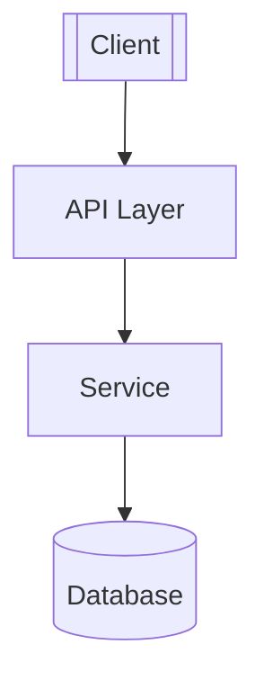
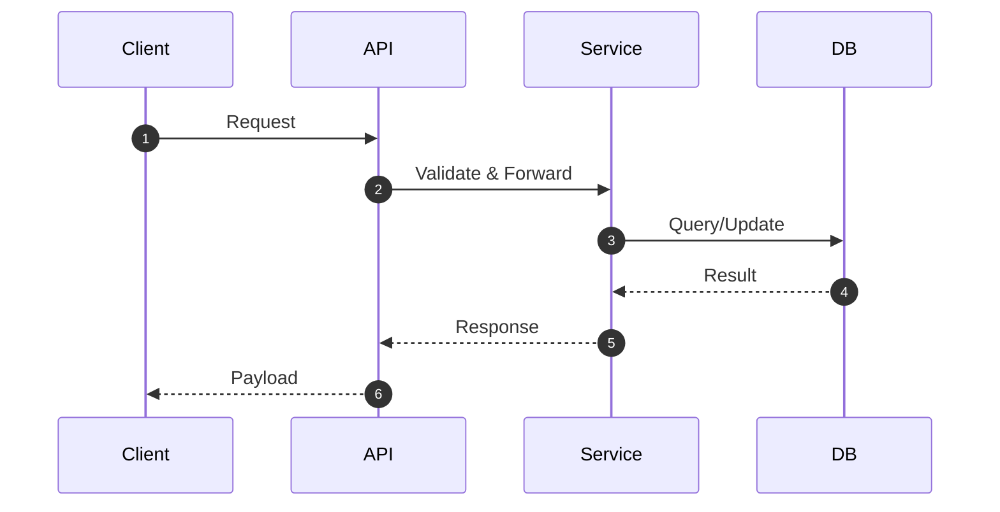
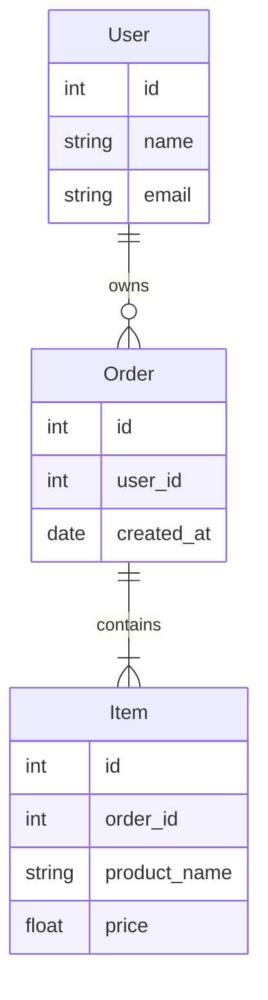
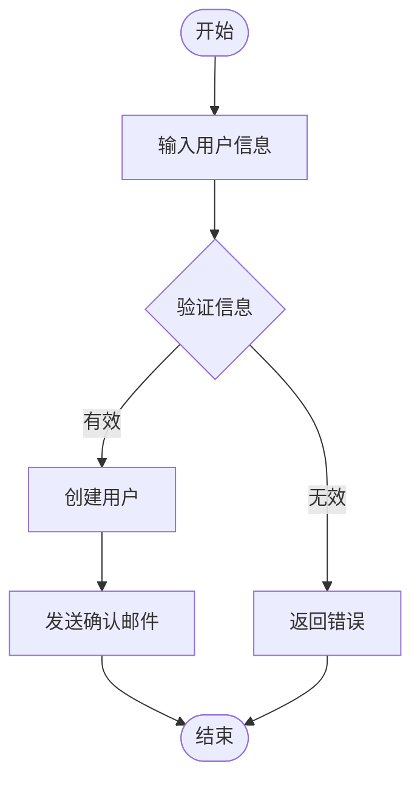
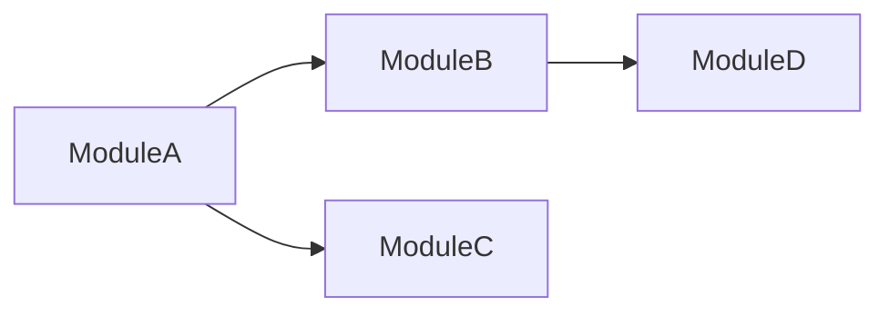

# 文档模板参考

本文档提供 AGENTS.md 和 CLAUDE.md 要求的标准文档模板，供 gemini 编写文档时参考。

## 一、PROJECTWIKI.md 标准模板

> 来源：AGENTS.md → 项目知识库内容结构与生成规则统一模板

### 必备要求

- **必须包含 12 个章节**（如下所示）
- **至少包含 1 个 Mermaid 代码块**（```mermaid）
- **所有相对链接必须有效**且指向仓库内实际文件
- **API 定义和数据模型与代码实现一致**

### 完整模板

````markdown
# PROJECTWIKI.md

> 说明：本文件为项目知识库，遵循 AGENTS.md 标准模板。

## 1. 项目概述

- **目标（Goal）**：
- **背景（Background）**：
- **范围（In-Scope）与非目标（Out-of-Scope）**：
- **角色 / 干系人（Stakeholders）**：
- **运行环境 / 平台**：

## 2. 架构设计

- **总体说明**：



- **关键流程（可选）**：



## 3. 架构决策记录（ADR）

- **目录**：`docs/adr/`
- **模板**：MADR（`YYYYMMDD-title.md`）
- **最新 ADR 列表**：
  - （示例）`20250101-select-database.md`

## 4. 设计决策 & 技术债务

- **当前技术债务清单**：

| 优先级 | 债务描述 | 影响范围 | 预计工作量 | 负责人 |
|--------|----------|----------|------------|--------|
| 高     | 示例债务 | 模块 A   | 2 天       | 待定   |

## 5. 模块文档

### 模块 A

- **职责**：
- **入口 / 出口点**：
- **关键类型与函数**：
- **外部依赖**：
- **测试覆盖基线**：
- **风险与扩展点**：

### 模块 B

（同上结构）

## 6. API 手册

### 接口清单

#### API 1: [接口名称]

- **签名**：`function_name(param1: Type1, param2: Type2) -> ReturnType`
- **参数**：
  - `param1`：描述
  - `param2`：描述
- **返回值**：描述
- **错误码**：
  - `ERR001`：描述
- **示例**：

```python
# 最小调用示例
result = function_name(value1, value2)
```

- **版本变更**：v1.0.0 引入

### 兼容性策略

- 采用语义化版本号（SemVer）
- 破坏性变更需在主版本号变更中引入
- 提供至少一个版本的过渡期

## 7. 数据模型

### 主要实体与关系



### 数据字典

#### User 表

| 字段  | 类型    | 必填 | 说明     |
|-------|---------|------|----------|
| id    | int     | 是   | 主键     |
| name  | string  | 是   | 用户名   |
| email | string  | 是   | 邮箱地址 |

## 8. 核心流程

### 流程 1：用户注册流程



**关键步骤说明**：
1. 输入验证：检查邮箱格式、密码强度
2. 创建用户：写入数据库
3. 发送邮件：异步任务处理

## 9. 依赖图谱

### 内部依赖



### 外部依赖

| 依赖库     | 版本    | 许可证 | 用途       | 可替代方案 |
|-----------|---------|--------|------------|------------|
| requests  | ^2.28.0 | Apache | HTTP 客户端| httpx      |
| pandas    | ^2.0.0  | BSD    | 数据分析   | polars     |

## 10. 维护建议

### 运维

- **部署流程**：CI/CD 自动部署到生产环境
- **监控指标**：CPU、内存、请求延迟、错误率
- **告警规则**：错误率 > 5% 或 P95 延迟 > 1s

### 容量规划

- **当前负载**：日均 10K 请求
- **预期增长**：月增长 20%
- **扩容触发点**：CPU > 70% 持续 10 分钟

### 成本控制

- **当前成本**：月均 ¥500
- **优化建议**：使用缓存减少数据库查询

## 11. 术语表和缩写

| 术语/缩写 | 全称/定义                      |
|-----------|-------------------------------|
| ADR       | Architecture Decision Record  |
| API       | Application Programming Interface |
| SLA       | Service Level Agreement       |
| MRE       | Minimal Reproducible Example  |

## 12. 变更日志

参见 `CHANGELOG.md`（与本节建立双向链接）

**最近变更摘要**：
- [2025-01-20] v1.2.0 - 新增用户认证模块
- [2025-01-15] v1.1.0 - 优化数据库查询性能
````

---

## 二、CHANGELOG.md 标准模板

> 来源：AGENTS.md → Keep a Changelog + SemVer

### 格式要求

- 遵循 [Keep a Changelog](https://keepachangelog.com/zh-CN/1.1.0/) 格式
- 使用 [语义化版本号](https://semver.org/lang/zh-CN/)（SemVer）
- 每个版本包含变更类型分类
- 提供比对链接

### 完整模板

```markdown
# 变更日志（Changelog）

所有重要变更均记录于此文件。

本文件格式遵循 [Keep a Changelog](https://keepachangelog.com/zh-CN/1.1.0/)，并遵循 [语义化版本号](https://semver.org/lang/zh-CN/) 规范。

## [Unreleased]

### Added（新增）
- 待发布的新功能

### Changed（变更）
- 待发布的变更

## [1.0.0] - 2025-01-20

### Added（新增）
- 首次发布
- 实现用户注册功能
- 添加基础 API 接口

### Changed（变更）
- 优化数据库查询性能

### Deprecated（弃用）
- 旧版 API v0.x 将在 v2.0.0 中移除

### Removed（移除）
-

### Fixed（修复）
- 修复用户登录时的空指针异常

### Security（安全）
- 修复 SQL 注入漏洞

<!-- 比对链接（将 <REPO_URL> 替换为实际仓库地址） -->
[Unreleased]: <REPO_URL>/compare/v1.0.0...HEAD
[1.0.0]: <REPO_URL>/releases/tag/v1.0.0

<!-- 归类指引（Conventional Commits → Changelog 分区）
feat: Added（新增）
fix: Fixed（修复）
perf / refactor / style / chore / docs / test: Changed（变更）或按需归类
deprecate: Deprecated（弃用）
remove / breaking: Removed（移除）并标注 BREAKING
security: Security（安全）
-->
```

### 变更类型说明

- **Added（新增）**：新功能
- **Changed（变更）**：既有功能的变化
- **Deprecated（弃用）**：即将移除的功能
- **Removed（移除）**：已移除的功能
- **Fixed（修复）**：Bug 修复
- **Security（安全）**：安全相关的修复或改进

---

## 三、ADR（架构决策记录）标准模板

> 来源：AGENTS.md → MADR (Markdown Architectural Decision Records)

### 命名规范

- 格式：`YYYYMMDD-title.md`
- 示例：`20250120-select-postgresql.md`
- 位置：`docs/adr/`

### MADR 模板

```markdown
# [ADR-XXX] [决策标题]

- **状态**：提议 | 已接受 | 已弃用 | 已替代
- **决策者**：[姓名或团队]
- **日期**：YYYY-MM-DD
- **技术故事**：[相关 Issue/Ticket 编号或链接]

## 背景与问题陈述（Context and Problem Statement）

[描述需要做出决策的背景和要解决的问题。用 2-3 段文字说明为什么需要这个决策。]

例如：
- 当前系统使用 MySQL 作为主数据库，但随着数据量增长，查询性能下降
- 需要支持复杂的地理空间查询和 JSON 数据存储
- 团队对不同数据库的熟悉程度不同

## 决策驱动因素（Decision Drivers）

[列出影响决策的关键因素]

- 性能要求：P95 查询延迟 < 100ms
- 数据规模：预计 3 年内增长到 1TB
- 团队技能：团队有 PostgreSQL 经验
- 成本约束：月预算 < ¥5000
- 合规要求：需要符合 GDPR

## 考虑的方案（Considered Options）

### 方案 1：PostgreSQL

**优点：**
- 原生支持 JSON 和地理空间数据
- 性能优秀，查询优化器先进
- 开源免费，社区活跃
- 团队有使用经验

**缺点：**
- 水平扩展相对复杂
- 运维需要一定专业知识

### 方案 2：MongoDB

**优点：**
- 原生 JSON 存储
- 水平扩展简单
- Schema 灵活

**缺点：**
- 事务支持较弱（在旧版本）
- 团队缺乏经验
- 查询性能在复杂关联时不如关系型数据库

### 方案 3：继续使用 MySQL

**优点：**
- 无迁移成本
- 团队熟悉

**缺点：**
- JSON 和地理空间支持较弱
- 无法解决当前性能问题

## 决策结果（Decision Outcome）

**选择方案**：方案 1 - PostgreSQL

**理由**：
- PostgreSQL 在性能、功能和成本之间提供最佳平衡
- 原生支持所需的 JSON 和地理空间功能
- 团队有使用经验，降低学习成本
- 开源方案，无许可费用
- 虽然水平扩展较复杂，但在未来 2-3 年内单机性能足够

### 积极影响（Positive Consequences）

- 查询性能提升 3-5 倍（基于基准测试）
- 支持复杂地理空间查询，满足业务需求
- 降低数据库成本（相比商业数据库）
- 开发效率提升（JSON 支持）

### 消极影响（Negative Consequences）

- 需要 1-2 周时间进行数据迁移
- 需要学习 PostgreSQL 特有的优化技巧
- 未来如需水平扩展，需要考虑分片或读写分离方案

## 实施计划（Implementation Plan）

1. **阶段 1（Week 1）**：搭建 PostgreSQL 测试环境
2. **阶段 2（Week 2-3）**：数据迁移脚本开发和测试
3. **阶段 3（Week 4）**：灰度切换，先切换 10% 流量
4. **阶段 4（Week 5）**：全量切换

## 验证方式（Validation）

- 性能基准测试：P95 延迟 < 100ms
- 功能测试：地理空间查询准确性 100%
- 压力测试：支持 1000 QPS
- 回滚演练：确保可以在 1 小时内回滚到 MySQL

## 跟踪链接（Links）

- [Issue #123: 数据库性能问题](link)
- [PR #456: 数据库迁移脚本](link)
- [技术方案文档](link)
- [性能测试报告](link)

## 后续决策（Follow-up Decisions）

- 如需水平扩展，考虑 Citus 或 PostgreSQL 分片方案
- 定期审查数据库性能指标，每季度一次

## 注释（Notes）

[其他相关说明]
```

---

## 四、plan.md 标准模板

> 来源：CLAUDE.md → G8｜思考与更改

### 用途

- 详细的实施计划
- 步骤分解和进度跟踪
- 完成后的总结和评审

### 完整模板

```markdown
# 实施计划（Implementation Plan）

> 任务：[任务简短描述]
> 开始时间：YYYY-MM-DD
> 预计完成：YYYY-MM-DD

## 一、任务概述

### 目标

[描述要完成的目标]

### 背景

[说明为什么要做这个任务]

### 范围

**包含（In-Scope）**：
- 功能点 1
- 功能点 2

**不包含（Out-of-Scope）**：
- 功能点 X
- 功能点 Y

## 二、需要审查和确认的内容

在开始实施前，需要仔细阅读和确认以下代码文件和逻辑：

### 代码文件清单

- [ ] `src/module_a.py` - 核心业务逻辑
- [ ] `src/module_b.py` - 辅助功能
- [ ] `tests/test_module_a.py` - 现有测试

### 关键逻辑点

1. **模块 A 的工作流程**：[描述]
2. **数据流向**：[描述]
3. **依赖关系**：[描述]

## 三、实施步骤

### 步骤 1：环境准备

- [ ] 安装依赖库 X
- [ ] 配置环境变量
- [ ] 创建测试数据

**预计时间**：0.5 天

**完成状态**：□ 待开始 | □ 进行中 | ☑ 已完成

**完成摘要**（完成后填写）：
- 已安装所有依赖
- 配置文件已更新

---

### 步骤 2：实现核心功能

- [ ] 编写 `feature_x()` 函数
- [ ] 添加输入验证
- [ ] 添加错误处理

**预计时间**：2 天

**完成状态**：□ 待开始 | □ 进行中 | □ 已完成

**完成摘要**（完成后填写）：
-

---

### 步骤 3：编写测试

- [ ] 单元测试：`test_feature_x()`
- [ ] 集成测试：`test_integration_workflow()`
- [ ] 边界条件测试

**预计时间**：1 天

**完成状态**：□ 待开始 | □ 进行中 | □ 已完成

**完成摘要**（完成后填写）：
-

---

### 步骤 4：文档更新

- [ ] 更新 PROJECTWIKI.md
- [ ] 更新 CHANGELOG.md
- [ ] 添加 API 文档

**预计时间**：0.5 天

**完成状态**：□ 待开始 | □ 进行中 | □ 已完成

**完成摘要**（完成后填写）：
-

---

### 步骤 5：代码审查和测试

- [ ] 运行所有测试
- [ ] 代码审查
- [ ] 修复问题

**预计时间**：0.5 天

**完成状态**：□ 待开始 | □ 进行中 | □ 已完成

**完成摘要**（完成后填写）：
-

## 四、风险与缓解措施

| 风险 | 可能性 | 影响 | 缓解措施 |
|------|--------|------|----------|
| 示例风险 | 中 | 高 | 缓解方案 |

## 五、验收标准（Definition of Done）

- [ ] 所有功能点已实现
- [ ] 所有测试通过（覆盖率 ≥ 70%）
- [ ] 代码已审查
- [ ] 文档已更新
- [ ] CHANGELOG.md 已更新

## 六、评审总结（完成后填写）

### 完成情况

- **实际完成时间**：YYYY-MM-DD
- **实际耗时**：X 天
- **与预期对比**：提前/延期/准时

### 成果摘要

[总结完成的工作和主要成果]

### 遇到的问题

[列出实施过程中遇到的主要问题及解决方案]

### 经验教训

[总结可以改进的地方，为未来任务提供参考]

### 后续工作

[列出遗留问题或后续需要跟进的工作]
```

---

## 五、README.md 标准模板（通用）

### 基础结构

```markdown
# 项目名称

> 一句话描述项目

[](LICENSE)
[](https://www.python.org/)

## 简介

[2-3 段文字介绍项目的目的、主要功能和适用场景]

## 特性

- ✨ 特性 1
- 🚀 特性 2
- 🔧 特性 3

## 快速开始

### 环境要求

- Python 3.8+
- 其他依赖

### 安装

```bash
pip install -r requirements.txt
```

### 基本使用

```python
# 示例代码
from myproject import MyClass

obj = MyClass()
result = obj.do_something()
print(result)
```

## 文档

详细文档请参见：
- [用户指南](docs/user_guide.md)
- [API 参考](docs/api_reference.md)
- [架构设计](PROJECTWIKI.md)

## 开发

### 本地开发环境搭建

```bash
# 克隆仓库
git clone <repo-url>
cd project-name

# 安装开发依赖
pip install -r requirements-dev.txt

# 运行测试
pytest
```

### 运行测试

```bash
# 运行所有测试
pytest

# 运行特定测试文件
pytest tests/test_module.py

# 查看覆盖率
pytest --cov=src tests/
```

### 代码规范

本项目遵循：
- PEP 8 代码风格
- Black 格式化
- Flake8 静态检查

```bash
# 格式化代码
black src/

# 静态检查
flake8 src/
```

## 贡献指南

欢迎贡献！请参阅 [CONTRIBUTING.md](CONTRIBUTING.md)。

## 许可证

本项目采用 [MIT License](LICENSE)。

## 致谢

感谢所有贡献者和支持者。
```

---

## 使用建议

### 选择合适的模板

1. **PROJECTWIKI.md**：每个项目必须有，严格遵循 12 章节结构
2. **CHANGELOG.md**：每个项目必须有，记录所有版本变更
3. **ADR**：重要架构决策时使用，存放在 `docs/adr/`
4. **plan.md**：复杂任务开始前使用，追踪实施进度
5. **README.md**：项目入口文档，对外展示

### 模板定制原则

- **保持必备章节**：PROJECTWIKI.md 的 12 个章节不可删减
- **按需扩展**：可以添加项目特定的额外章节
- **保持一致**：同一项目内的文档风格应保持一致
- **链接有效**：所有链接必须指向有效的文件或 URL
- **Mermaid 图表**：架构图、流程图、ER 图必须使用 Mermaid

### 质量检查清单

编写完文档后，检查：
- [ ] 必备章节完整
- [ ] 至少有 1 个 Mermaid 图
- [ ] 所有链接有效
- [ ] API 定义与代码一致
- [ ] 数据模型与代码一致
- [ ] 变更日志遵循 Keep a Changelog
- [ ] ADR 使用 MADR 模板
- [ ] 代码示例可以运行
- [ ] 专业术语在术语表中有定义
