# 文档模板集合 (Documentation Templates)

> **用途**: 为 simple-gemini 技能提供标准化文档模板，确保生成的文档符合项目规范。

---

## 目录

1. [PROJECTWIKI.md 标准模板](#projectwikimd-标准模板)
2. [README.md 标准模板](#readmemd-标准模板)
3. [CHANGELOG.md 标准模板](#changelogmd-标准模板)
4. [架构设计章节模板](#架构设计章节模板)
5. [API 文档章节模板](#api-文档章节模板)
6. [Mermaid 图表示例](#mermaid-图表示例)

---

## PROJECTWIKI.md 标准模板

````markdown
# PROJECTWIKI.md（标准模板）

> **说明**: 本文件为项目知识库，记录架构设计、技术决策和关键文档。

---

## 1. 项目概述

- **目标（Goal）**: [项目要解决的核心问题]
- **背景（Background）**: [项目起因和业务背景]
- **范围（In-Scope）**: [本项目包含的功能]
- **非目标（Out-of-Scope）**: [明确不包含的功能]
- **角色/干系人（Stakeholders）**: [用户、开发者、运维等]
- **运行环境/平台**: [Python 3.x, Node.js, Docker等]

---

## 2. 架构设计

### 总体架构

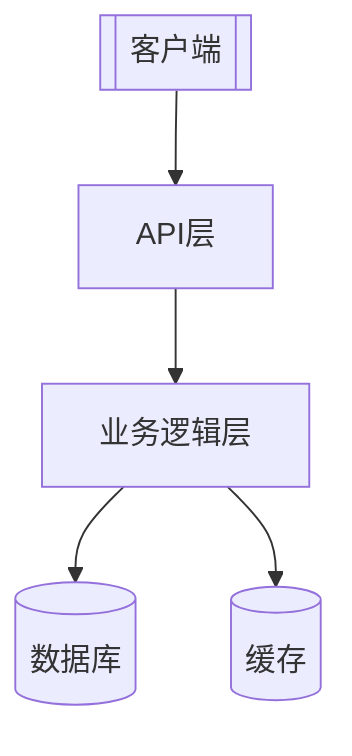

### 关键流程

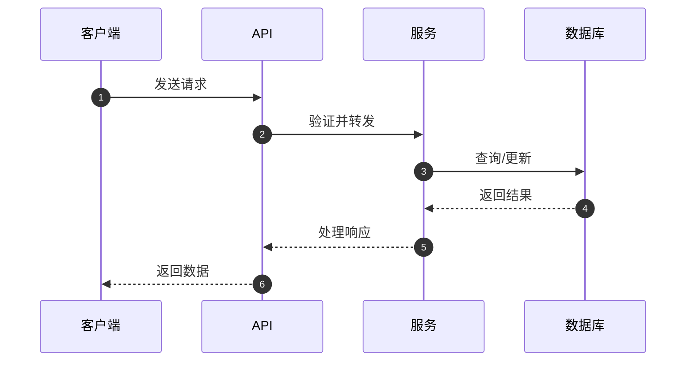

---

## 3. 架构决策记录（ADR）

- **目录**: `docs/adr/`
- **模板**: MADR（`YYYYMMDD-title.md`）
- **最新 ADR 列表**:
  - `20250101-select-database.md` - 数据库选型
  - `20250102-api-versioning.md` - API 版本化策略

---

## 4. 设计决策 & 技术债务

### 当前技术债务

| ID | 描述 | 优先级 | 负责人 | 预计工作量 |
|----|------|--------|--------|-----------|
| TD-001 | 重构用户认证模块 | High | @team | 3天 |
| TD-002 | 优化数据库查询性能 | Medium | @team | 2天 |

---

## 5. 模块文档

### 模块 A: 用户管理

- **职责**: 用户注册、登录、权限管理
- **入口点**: `src/user/controller.py`
- **关键类型**: `User`, `Permission`, `Role`
- **外部依赖**: `jwt`, `bcrypt`
- **测试覆盖率**: 85%
- **风险**: 密码加密算法升级时需要数据迁移

### 模块 B: 数据处理

- **职责**: 数据清洗、转换、存储
- **入口点**: `src/data/processor.py`
- **关键函数**: `clean_data()`, `transform()`, `save()`
- **外部依赖**: `pandas`, `numpy`
- **扩展点**: 支持插件式数据转换器

---

## 6. API 手册

### API 端点列表

#### 1. 用户注册

```http
POST /api/v1/users/register
Content-Type: application/json

{
  "username": "string",
  "email": "string",
  "password": "string"
}
```

**响应**:
```json
{
  "id": "string",
  "username": "string",
  "email": "string",
  "created_at": "2025-01-01T00:00:00Z"
}
```

**错误码**:
- `400` - 参数错误
- `409` - 用户已存在
- `500` - 服务器错误

#### 兼容性策略

- API 使用语义化版本号 (v1, v2, ...)
- 向后兼容：新增字段可选，废弃字段保留至少 2 个版本
- 破坏性变更：提前 1 个月通知，发布新版本

---

## 7. 数据模型

### 实体关系图

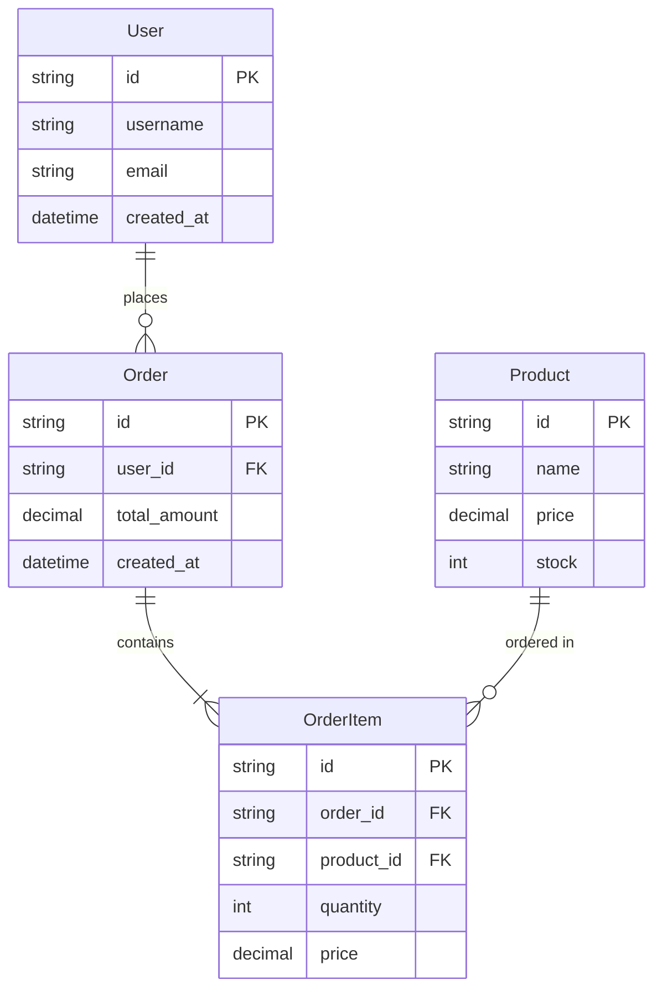

### 状态机

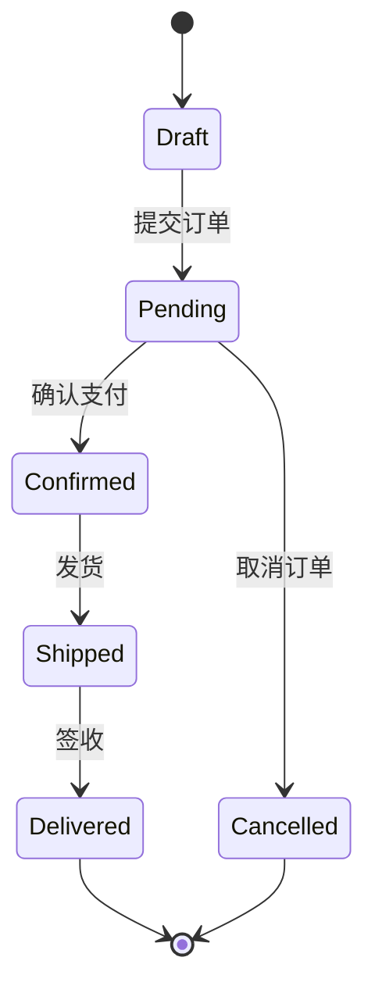

---

## 8. 核心流程

### 用户下单流程

1. **创建订单**: 用户选择商品，创建草稿订单
2. **提交订单**: 验证库存，计算总价
3. **支付处理**: 调用支付网关
4. **订单确认**: 支付成功后更新订单状态
5. **库存扣减**: 扣减商品库存
6. **发货通知**: 触发发货流程

---

## 9. 依赖图谱

### 内部依赖

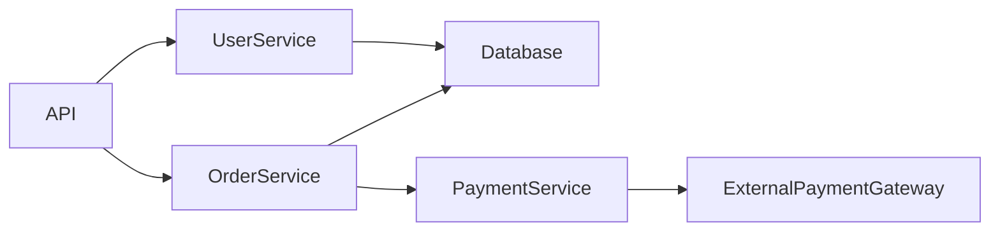

### 外部依赖

| 依赖 | 版本 | 许可证 | 用途 | 替代方案 |
|------|------|--------|------|----------|
| Flask | 2.3.x | BSD-3 | Web 框架 | FastAPI, Django |
| SQLAlchemy | 2.0.x | MIT | ORM | Django ORM, Peewee |
| Redis | 7.x | BSD-3 | 缓存 | Memcached |
| JWT | 2.x | MIT | 认证 | OAuth2 |

---

## 10. 维护建议

### 运维要点

- **监控**: Prometheus + Grafana，关键指标：QPS、错误率、响应时间
- **告警**: 错误率 > 1% 或 P99 > 500ms 触发告警
- **日志**: 结构化日志（JSON），保留 30 天
- **备份**: 数据库每日全量备份 + 增量备份（每小时）

### 容量规划

- **当前负载**: 1000 QPS，10万 DAU
- **扩容阈值**: CPU > 70% 或内存 > 80%
- **扩容策略**: 水平扩展，最多 10 个实例

### 成本控制

- **云服务成本**: 约 $500/月
- **优化建议**: 使用 CDN 减少流量成本，优化数据库查询减少实例数

---

## 11. 术语表和缩写

| 术语/缩写 | 全称 | 定义 |
|-----------|------|------|
| API | Application Programming Interface | 应用程序编程接口 |
| ORM | Object-Relational Mapping | 对象关系映射 |
| QPS | Queries Per Second | 每秒查询数 |
| P99 | 99th Percentile | 第99百分位数 |
| DAU | Daily Active Users | 日活跃用户数 |

---

## 12. 变更日志

参见 `CHANGELOG.md`（与本节建立双向链接）

**最新变更**:
- [v1.2.0] 2025-01-15 - 新增订单管理模块
- [v1.1.0] 2025-01-10 - 优化用户认证流程
- [v1.0.0] 2025-01-01 - 首次发布

---

## 附录

### 相关文档

- [CHANGELOG.md](./CHANGELOG.md) - 详细变更历史
- [docs/adr/](./docs/adr/) - 架构决策记录
- [README.md](./README.md) - 项目说明

### 贡献指南

参见 [CONTRIBUTING.md](./CONTRIBUTING.md)
````

---

## README.md 标准模板

```markdown
# 项目名称

> 一句话描述项目功能和价值

[](LICENSE)
[](https://github.com/user/repo/actions)
[](https://codecov.io/gh/user/repo)

---

## 目录

- [功能特性](#功能特性)
- [快速开始](#快速开始)
- [安装](#安装)
- [使用方法](#使用方法)
- [配置](#配置)
- [开发指南](#开发指南)
- [测试](#测试)
- [部署](#部署)
- [贡献](#贡献)
- [许可证](#许可证)

---

## 功能特性

- ✅ **功能 A**: 简要描述
- ✅ **功能 B**: 简要描述
- ✅ **功能 C**: 简要描述
- 🚧 **计划中**: 未来功能

---

## 快速开始

```bash
# 克隆仓库
git clone https://github.com/user/repo.git
cd repo

# 安装依赖
npm install  # 或 pip install -r requirements.txt

# 运行项目
npm start  # 或 python main.py
```

---

## 安装

### 前置要求

- Node.js >= 18.x 或 Python >= 3.10
- Docker（可选，用于容器化部署）

### 开发环境

```bash
# 安装开发依赖
npm install --save-dev  # 或 pip install -r requirements-dev.txt

# 配置环境变量
cp .env.example .env
# 编辑 .env 文件，填入必要配置
```

---

## 使用方法

### 基本用法

```javascript
// JavaScript 示例
const app = require('./app');

app.start({
  port: 3000,
  debug: true
});
```

```python
# Python 示例
from app import Application

app = Application(port=3000, debug=True)
app.start()
```

### 高级用法

参见 [使用文档](docs/usage.md)

---

## 配置

### 环境变量

| 变量名 | 默认值 | 说明 |
|--------|--------|------|
| `PORT` | 3000 | 服务端口 |
| `DATABASE_URL` | - | 数据库连接字符串 |
| `LOG_LEVEL` | info | 日志级别（debug/info/warn/error） |

### 配置文件

参见 [config.example.json](config.example.json)

---

## 开发指南

### 项目结构

```
.
├── src/                # 源代码
│   ├── controllers/    # 控制器
│   ├── models/         # 数据模型
│   ├── services/       # 业务逻辑
│   └── utils/          # 工具函数
├── tests/              # 测试文件
├── docs/               # 文档
├── config/             # 配置文件
└── scripts/            # 构建脚本
```

### 代码规范

- 使用 ESLint / Pylint 进行代码检查
- 遵循 [Airbnb Style Guide](https://github.com/airbnb/javascript) / [PEP 8](https://pep8.org/)
- 提交前运行 `npm run lint` 或 `pylint src/`

---

## 测试

```bash
# 运行所有测试
npm test  # 或 pytest

# 运行特定测试
npm test -- --testNamePattern="User"  # 或 pytest tests/test_user.py

# 查看覆盖率
npm run test:coverage  # 或 pytest --cov=src
```

**目标覆盖率**: ≥ 85%（语句覆盖率）

---

## 部署

### Docker 部署

```bash
# 构建镜像
docker build -t my-app:latest .

# 运行容器
docker run -p 3000:3000 -e DATABASE_URL=... my-app:latest
```

### 手动部署

参见 [部署文档](docs/deployment.md)

---

## 贡献

我们欢迎所有形式的贡献！请查看 [贡献指南](CONTRIBUTING.md)。

### 提交流程

1. Fork 本仓库
2. 创建功能分支 (`git checkout -b feature/amazing-feature`)
3. 提交更改 (`git commit -m 'feat: add amazing feature'`)
4. 推送到分支 (`git push origin feature/amazing-feature`)
5. 创建 Pull Request

---

## 许可证

本项目采用 MIT 许可证 - 详见 [LICENSE](LICENSE) 文件

---

## 联系方式

- **作者**: Your Name
- **Email**: your.email@example.com
- **项目地址**: https://github.com/user/repo
- **问题反馈**: https://github.com/user/repo/issues
```

---

## CHANGELOG.md 标准模板

```markdown
# 变更日志（Changelog）

所有重要变更均记录于此文件。

本文件格式遵循 [Keep a Changelog](https://keepachangelog.com/zh-CN/1.1.0/)，并遵循 [语义化版本号](https://semver.org/lang/zh-CN/) 规范。

---

## [Unreleased]

### Added（新增）
-

### Changed（变更）
-

### Deprecated（弃用）
-

### Removed（移除）
-

### Fixed（修复）
-

### Security（安全）
-

---

## [1.0.0] - 2025-01-01

### Added（新增）
- 首次发布
- 基础功能实现

### Changed（变更）
- 无

### Fixed（修复）
- 无

---

## 版本说明

### 版本号规则

- **主版本号（Major）**: 不兼容的 API 变更
- **次版本号（Minor）**: 向后兼容的功能新增
- **修订号（Patch）**: 向后兼容的问题修正

### 归类指引

| Commit 类型 | Changelog 分区 |
|-------------|----------------|
| `feat:` | Added（新增） |
| `fix:` | Fixed（修复） |
| `perf:`, `refactor:`, `style:`, `chore:`, `docs:`, `test:` | Changed（变更） |
| `deprecate:` | Deprecated（弃用） |
| `remove:`, `breaking:` | Removed（移除） + BREAKING 标注 |
| `security:` | Security（安全） |

---

<!-- 比对链接（将 <REPO_URL> 替换为实际仓库地址） -->
[Unreleased]: <REPO_URL>/compare/v1.0.0...HEAD
[1.0.0]: <REPO_URL>/releases/tag/v1.0.0
```

---

## 架构设计章节模板

### 系统架构图

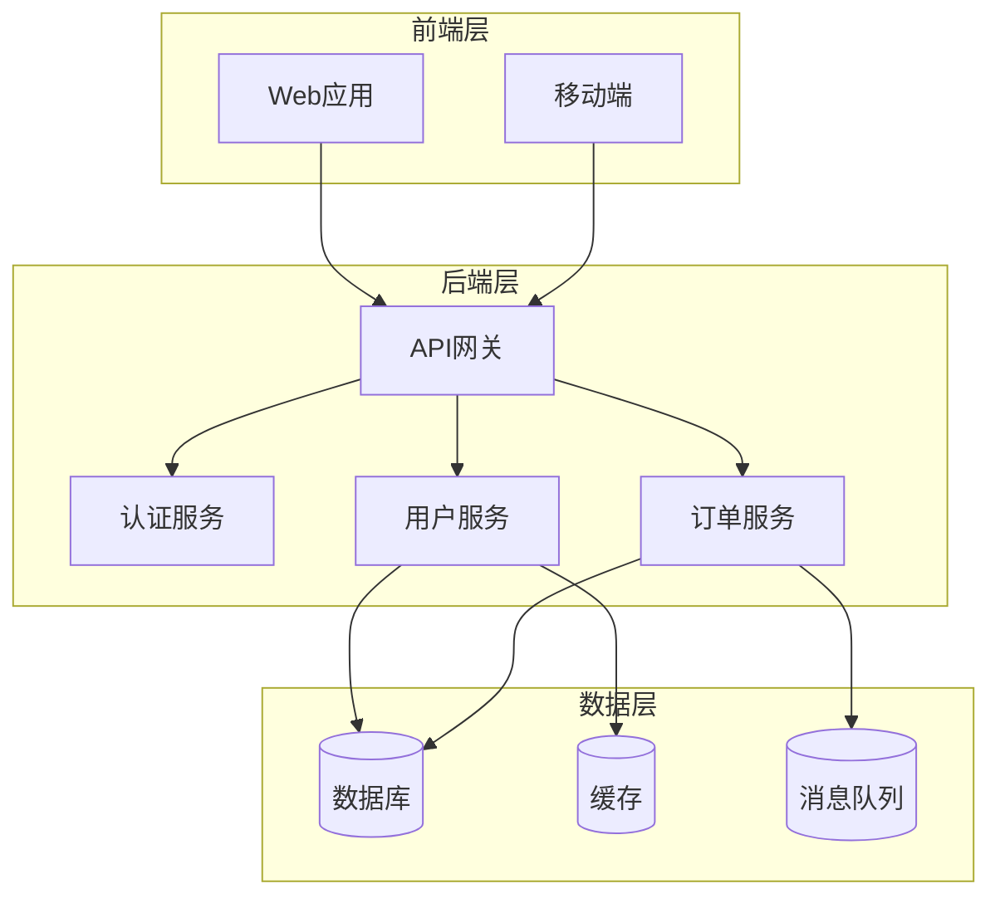

### 部署架构图

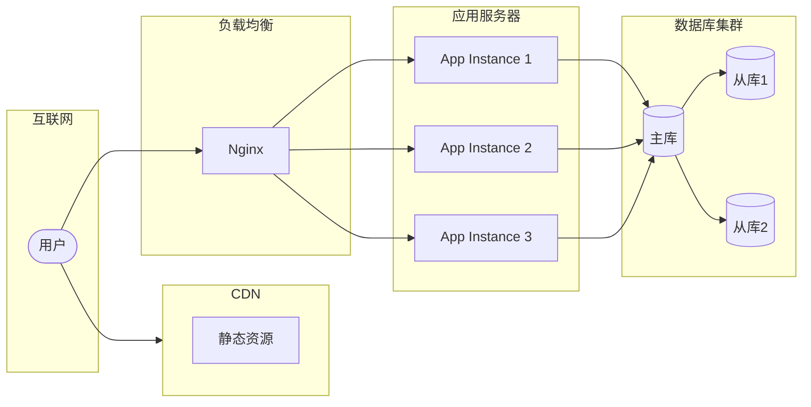

---

## API 文档章节模板

### RESTful API 示例

#### 端点: 创建用户

**请求**:
```http
POST /api/v1/users
Content-Type: application/json
Authorization: Bearer <token>

{
  "username": "john_doe",
  "email": "john@example.com",
  "password": "secure_password",
  "profile": {
    "first_name": "John",
    "last_name": "Doe"
  }
}
```

**响应** (201 Created):
```json
{
  "id": "usr_1234567890",
  "username": "john_doe",
  "email": "john@example.com",
  "profile": {
    "first_name": "John",
    "last_name": "Doe"
  },
  "created_at": "2025-01-01T12:00:00Z",
  "updated_at": "2025-01-01T12:00:00Z"
}
```

**错误响应**:
```json
{
  "error": {
    "code": "VALIDATION_ERROR",
    "message": "Invalid email format",
    "details": {
      "field": "email",
      "provided": "invalid-email"
    }
  }
}
```

**状态码**:
- `201` - 创建成功
- `400` - 请求参数错误
- `401` - 未授权
- `409` - 用户已存在
- `500` - 服务器错误

---

## Mermaid 图表示例

### 时序图（Sequence Diagram）

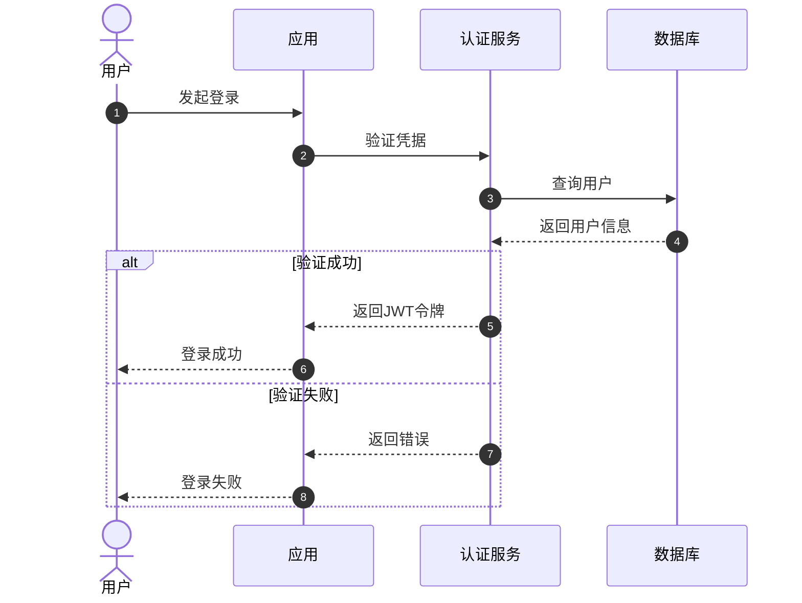

### 状态图（State Diagram）

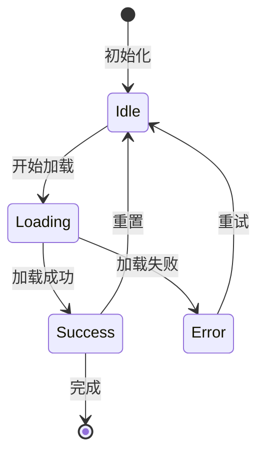

### 实体关系图（ER Diagram）

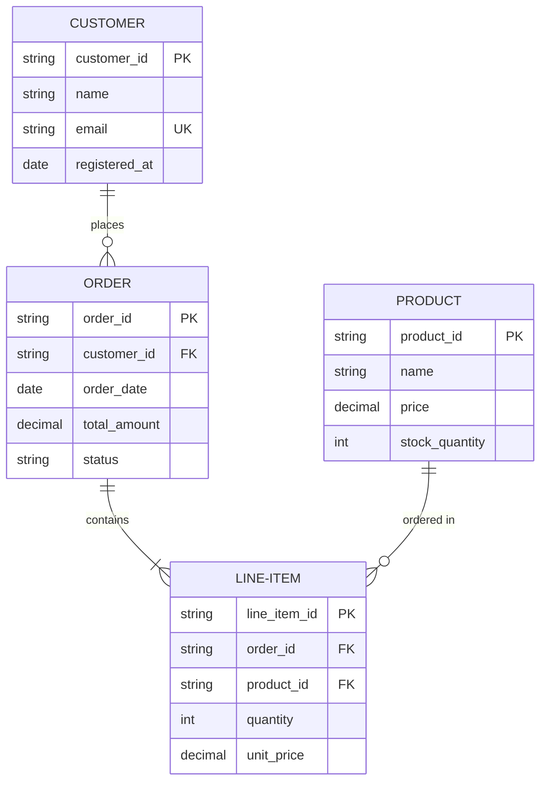

### 类图（Class Diagram）

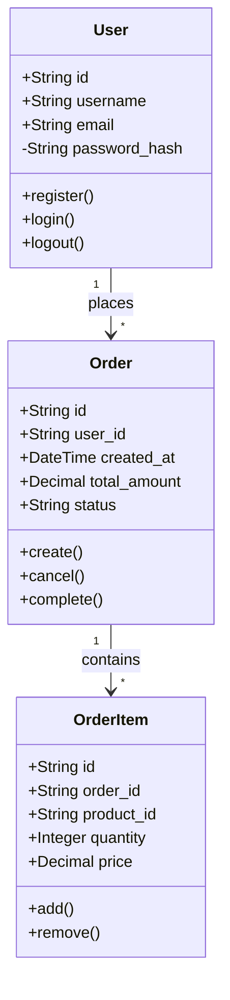

### 甘特图（Gantt Chart）

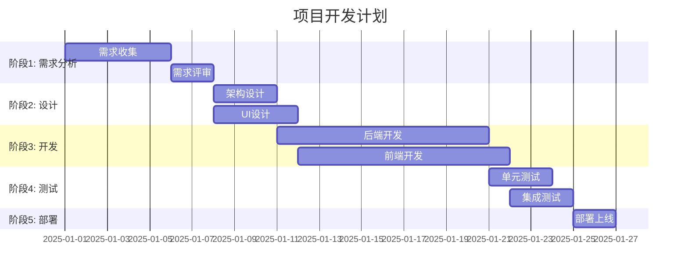

### 流程图（Flowchart）

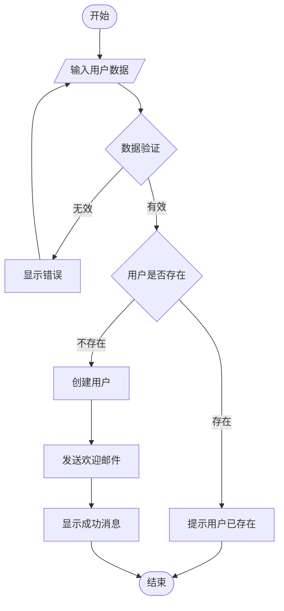

---

## 使用指南

### simple-gemini 使用此模板

在 simple-gemini 技能中，可以这样引用模板：

```markdown
生成 PROJECTWIKI.md 时，请参考 `references/doc_templates.md` 中的标准模板。
确保包含以下要素：
1. 必备 12 章节
2. 至少 1 个 Mermaid 图
3. 双向链接（PROJECTWIKI ↔ CHANGELOG）
```

### 自定义模板

可以根据项目需要修改模板内容，但应保持以下原则：
1. **结构化**: 使用清晰的章节层次
2. **可视化**: 使用 Mermaid 图表而非 ASCII 图
3. **可追溯**: 包含版本历史和变更记录
4. **完整性**: 覆盖架构、API、数据模型等核心要素

---

## 质量检查清单

生成文档时，确保通过以下检查：

- [ ] 包含必备章节（PROJECTWIKI 12 章节）
- [ ] 至少包含 1 个 Mermaid 代码块
- [ ] 所有相对链接指向存在的文件
- [ ] API 定义与实际代码一致
- [ ] 数据模型与数据库 schema 一致
- [ ] 版本号遵循语义化版本规范
- [ ] 变更日志遵循 Keep a Changelog 格式
