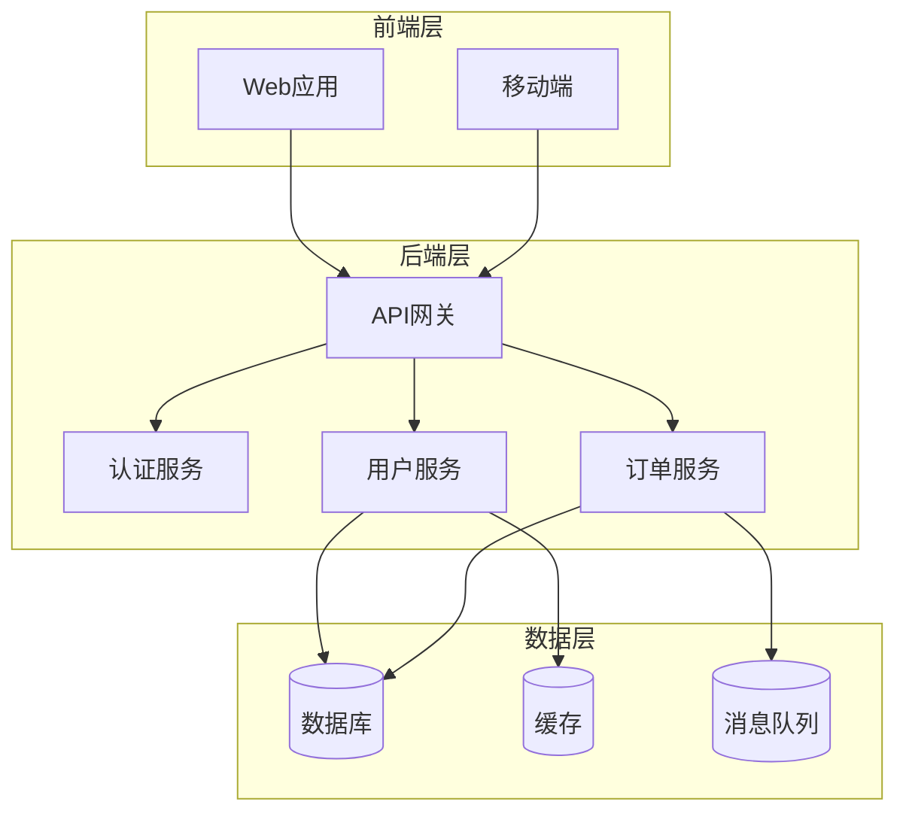
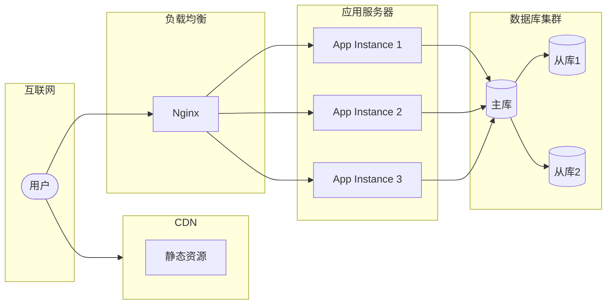

# 架构设计章节模板

> **用途**: 提供标准的架构设计文档模板，包含系统架构图和部署架构图。

---

## 系统架构图

```mermaid
flowchart TD
    subgraph Frontend[前端层]
        Web[Web应用]
        Mobile[移动端]
    end

    subgraph Backend[后端层]
        Gateway[API网关]
        Auth[认证服务]
        UserSvc[用户服务]
        OrderSvc[订单服务]
    end

    subgraph Data[数据层]
        DB[(数据库)]
        Cache[(缓存)]
        Queue[(消息队列)]
    end

    Web --> Gateway
    Mobile --> Gateway
    Gateway --> Auth
    Gateway --> UserSvc
    Gateway --> OrderSvc
    UserSvc --> DB
    OrderSvc --> DB
    UserSvc --> Cache
    OrderSvc --> Queue
```

---

## 部署架构图

```mermaid
flowchart LR
    subgraph Internet[互联网]
        User([用户])
    end

    subgraph CDN[CDN]
        Static[静态资源]
    end

    subgraph LoadBalancer[负载均衡]
        LB[Nginx]
    end

    subgraph AppServers[应用服务器]
        App1[App Instance 1]
        App2[App Instance 2]
        App3[App Instance 3]
    end

    subgraph Database[数据库集群]
        Master[(主库)]
        Slave1[(从库1)]
        Slave2[(从库2)]
    end

    User --> CDN
    User --> LB
    LB --> App1
    LB --> App2
    LB --> App3
    App1 --> Master
    App2 --> Master
    App3 --> Master
    Master --> Slave1
    Master --> Slave2
```

---

*本模板提供可复用的架构设计章节，适用于 PROJECTWIKI.md 或独立的架构文档*
