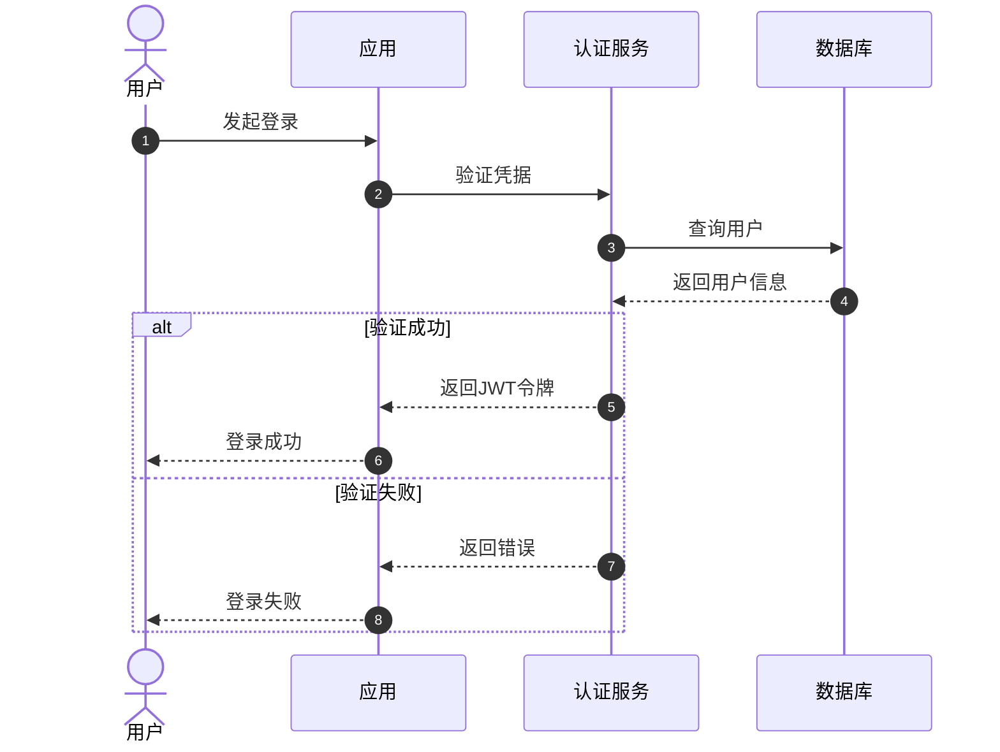
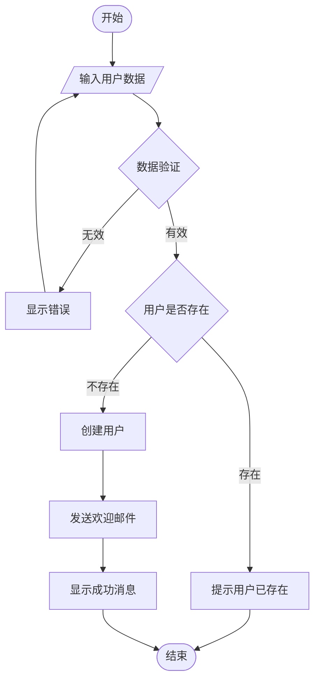
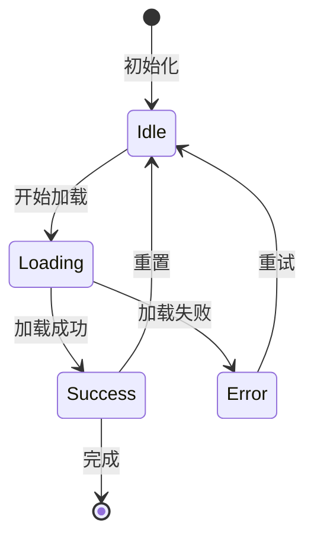
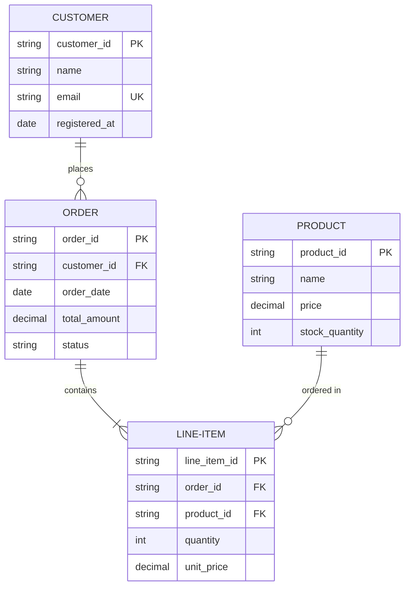
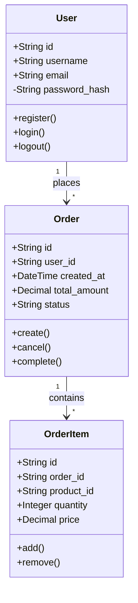
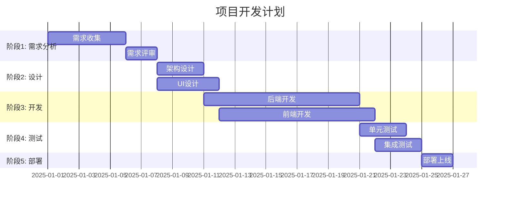

# Mermaid 图表示例集合

> **用途**: 提供常用的 Mermaid 图表类型示例，包括流程图、时序图、状态图、ER图、类图、甘特图等。

---

## 1. 时序图（Sequence Diagram）

---

## 2. 流程图（Flowchart）

---

## 3. 状态图（State Diagram）

---

## 4. 实体关系图（ER Diagram）

---

## 5. 类图（Class Diagram）

---

## 6. 甘特图（Gantt Chart）

---

## 使用说明

### 选择合适的图表类型

| 图表类型 | 适用场景 | 关键词 |
|---------|----------|--------|
| 流程图 (Flowchart) | 业务流程、算法逻辑 | 条件判断、循环、分支 |
| 时序图 (Sequence) | API 交互、系统间通信 | 时间顺序、消息传递 |
| 状态图 (State) | 状态机、生命周期 | 状态转换、事件触发 |
| ER图 (ER Diagram) | 数据库设计、实体关系 | 表结构、外键关系 |
| 类图 (Class) | 面向对象设计、代码结构 | 类、继承、关联 |
| 甘特图 (Gantt) | 项目计划、时间线 | 任务安排、里程碑 |

### 质量检查清单

- [ ] 使用 Mermaid 语法（禁止 ASCII 图）
- [ ] 节点标识清晰（英文 ID + 中文说明）
- [ ] 图表可以正确渲染
- [ ] 适合文档场景（选择正确的图表类型）

---

*本文件提供常用 Mermaid 图表类型的可复用示例*
