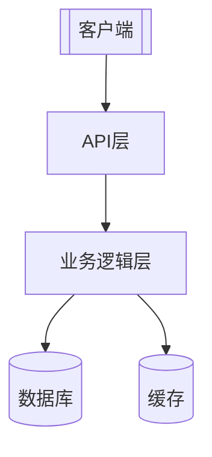
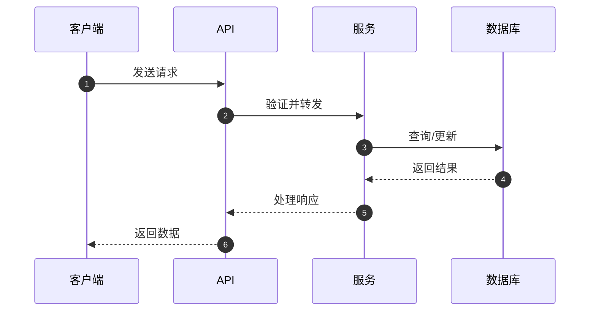
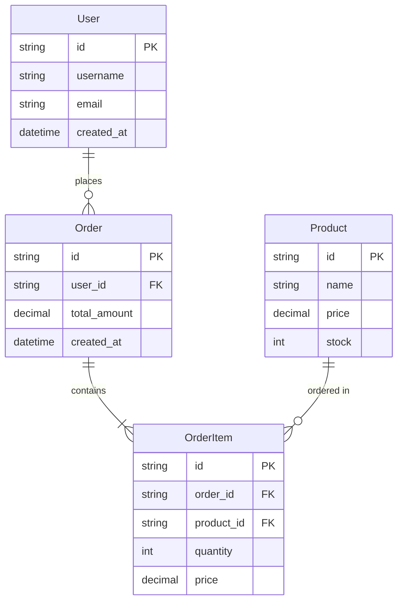
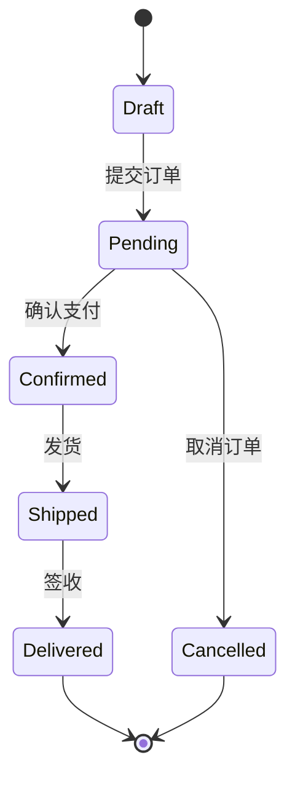
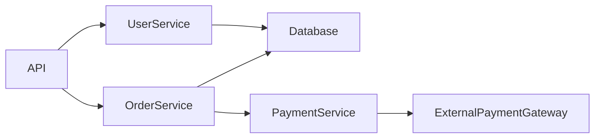

# PROJECTWIKI.md 标准模板

> **用途**: 项目知识库标准模板，包含 12 个必备章节和完整的架构、设计、API、数据模型等内容。

---

## 模板内容

````markdown
# PROJECTWIKI.md（标准模板）

> **说明**: 本文件为项目知识库，记录架构设计、技术决策和关键文档。

---

## 1. 项目概述

- **目标（Goal）**: [项目要解决的核心问题]
- **背景（Background）**: [项目起因和业务背景]
- **范围（In-Scope）**: [本项目包含的功能]
- **非目标（Out-of-Scope）**: [明确不包含的功能]
- **角色/干系人（Stakeholders）**: [用户、开发者、运维等]
- **运行环境/平台**: [Python 3.x, Node.js, Docker等]

---

## 2. 架构设计

### 总体架构



### 关键流程



---

## 3. 架构决策记录（ADR）

- **目录**: `docs/adr/`
- **模板**: MADR（`YYYYMMDD-title.md`）
- **最新 ADR 列表**:
  - `20250101-select-database.md` - 数据库选型
  - `20250102-api-versioning.md` - API 版本化策略

---

## 4. 设计决策 & 技术债务

### 当前技术债务

| ID | 描述 | 优先级 | 负责人 | 预计工作量 |
|----|------|--------|--------|-----------|
| TD-001 | 重构用户认证模块 | High | @team | 3天 |
| TD-002 | 优化数据库查询性能 | Medium | @team | 2天 |

---

## 5. 模块文档

### 模块 A: 用户管理

- **职责**: 用户注册、登录、权限管理
- **入口点**: `src/user/controller.py`
- **关键类型**: `User`, `Permission`, `Role`
- **外部依赖**: `jwt`, `bcrypt`
- **测试覆盖率**: 85%
- **风险**: 密码加密算法升级时需要数据迁移

### 模块 B: 数据处理

- **职责**: 数据清洗、转换、存储
- **入口点**: `src/data/processor.py`
- **关键函数**: `clean_data()`, `transform()`, `save()`
- **外部依赖**: `pandas`, `numpy`
- **扩展点**: 支持插件式数据转换器

---

## 6. API 手册

### API 端点列表

#### 1. 用户注册

```http
POST /api/v1/users/register
Content-Type: application/json

{
  "username": "string",
  "email": "string",
  "password": "string"
}
```

**响应**:
```json
{
  "id": "string",
  "username": "string",
  "email": "string",
  "created_at": "2025-01-01T00:00:00Z"
}
```

**错误码**:
- `400` - 参数错误
- `409` - 用户已存在
- `500` - 服务器错误

#### 兼容性策略

- API 使用语义化版本号 (v1, v2, ...)
- 向后兼容：新增字段可选，废弃字段保留至少 2 个版本
- 破坏性变更：提前 1 个月通知，发布新版本

---

## 7. 数据模型

### 实体关系图



### 状态机



---

## 8. 核心流程

### 用户下单流程

1. **创建订单**: 用户选择商品，创建草稿订单
2. **提交订单**: 验证库存，计算总价
3. **支付处理**: 调用支付网关
4. **订单确认**: 支付成功后更新订单状态
5. **库存扣减**: 扣减商品库存
6. **发货通知**: 触发发货流程

---

## 9. 依赖图谱

### 内部依赖



### 外部依赖

| 依赖 | 版本 | 许可证 | 用途 | 替代方案 |
|------|------|--------|------|----------|
| Flask | 2.3.x | BSD-3 | Web 框架 | FastAPI, Django |
| SQLAlchemy | 2.0.x | MIT | ORM | Django ORM, Peewee |
| Redis | 7.x | BSD-3 | 缓存 | Memcached |
| JWT | 2.x | MIT | 认证 | OAuth2 |

---

## 10. 维护建议

### 运维要点

- **监控**: Prometheus + Grafana，关键指标：QPS、错误率、响应时间
- **告警**: 错误率 > 1% 或 P99 > 500ms 触发告警
- **日志**: 结构化日志（JSON），保留 30 天
- **备份**: 数据库每日全量备份 + 增量备份（每小时）

### 容量规划

- **当前负载**: 1000 QPS，10万 DAU
- **扩容阈值**: CPU > 70% 或内存 > 80%
- **扩容策略**: 水平扩展，最多 10 个实例

### 成本控制

- **云服务成本**: 约 $500/月
- **优化建议**: 使用 CDN 减少流量成本，优化数据库查询减少实例数

---

## 11. 术语表和缩写

| 术语/缩写 | 全称 | 定义 |
|-----------|------|------|
| API | Application Programming Interface | 应用程序编程接口 |
| ORM | Object-Relational Mapping | 对象关系映射 |
| QPS | Queries Per Second | 每秒查询数 |
| P99 | 99th Percentile | 第99百分位数 |
| DAU | Daily Active Users | 日活跃用户数 |

---

## 12. 变更日志

参见 `CHANGELOG.md`（与本节建立双向链接）

**最新变更**:
- [v1.2.0] 2025-01-15 - 新增订单管理模块
- [v1.1.0] 2025-01-10 - 优化用户认证流程
- [v1.0.0] 2025-01-01 - 首次发布

---

## 附录

### 相关文档

- [CHANGELOG.md](./CHANGELOG.md) - 详细变更历史
- [docs/adr/](./docs/adr/) - 架构决策记录
- [README.md](./README.md) - 项目说明

### 贡献指南

参见 [CONTRIBUTING.md](./CONTRIBUTING.md)
````

---

## 使用说明

### 何时使用此模板

- 创建新项目的 PROJECTWIKI.md
- 为既有项目补建知识库文档
- 重构或重建不合规的知识库文档

### 自定义要点

1. **必备 12 章节**不可删减，但可根据项目实际情况调整内容
2. **Mermaid 图**必须至少包含 1 个，建议使用多种图表类型（flowchart, sequenceDiagram, erDiagram 等）
3. **双向链接**：PROJECTWIKI ↔ CHANGELOG 必须建立关联
4. **代码一致性**：API 定义、数据模型必须与实际代码保持一致

### 质量检查清单

- [ ] 包含必备 12 章节
- [ ] 至少包含 1 个 Mermaid 代码块
- [ ] 所有相对链接指向存在的文件
- [ ] API 定义与实际代码一致
- [ ] 数据模型与数据库 schema 一致

---

*本模板遵循 CLAUDE.md 中的项目知识库内容结构与生成规则统一模板*
